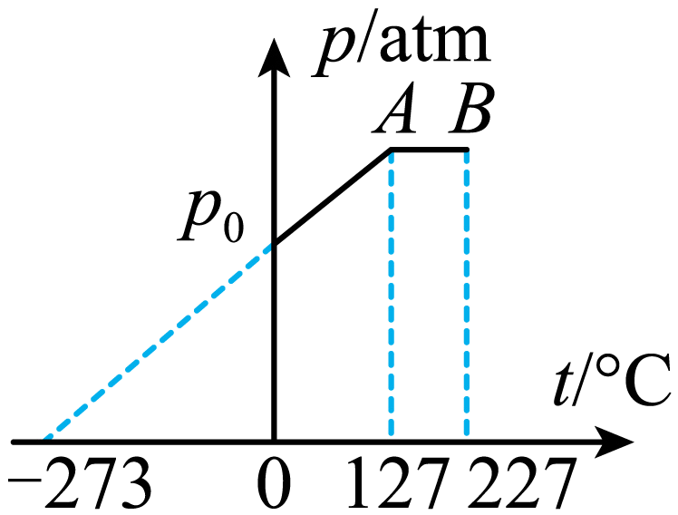

## 讲解

### 判据

先识别纵轴、横轴及温标。p-V图上横线等压、竖线等容，等温线是pV不变的曲线；p-T图中理想等容线过原点，p-t图中的同一线应延长到约−273℃，而非0℃。

### 流程

1. 把坐标点译成物理状态，p用绝对压强，摄氏温度转K。不要把图上127与227直接当温度比。
2. 判断路径固定什么。横线p不变；p随T成正比且同一份气体，则V不变。
3. 为已知状态建立标尺。本题0℃、p₀时0.3 mol气体占$0.3\times22.4=6.72\,\mathrm L$；这把未知体积与标准摩尔体积联系起来。
4. 沿等容线到A，体积仍6.72 L；沿等压线到B，用$V_B/V_A=T_B/T_A$，得到8.4 L。
5. 比较线的斜率要从方程出发：p-T斜率$nR/V$，V-T斜率$nR/p$，p-1/V斜率nRT。不同气体量时不能仅凭斜率比较温度。

## 例题

> 题目与解析：第二章 气体、固体和液体（复习讲义）（解析版）.docx，来源ID S06，第243—256段。分段选取时保留该子问的完整题干、答案与解析；题目背景和原资料标注照录。

【变式5-1】0.3mol的某种气体的压强和温度的关系图像（p—t图像）如图所示。$p_{0}$表示1个标准大气压，标准状态（0℃，1个标准大气压）下气体的摩尔体积为22.4L∙$\mathrm{mol}^{-1}$。下列说法正确的是（   ）

A．状态A时气体的体积为5.6L

B．状态A时气体的体积为7.72L

C．状态B时气体的体积为1.2L

D．状态B时气体的体积为8.4L

**原资料答案：** D

**原资料详解：** 此气体在0℃时，压强为标准大气压，所以此时它的体积应为

$22.4\times0.3\,\mathrm L=6.72\,\mathrm L$

由题中图线可知，从压强为$p_{0}$到A状态，气体做等容变化，A状态时气体的体积为6.72L，温度为

(127＋273)K = 400K

从A状态到B状态为等压变化，B状态的温度为

(227＋273)K = 500K

根据盖—吕萨克定律$\frac{V_A}{T_A}=\frac{V_B}{T_B}$得

$V_B=\frac{V_AT_B}{T_A}=\frac{6.72\times500}{400}\,\mathrm L=8.4\,\mathrm L$

故选D。

## 易错

A、B给A状态的两个数值都不等于6.72 L；C的1.2 L不符合等压升温体积增加；D的8.4 L符合500/400倍。p-t图直线未过原点不代表不是等容线。
