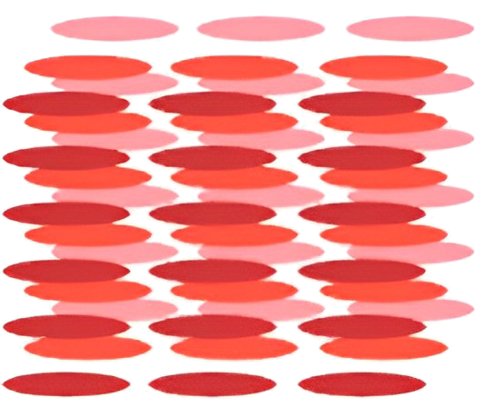

## 讲解

### 判据

同时具有流动性与一定光学各向异性，提示液晶；分子排列图中取向较一致而位置不构成完整晶格，是典型识别特征。只看到整齐排列，不能立即判液晶。

### 流程

1. 先看宏观性质：能流动排除通常固态晶体模型；具有光学方向性又区别于普通各向同性液体。
2. 再看微观图：位置排列与方向取向分别判断。液晶可以取向部分有序，而不具有完整晶格位置约束。
3. 用两个条件逐项排除。原题A、D画高度有序晶体结构，C画完全杂乱液体结构，B同时体现部分有序和位置杂乱。
4. 若考显示原理，说明电场改变分子取向→偏振光透过情况变化，不把“通电”直接等同于液晶自发光。
5. 注意温度、浓度范围，离开相应范围不必继续保持液晶态。

## 例题

> 题目与解析：第二章  气体、固体和液体（专项训练）（解析版）.docx，来源ID S04，第100—107段。分段选取时保留该子问的完整题干、答案与解析；题目背景和原资料标注照录。

8．（22-23高二下·江苏泰州·期末）液晶在现代生活中扮演着重要角色，广泛应用于手机屏幕、平板电视等显示设备中。下列四幅图哪个是液晶态分子排列图（　　）

A．

B．

C．

  

D．

**原资料答案：** B

**原资料详解：** AD．液晶在某个方向上看，其分子排列比较整齐，但从另一方向看，分子的排列是杂乱无章的，选项A、D中分子排列非常有序，不符合液晶分子的排列规律，故AD错误；

B．选项B中分子排列比较整齐，但从另外一个角度看也具有无序性，符合液晶分子的排列规律，故B正确；

C．选项C中，分子排列是完全无序的，不符合液晶分子的排列规律，故C错误。

故选B。

## 易错

原题解析中的“从另一个角度看杂乱”是高中部分有序模型的描述，不是把同一组分子旋转观察就必然从有序变无序。区分的是有序的程度和类型。
