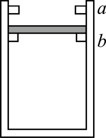

## 讲解

### 判据

气体压强来自活塞受力约束。看到质量、截面积、大气压、弹簧、卡环或摩擦时，先画活塞受力，不能默认$p=p_0$。缓慢或静止通常给合力为零；快速运动则需考虑加速度。

### 流程

1. 选活塞或连接活塞整体，标清气体压力pS与大气压力p₀S的方向。竖直气缸自由活塞上方通大气、下方封气时有$pS=p_0S+mg$。
2. 加上额外约束力。下卡环支撑向上，会减小维持平衡所需气体压力；上卡环压住活塞向下，会增大所需气体压力。
3. 分辨移动与卡住。自由移动且外力不变时p固定；卡在固定位置时V固定而卡环作用力可以改变。
4. 用状态关系求p或T，再回代受力式计算约束力。既检查不超过卡环极限，也检查力方向确实允许接触。
5. 如果接触力算成拉力而卡环只能推，就说明假设不成立，需退回自由移动阶段。

## 例题

> 题目与解析：专项01 气体、固体和液体（重难点训练）（解析版）.docx，来源ID S02，第146—162段。分段选取时保留该子问的完整题干、答案与解析；题目背景和原资料标注照录。

9．如图所示，导热性能良好的气缸开口向上竖直放置，$a、b$是固定在气缸内壁的卡环，两卡环间的距离为h，缸内一个质量为m、横截面积为S的活塞与气缸内壁接触良好，无摩擦不漏气，活塞只能在$a、b$之间移动，缸内封闭一定质量的理想气体。此时环境温度为${T}_{0}$，活塞与卡环b刚好接触，且无相互作用力，活塞离缸底的距离为$3h$。已知卡环能承受的压力最大为$\frac{1}{2}mg$，活塞的厚度不计，大气压强满足${p}_{0}=\frac{5mg}{S}$，重力加速度为g，求：

(1)要使卡环不被破坏，环境的温度最低能降到多少；

(2)若提高环境温度，当环境温度为$1.4{T}_{0}$时，试通过计算判断卡环是否损坏？若不损坏，此时缸内气体的压强多大。

**原资料答案：** (1)$\frac{11}{12}{T}_{0}$

(2)卡环并未损坏，$\frac{6.3mg}{S}$

**原资料详解：** （1）开始时，缸内气体压强${p}_{1}S={p}_{0}S+mg$

气体温度${T}_{1}={T}_{0}$；设温度降低到${T}_{2}$时活塞对卡环的压力为$\frac{1}{2}mg$，此时缸内气体压强${p}_{2}S+\frac{1}{2}mg={p}_{0}S+mg$

得${p}_{2}=\frac{11mg}{2S}$

气体发生等容变化，则有$\frac{{p}_{1}}{{T}_{1}}=\frac{{p}_{2}}{{T}_{2}}$

解得${T}_{2}=\frac{11}{12}{T}_{0}$

（2）假设环境温度为$1.4{T}_{0}$时活塞与卡环a接触，且卡环a没有被破坏。设此时缸内气体压强为${p}_{3}$，根据理想气体状态方程有$\frac{{p}_{1}\times (3hS)}{{T}_{1}}=\frac{{p}_{3}\times (4hS)}{{T}_{3}}$

解得${p}_{3}=\frac{6.3mg}{S}$

设此时活塞与卡环的作用力为F，则$6mg+F={p}_{3}S$

解得$F=0.3mg$

由于${p}_{3}>\frac{6mg}{S}$且$F<\frac{mg}{2}$

说明卡环并未损坏，此时缸内气体压强为${p}_{3}=\frac{6.3mg}{S}$

### 顺着本题再看清一步

初态$p_1=6mg/S$。升温自由上移时p仍为此值，气柱从3h增至4h，故刚碰上环时温度为$4T_0/3$。1.4T₀超过该阈值，所以随后是等容加热，不是继续自由膨胀。

卡住后$p_3=(6mg/S)\times(3/4)\times1.4=6.3mg/S$，卡环受力$F=p_3S-6mg=0.3mg$，小于0.5mg，结论与“未破坏”的假设一致。

## 易错

“导热良好”支持缓慢状态随环境温度，不代表p永远不变。最低温的状态被下卡环托住，最高温讨论被上卡环挡住，两种接触力方向相反。
