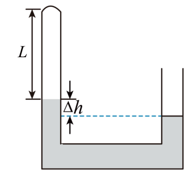

## 讲解

### 判据

先从题干找真正固定的量，而不是看见“加热”就选等压，看见“压缩”就选等温。密封保证量不变；刚性容器或固定活塞保证V不变；外压和载重不变且活塞自由缓慢运动，才可能保证p不变；与恒温环境充分热接触才支持T不变。

### 流程

1. 画出这份气体的边界，确认整个过程是否漏气或充气；若气体量变，分别使用$pV=nRT$。
2. 写出初末p、V、T。水银或活塞题先用静力学求p，温度先转K，体积包含所有连通气腔。
3. 明确固定T用$p_1V_1=p_2V_2$，固定p用$V_1/T_1=V_2/T_2$，固定V用$p_1/T_1=p_2/T_2$；没有一个固定则用$p_1V_1/T_1=p_2V_2/T_2$。
4. 有卡环、接触、转向时分段，检查算出的状态能否满足原假设。卡住以后体积可能不变，原等压式就结束。
5. 用变化方向复核：等温压强升高应体积减小；等压升温体积应增大。

## 例题

> 题目与解析：专项01 气体、固体和液体（重难点训练）（解析版）.docx，来源ID S02，第74—87段。分段选取时保留该子问的完整题干、答案与解析；题目背景和原资料标注照录。

5．如图所示，粗细均匀的U形管，左端封闭，右端开口，左端用水银封闭着长L=45cm的理想气体，当温度为27℃时，两管水银面的高度差Δh=10cm，外界大气压为75cmHg。

(1)若对封闭气体缓慢加热，使左、右两管中的水银面相平，求封闭气体的摄氏温度t；（结果保留整数）

(2)若封闭气体的温度不变，从右管的开口端缓慢注入水银，使左、右两管中的水银面相平，求注入水银柱的长度l。

**原资料答案：** (1)t=112℃

(2)l=22cm

**原资料详解：** （1）左、右两管中的水银面相平时，理想气体的长度${L}_{1}=L+\frac{\Delta h}{2}=50cm$

以封闭气体为研究对象，根据理想气体状态方程有$\frac{({p}_{0}-ρg\Delta h)LS}{{T}_{1}}=\frac{{p}_{0}{L}_{1}S}{{T}_{2}}$

解得${T}_{2}=385K$

即$t=112℃$

（2）根据玻意耳定律有$({p}_{0}-ρg\Delta h)LS={p}_{0}{L}^{′}S$

解得${L}^{′}=39cm$

根据几何关系，有$l=\Delta h+2(L-{L}^{′})$

解得$l=22cm$

## 易错

两问同一装置，却是两个不同约束：加热至等高时p和V同时变；恒温注水银时用玻意尔定律。水银守恒的几何关系也因是否新增水银而不同，不能把第一问的长度50 cm直接移到第二问。
