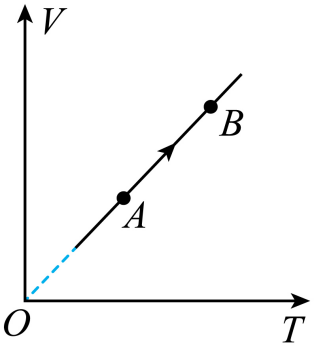

## 错法

看到“气体对外做80 J功”，把大小80直接放进Q+W，算成内能增加200 J只需吸热120 J。错在Q+W的W定义为外界对气体做功，和题目说的对外做功方向相反。

## 正解

先写出$W=-W_{\rm out}$。本题W_out=80 J，所以W=−80 J，$200=Q-80$得Q=280 J。

若坚持用正的对外功，应换成$\Delta U=Q-W_{\rm out}$，同样得到280 J。方程与量的定义必须成套，不能半句用一种约定、另半句换另一种。

## 例题

> 题目与解析：第三章 热力学定律（复习讲义）（解析版）.docx，来源ID S04，第498—508段。分段选取时保留该子问的完整题干、答案与解析；题目背景和原资料标注照录。

9．（2026·江苏镇江·模拟预测）如图所示为一定质量的某种理想气体从状态$A$到状态$B$的体积随温度变化的$V-T$图像。已知气体在状态$A$时的压强$p_A=4\times10^4\,\mathrm{Pa}$，体积$V_A=2\times10^{-3}\,\mathrm{m^3}$，温度$T_A=200\,\mathrm K$；在状态$B$时的温度$T_B=400\,\mathrm K$。

(1)求气体在状态$B$时的体积$V_B$；

(2)若上述过程气体内能增加了200J，求该过程中气体吸收的热量。

**原资料答案：** (1)$4\times10^{-3}\,\mathrm{m^3}$

(2)$280\,\mathrm J$

**原资料详解：** （1）由题图可知，$A\to B$为等压变化，则有$\frac{V_A}{T_A}=\frac{V_B}{T_B}$

代入数据解得$V_B=4\times10^{-3}\,\mathrm{m^3}$

（2）$A\to B$过程，外界对气体做功为$W_{AB}=-p_A(V_B-V_A)=-80\,\mathrm J$

根据热力学第一定律可得$\Delta U=W_{AB}+Q$

联立解得$Q=280\,\mathrm J$

### 顺着本题再看清一步

检查能量流：输入280 J，系统留下200 J，向外输出80 J。120 J输入不足以同时满足两个去向，因此也能从账目看出符号错误。
