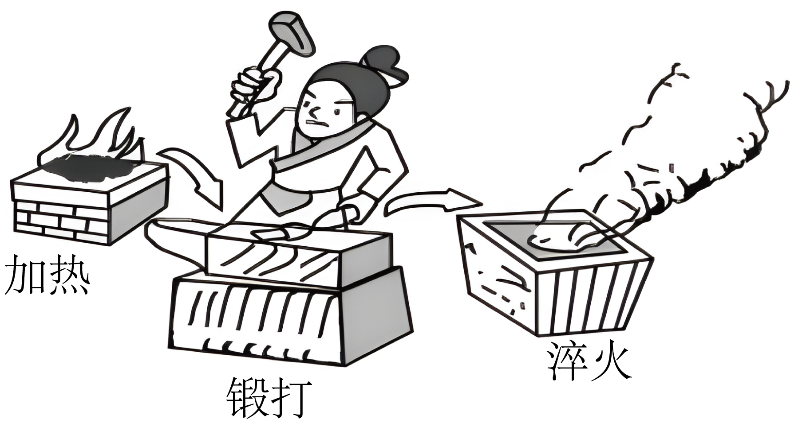

## 讲解

### 是什么

内能U是系统自身状态所对应的能量。做功与传热是改变内能的两种方式；功W、热量Q都是过程中的能量交换量，单位J，不能说一个物体“装有多少热量”。

做功通过力及位移、电功等有组织的作用传递能量；传热由温差引起能量交换，可以通过接触传导、对流、辐射等方式进行。两种方式在内能变化的数值效果上可以相同，交换机制不同。

### 怎么来的

焦耳用绝热容器内的搅拌、电功等方式改变同一份水的状态，比较机械功、电功与水温变化，建立功和内能改变的定量联系。绝热时没有热量交换，输入的功增加内能。

也可以不做机械功，利用高温物体向低温物体传热升温。下题锻打是机械作用，加热和淬火分别使铁器吸热与放热，因而不能用“温度变了”来区分两种方式。

### 什么时候能用

先选系统，再判断能量如何越过边界。摩擦锻打会把机械能转为内能；高温火焰、较冷的水与铁器之间有温差，形成热交换。若同时有做功与传热，两者的代数和决定内能变化，不能只盯其中一项。

把电阻丝和水合成一个系统时，流入的电能算电功；只选水而电阻丝在外时，水从电阻丝吸收的是热量。系统边界不同，账目归类也不同。

## 例题

> 题目与解析：第三章 热力学定律（复习讲义）（解析版）.docx，来源ID S04，第70—78段。分段选取时保留该子问的完整题干、答案与解析；题目背景和原资料标注照录。

【变式1-2】如图所示是古人锻造铁器的过程，关于改变物体内能的方式，下列说法正确的是（　　）

A．加热和锻打属于传热，淬火属于做功

B．加热属于传热，锻打和淬火属于做功

C．加热和淬火属于传热，锻打属于做功

D．加热和淬火属于做功，锻打属于传热

**原资料答案：** C

**原资料详解：** 用铁锤锻打铁器，铁器会发热，属于做功改变物体内能；用火对铁器加热，铁器从火中吸收热量，把铁器放在水中淬火，铁器向水中放热，所以加热和淬火属于传热改变物体内能。

故选C。

## 易错

A把锻打说成传热；B把淬火说成做功；D把加热和淬火都说成做功。C分别识别热交换、机械作用、热交换。温度上升不是“必有吸热”的证据。
