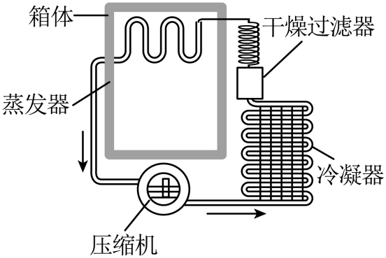

## 讲解

### 是什么

第一定律管能量数量，第二定律管宏观热过程的方向。常见表述是：热量不能自发地从低温物体传向高温物体；不可能让循环热机只从单一热库吸热、全部变成功，且不产生其他影响。

“自发”“循环”“单一热库”“不产生其他影响”限定的是一组完整条件。去掉这些词，就可能把冰箱或一次性膨胀过程误判为违背定律。

### 怎么来的

热物体向冷物体传热可以自然发生，反向搬运则需要外界做功等影响。气体自由膨胀也不会自行重新全部集中在原来的半边；宏观初态和末态虽可在能量上同值，过程仍有方向。

循环热机回到原状态，ΔU为零；吸热的一部分转为输出功，其余排向低温热库。若假设只吸热、全做功、装置复原且没有其他变化，它虽在能量数值上可平衡，却违反热过程方向规律。

这是拓展：孤立系统的总熵不减少，可逆理想过程不变，不可逆过程增加。熵不是能量总量，也不能只看系统某一部分的熵。

### 什么时候能用

判断实际传热、热机、制冷机或永动机时使用。气体等温膨胀吸热全部转为功可以发生，因为气体最终体积、状态变了，并未完成无其他影响的循环。

冰箱耗电后把冷端热量搬到热端，符合定律。制冷性能系数$Q_c/W_{\rm in}$与热机效率不同，可以大于1，不代表能量凭空产生。核对见[OpenStax制冷机](https://openstax.org/books/university-physics-volume-2/pages/4-3-refrigerators-and-heat-pumps)。

## 例题

> 题目与解析：第三章  热力学定律（专项训练）（解析版）.docx，来源ID S02，第137—147段。分段选取时保留该子问的完整题干、答案与解析；题目背景和原资料标注照录。

11．（24-25高二下·广东东莞·期末）如图所示为电冰箱的工作原理示意图，压缩机工作时，强迫制冷剂在冰箱内外的管道中不断循环，在蒸发器中制冷剂汽化，吸收箱体内的热量，经过冷凝器时制冷剂液化，放出热量到箱体外。下列说法正确的是（　　）

A．热量可以自发地从低温的冰箱内传到高温的冰箱外

B．电冰箱的制冷系统能够不断地把冰箱内的热量传到外界，是因为其消耗了电能

C．电冰箱的工作原理违反了热力学第一定律

D．电冰箱的工作效率可达到100%

**原资料答案：** B

**原资料详解：** AB．由热力学第二定律可知，热量不能自发地从低温物体传到高温物体，除非有外界的影响或帮助，电冰箱把热量从低温的内部传到高温的外部，需要压缩机的帮助并消耗电能，故A错误，B正确；

C．电冰箱在工作过程中，消耗电能，实现了热量从低温物体向高温物体的传递，其能量的转化和守恒满足热力学第一定律，并没有违反，故C错误；

D．任何热机的效率都不能达到100%，因为在能量转化过程中总会有能量损耗，电冰箱也不例外，故D错误。

故选B。

### 顺着本题再看清一步

以一个制冷循环为系统，吸入冷端热量$Q_c$、输入功$W_{\rm in}$、向热端放出$Q_h$，回到原态后有$Q_h=Q_c+W_{\rm in}$。热端接收的不只有从冰箱里搬来的热量，也包含输入电能。

原题答案B保留。D的原解析完整照录供核对，但“任何制冷机效率不能100%”的说法需先定义指标，不能用热机上限直接判断制冷性能系数。

## 易错

A漏“自发”的限制；B正确，电功提供外部影响；C错误，能量照样守恒。D未定义“工作效率”，原解析把冰箱与热机效率混同，不作为严谨的性能系数结论。
