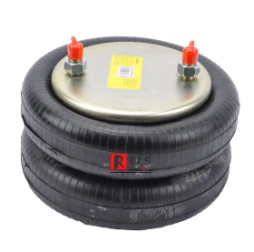

## 讲解

### 是什么

绝热过程是系统与外界没有热量交换的过程，Q=0。它不要求温度不变，也不禁止做功。在本章符号约定下

$$\Delta U=W.$$

外界压缩气体做正功，内能增加；气体克服外界作用膨胀做功，内能减少。对固定量理想气体，这分别对应升温和降温。

### 怎么来的

隔热边界阻止传热；很快的过程若来不及显著传热，也可近似绝热。此时第一定律中Q项为零，功直接对应内能变化。

气囊压缩把车体机械能的一部分输入气体。回弹时气体把能量输出，因而降温。快压缩引火仪与膨胀冷却也来自同一能量关系，不能说没有吸热就无法升温。

### 什么时候能用

要有隔热条件，或题目允许忽略短时间传热。快速不自动保证完美绝热，缓慢也不自动意味着等温；良好隔热装置中的缓慢过程仍可绝热。

气体向真空自由膨胀是重要边界：Q=0而无外部阻力、无其他能量交换时W=0，理想气体ΔU=0、初末温度相同。中间不可逆过程不必有统一平衡压强。

## 例题

> 题目与解析：高二物理热学第三章  单元测试·提升卷（解析版）.docx，来源ID S10，第43—52段。分段选取时保留该子问的完整题干、答案与解析；题目背景和原资料标注照录。

5．重型汽车的气囊减震装置会在路面不平的情况下保护车体，气囊内有绝热涂层。关于气囊内的气体，下列说法正确的是（　　）

A．若车体突然下沉挤压气囊，气体温度升高，内能增大

B．若车体突然下沉挤压气囊，气体温度不变，内能不变

C．若气囊缓慢回弹恢复原状，气体温度升高，内能增大

D．若气囊缓慢回弹恢复原状，气体温度不变，内能不变

**原资料答案：** A

**原资料详解：** AB．若车体突然下沉挤压气囊，气囊体积减小，外界对气体做正功（$W>0$），由于气囊内有绝热涂层，气体与外界无热交换（$Q=0$），由$\Delta U=Q+W=W>0$可知气体内能增大，温度升高，故A正确，B错误；

CD．若气囊缓慢回弹恢复原状，气囊体积增大，气体对外界做功（$W<0$），由于气囊内有绝热涂层，气体与外界无热交换（$Q=0$），由$\Delta U=Q+W=W<0$可知内能减小，气体温度降低，故CD错误。

故选A。

## 易错

A压缩后内能增大正确；B忽略正功；C、D对回弹均误判，题设绝热涂层保持Q≈0，膨胀向外输出功使内能下降。回到原体积不代表在耗散情况下必然回到全部初始状态。
