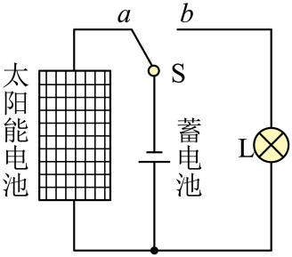

## 讲解

### 是什么

能量可以在物体间转移，也可以在机械能、内能、电能、化学能等形式间转化；计入系统与环境的全部相关能量，总量守恒。

封闭孤立系统的总能量不变。只看一个有输入、输出的局部系统，它的能量可以增减，应写成“增加量=输入−输出”，不能要求每个局部物体都单独不变。

### 怎么来的

不同实验中，减少的机械能、电能等与增加的其他能量对应。焦耳实验把机械功、电功与内能改变联系起来，是统一能量量度的重要证据。

太阳能路灯白天从外部太阳辐射取得能量，光伏板输出电能，充电使蓄电池化学能增加；夜间化学能转成电能供灯，再形成光和内能。转移链条说明“守恒”不等于“无需补给”。

### 什么时候能用

先划清系统边界并把有意义的输入输出列全。机械能守恒还需要没有把机械能转为其他形式的条件；有摩擦时机械能可减少，总能量仍守恒。

高中的能量守恒账目不能替代力学、电学定律的全部信息。例如闭合电路关系含电源和电阻性质，不能说仅由能量守恒就能证明所有器件一定满足欧姆定律。

## 例题

> 题目与解析：高二物理热学第三章  单元测试·提升卷（解析版）.docx，来源ID S10，第53—64段。分段选取时保留该子问的完整题干、答案与解析；题目背景和原资料标注照录。

6．西藏地区日照时间长，太阳能资源丰富。如图所示为某太阳能路灯的电路简化图，光电池板为蓄电池充电，蓄电池为LED路灯供电。关于该系统中的能量转化，下列说法正确的是（　　）

A．光电池板充电时，将化学能转化为电能

B．蓄电池在夜晚放电时，将电能转化为内能

C．LED路灯工作时，将电能主要转化为光能

D．整个系统遵循能量守恒定律，故能量可被循环利用，无需外界输入

**原资料答案：** C

**原资料详解：** 

A．光电池板充电时，将光能转化为化学能，故A错误；

B．蓄电池在夜晚放电时，将化学能转化为电能，故B错误；

C．LED路灯工作时，将电能主要转化为光能，故C正确；

D．整个系统遵循能量守恒定律，但是能量的转化和转移是有方向性的，能量不能被循环利用，太阳能路灯系统需要不断从太阳获取太阳能这种外界能量输入，故D错误。

故选C。

### 顺着本题再看清一步

原解析A把“光伏板充电”合并说成光能变为化学能；细分时光伏板是光能→电能，蓄电池充电是电能→化学能，合并的系统才是光能→储存化学能。

原解析D写“能量不能被循环利用”，讲解补足：可以回收、循环利用一部分能量，但不能无外界输入把每次输出完全回收并持续净输出有用功。

## 易错

A混淆光伏发电与蓄电池充电，B把蓄电池放电的化学能说成电能输入；C按题意识别LED输出光；D漏掉太阳能输入与能量耗散。
