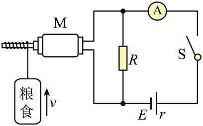

## 讲解

### 判据

题中有电机、加热、摩擦等能量转换，始终可按明确系统列总能量账；只有相应系统仅有重力、弹力等保守力做功，且无额外机械能转移，才可以直接设动能与势能总和不变。

看到匀速提升，只能判动能不变；高度增加使重力势能增加，因此粮食与地球的机械能并不守恒。电机输入电功正是势能增加和线圈发热的来源。

### 流程

1. **选系统与能量形式。** 若选粮食与地球，考虑动能、重力势能，绳的拉力从外部输入机械功；若含电机，还要记线圈内能及电输入。

2. **用运动条件处理动能。** 原题匀速上升，ΔE_k＝0，但ΔE_p＝mgh＞0，不能由匀速直接设机械能守恒。

3. **列正确收支。** 粮食提升功率mgv＝600 W；电机输入UI机＝750 W，差额150 W是题目模型中的线圈发热。由150＝I机²r线反推电阻，不能把750 W都算成热。

4. **扩大系统再核账。** 电源总转化1200 W，源内200 W、外电阻250 W、电机发热150 W、提升600 W相加恰好1200 W；机械能增加并未违反总能量守恒。

5. **核对效率对象。** 电机效率是提升/电机输入，源效率是全部外部输出/源转化；整体有用效率还需把所有环节损失计入。不同对象对应不同分子分母。

## 例题

> 题目与解析：第十二章 电能 能量守恒定律（单元测试·基础卷）（解析版）.docx，来源ID S06，第214—229段。分段选取时保留该子问的完整题干、答案与解析；题目背景和原资料标注照录。

13．（11分）某农场为了方便将粮食运送到一定高度的仓库，设计了一个小型运粮装置，其工作原理可简化为如图所示的电路图，电源电动势$E=120\,\mathrm V$、内阻$r=2\,\Omega$，定值电阻R的阻值为40Ω，M为电动机。闭合开关S，稳定后，理想电流表A的示数$I=10\,\mathrm A$，电动机带动质量$m=60\,\mathrm{kg}$的一袋粮食以速度$v=1\,\mathrm{m/s}$匀速上升，重力加速度$g=10\,\mathrm{m/s^2}$。求：

(1)定值电阻R两端的电压；

(2)电动机的机械效率；

(3)电动机线圈的内阻。

**原资料答案：** (1)100V

(2)80%

(3)$\frac83\,\Omega$

**原资料详解：** （1）电动机与定值电阻并联，根据闭合电路欧姆定律可知定值电阻R两端电压为$U=E-Ir=100\,\mathrm V$（2分）

（2）通过R的电流为$I_1=\frac UR=2.5\,\mathrm A$（1分）

根据并联电路规律可知电动机的工作电流为$I_2=I-I_1=7.5\,\mathrm A$（1分）

电动机的输入功率为$P_{\text{入}}=UI_2=750\,\mathrm W$（1分）

电动机的输出功率为$P_{\text{出}}=mgv=600\,\mathrm W$（1分）

电动机的机械效率为$\eta=\frac{P_{\text{出}}}{P_{\text{入}}}\times100\%=80\%$（2分）

（3）电动机线圈的发热功率为$P_{\text{损}}=P_{\text{入}}-P_{\text{出}}=I_2^2r_{\text{线}}$（2分）

则电动机线圈的内阻为$r_{\text{线}}=\frac83\,\Omega$（1分）

### 顺着本题再看清一步

本题电机支路I机＝10−100/40＝7.5 A；输入750 W、提升600 W、发热150 W，故电机效率80%，线圈r线＝150/7.5²＝8/3 Ω。若误用机械能守恒，会无法解释重力势能增加的供能来源；若误把电功全当热，得到的线圈电阻也错。

## 易错

总能量守恒不自动推出机械能守恒；匀速仅说明动能不变；热耗散必须记入总能量账。
