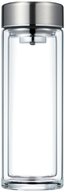

## 讲解

### 判据

固定量理想气体题中，等温先给ΔU=0，等容且无其他功给W=0，绝热给Q=0。三者分别消去不同项，不能把“温度不变”当成“没有热交换”。

### 流程

1. 找题意确定的过程条件，不用运动快慢代替明确的隔热、导热、固定条件。
2. 等温：固定量理想气体内能不变，故Q=−W。膨胀向外做功W负，需要Q正补偿；压缩时则放热。
3. 等容：边界不做体积功；若无电功等，W=0，Q=ΔU，吸热升温、放热降温。
4. 绝热：Q=0，ΔU=W，压缩升温、克服外压膨胀降温；真空自由膨胀另查W=0。
5. 分段过程各段单独判断，最后把各段Q、W和ΔU相加。回到初态只保证总ΔU=0，不保证总Q或总W为零。

## 例题

> 题目与解析：第三章  热力学定律（专项训练）（解析版）.docx，来源ID S02，第12—22段。分段选取时保留该子问的完整题干、答案与解析；题目背景和原资料标注照录。

1．（24-25高二下·广东云浮·期末）如图所示，玻璃杯盖上杯盖时密封良好，初始时杯内气体压强等于外界大气压强，杯内气体视为理想气体，现将玻璃杯放入消毒柜高温消毒，杯内封闭气体的温度缓慢升高，关于此过程下列说法正确的是（　　）

A．外界对杯内气体做功

B．杯内气体从外界吸收热量

C．杯内所有气体分子的运动速率均增大

D．杯内气体分子单位时间内碰撞单位面积器壁的次数减少

**原资料答案：** B

**原资料详解：** AB．因气体体积不变，则外界对杯内气体不做功，则W=0；气体温度升高，则内能增加$\Delta U>0$，根据$\Delta U=W+Q$，可知Q>0，即杯内气体从外界吸收热量，选项A错误，B正确；

C．杯内气体温度升高，分子平均速率变大，但并非所有气体分子的运动速率均增大，选项C错误；

D．气体体积不变，温度升高，由理想气体状态方程可知气体压强变大，则分子数密度不变，分子平均速率变大，则杯内气体分子单位时间内碰撞单位面积器壁的次数增加，选项D错误。

故选B。

### 顺着本题再看清一步

密封玻璃杯近似刚性，消毒加热是等容吸热。与本章气囊绝热压缩、零食袋等温膨胀原题对照时，分别为W=0、Q=0、ΔU=0，三个结论来自不同条件。

## 易错

A忽略杯体积固定；C把平均热运动变化说成每个分子都加速；D错误地认为温度上升碰撞次数反而下降。B由W=0、ΔU>0推出Q>0。
