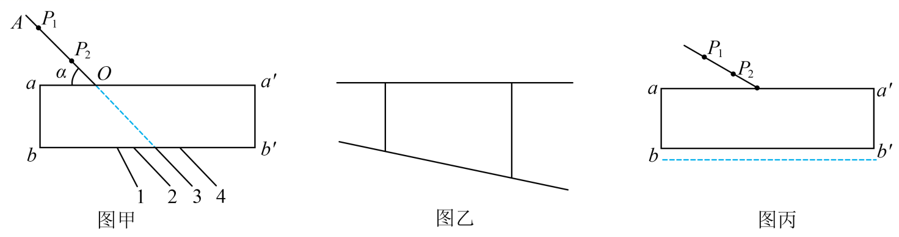

## 讲解

### 判据

插针法通过针与针像对齐，确定入射光线和出射光线，再连接玻璃内的入射点、出射点，重建折射光路。空气入玻璃的折射率由两个相对法线的角求得：

$$n\approx\frac{\sin i}{\sin r}.$$

正确光路比玻璃形状是否矩形更关键。梯形砖也可测同种材料的n；只是不能再套出射线与入射线平行的几何结论。

### 流程

1. **描边并固定。** 白纸固定在木板上，玻璃砖置稳，细线描出真实前后边界。测量期间不移动砖，否则针的路径与所描轮廓不一致。
2. **确定入射线。** 在前侧竖直插P₁、P₂，两针适当分开，连线交前边界为O。间距太近时同样位置偏差会造成较大的方向误差。
3. **对齐针像。** 从后侧透过砖观察，调视线和P₃，使P₃挡住P₁、P₂的像；再使P₄同时挡住P₃和两入射针的像。这让四针处于同一光路，而非只遮一枚像。
4. **重建内部光线。** 取下砖与针，连P₃P₄交后边界于O′，再连OO′。P₃P₄在空气中是出射线，OO′才是玻璃内折射线。
5. **按法线量角。** 在O处作前边界法线，入射线与它夹i，内部OO′与它夹r。原题图甲标α为界面夹角，应先用i=90°−α，不直接把α代正弦比。
6. **多次验证。** 换适当入射角重复，用多组sin i/sin r平均；也可纵轴sin i、横轴sin r作图，斜率为n。若交换坐标轴，斜率为1/n。

入射角不宜太小以免角度误差占比过大，也不宜追求过大而导致针像难辨。针竖直、边界细准、视线对齐，比盲目增大任何一个尺寸更重要。

本题下边界画到真实边界下方，重建O′落在出射空气光线上更远处。空气出射角比内部角大，多加入的空气段会把重建内部线拉得更偏离法线，使r测量偏大，n偏小。

## 例题

> 题目与解析：第四章 光（专项训练）（解析版）.docx，来源ID S02，第471—476段。分段选取时保留该子问的完整题干、答案与解析；题目背景和原资料标注照录。

38．（25-26高二下·福建福州·期末）甲同学用“插针法”测平行玻璃砖的折射率，如图甲所示，在入射方向AO上插了两枚大头针$P_{1}$和$P_{2}$，1、2、3、4分别表示四条直线，且直线2、3、4相互平行。在bb’侧调整观察视线，另两枚大头针$P_{3}$和$P_{4}$可能插在直线____（填“1”“2”“3”或“4”）上；乙同学用的是梯形玻璃砖，如图乙所示，其他操作均正确，则测得的折射率与真实值相比____；（选填“偏大”“偏小”或“不变”）；丙同学在操作过程不小心将下边界画在如图丙中虚线位置，则测得的折射率与真实值相比____；（选填“偏大”“偏小”或“不变”）。

**原资料答案：**      2     不变     偏小

**原资料详解：** [1]光线在玻璃砖中发生折射向法线偏折，因此射出点向左偏移，玻璃砖上下表面平行，因此出射光线和入射光线平行，因此选择光线2。

[2]操作正确，则光路正确，此时测量结果与玻璃砖形状没有关系，所以测量结果与真实值相比不变。

[3]图丙导致玻璃砖内折射角偏大，由折射定律$n=\frac{\sin i}{\sin r}$得折射角变大，因此折射率会偏小。

### 顺着本题再看清一步

图甲2、3、4虽互相平行，仍须用折射引起的横向偏移定位，不能只找平行线。图乙入口法线与内部线照常可测，出射不平行不影响入口定律。图丙的偏小来自重建路径混入更多空气中的较大角段，原解析只给结论，本条补了几何原因。

## 易错

- 平行玻璃砖出射线与入射线平行，同时比原延长线偏向法线一侧，原图选2。
- 梯形砖正确重建两面光路，仍按入口i、r测材料n，结果不因形状改变，第二空不变。
- 图丙边界偏下导致r偏大，sin i不变、sin r增大，n偏小；这个误差方向只针对所画边界与实际位置关系。
