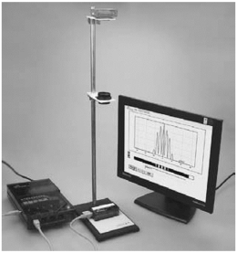

## 讲解

### 判据

资料把逐条观察条纹改为用一排光敏单元同时记录不同位置的光照。读出的光强—位置曲线，峰对应亮纹中心、谷对应暗纹中心；通过同类峰的间距仍可用双缝公式求波长。

$$\lambda\approx\frac dL\Delta x.$$

d为双缝中心距、L为双缝到传感器记录平面距离、Δx为真实空间的同类峰间距。曲线纵轴可为光强或传感器响应，峰高不是波长，横轴若是像素/单元编号，也不是未经换算的米。

### 流程

1. **对齐实际装置。** 资料装置光源在上、双缝居中、光传感器在下，光路自上而下。传感器有效长边沿条纹间距变化方向，才能依次经过亮暗，而非只沿同一条亮纹取样。
2. **确认坐标与响应。** 读取仪器是否给实际长度，还是编号/像素；按装置已有的间距或校准换成空间位置。资料未给型号、单元间距、标定数据，不能补造数值。
3. **记录光强分布。** 若可取得遮光时的背景响应，扣除背景有助辨认；避免饱和使峰顶变平，曝光/响应设置须按实际仪器而定。这些是补写的测量流程，资料没有具体操作参数。
4. **选择同类峰中心。** 双缝细条纹可能被宽包络调制，辨的是相邻细峰，不把两个包络峰当间距。用多峰总距离除间隔数，减小单峰定位波动。
5. **算Δx再求λ。** 多个同类峰从第1到第n个仍是n−1个间距。用实际L、d代入，必要时重复记录比较；峰高变化只反映光强响应，不直接说明λ变化。
6. **报告测量边界。** 空间采样过稀、背景大、峰饱和、未校准横轴都会影响间距。资料没有完整传感器定标和不确定度数据，本条不声称已验证某型号的测量精度。

### 原资料装置说明

> 以下装置图与说明来自教师版来源S06第198—203段。后面的例题来自普通双缝测量题，保留原题使用测量头的设置，用于说明相同的间距计算原理；没有把它改称传感器题。

五、创新方案：用光传感器做双缝干涉的实验

1.实验装置

光源在铁架台的最上端，中间是刻有双缝的挡板，下面是光传感器。这个实验的光路是自上而下的。

2.光传感器是一个小盒，在图中为白色狭长矩形部分，沿矩形的长边分布着许多光敏单元。这个传感器各个光敏单元得到的光照信息经计算机处理后，在显示屏上显示出来。根据显示器上干涉图像的条纹间距，从而算出光的波长。

3.这种方法除了同样可以测量条纹间距外，它还可以方便、形象地在显示屏上展示亮条纹的分布，并能定量地描绘传感器上各点的光照强度。

## 例题

> 题目与解析：第四章 光（专项训练）（解析版）.docx，来源ID S02，第308—320段。分段选取时保留该子问的完整题干、答案与解析；题目背景和原资料标注照录。

24．（24-25高二下·广东清远·期中）如图是双缝干涉实验装置的示意图，$S$为单缝，双缝$S_1$、$S_2$之间的距离是0.2mm，P为光屏，A为光屏的中央处，双缝到屏的距离为1.2m。用绿色光照射单缝$S$时，可在光屏P上观察到第1条亮纹中心与第6条亮纹中心间距为1.500cm。若相邻两条亮条纹中心间距为$\Delta x$，则下列说法正确的是（　　）

A．$\Delta x$为0.250cm

B．增大双缝到屏的距离，$\Delta x$将变大

C．改用间距为0.3mm的双缝，$\Delta x$将变大

D．换用紫光照射，光屏的中央处可能出现暗纹

**原资料答案：** B

**原资料详解：** 

A．由于第1条亮纹中心与第6条亮纹中心间距为1.500cm，则有$\Delta x=\frac{1.500}{6-1}\,\mathrm{cm}=0.300\,\mathrm{cm}$，故A错误；

B．根据双缝干涉公式有$\Delta x=\frac{L}{d}\lambda$

可知，增大双缝到屏的距离，$\Delta x$将变大，故B正确；

C．改用间距为0.3mm的双缝，即增大双缝的间距，结合上述可知，$\Delta x$将变小，故C错误；

D．屏的中央位置到双缝间距相等，光程差为0，可知，换用紫光照射，光屏的中央处仍然出现明条纹，故D错误。

故选B。

### 顺着本题再看清一步

原题用单色光和光屏，计算得到Δx=3mm、λ=500nm；若真实传感器经标定后记录到对应间距，使用同一公式。这里没有假设任何未给的传感器读数、像素尺寸或实验数据。A数错间隔，B增L使间距大，C增d使间距小，D中央同相等路径仍亮，答案B。

## 易错

- 例题六条亮纹对应五个间距，Δx=0.300cm。传感器曲线数峰也必须同样数间隔。
- 仪器输出的屏幕像素距离不能未经校准直接代Δx，计算机窗口缩放不改变实际条纹间距。
- 原资料只有传感器装置说明，没有独立传感器题和定标参数；正文将原题与补写流程分开注明。
