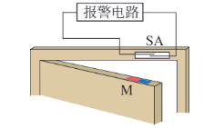
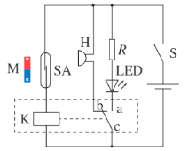
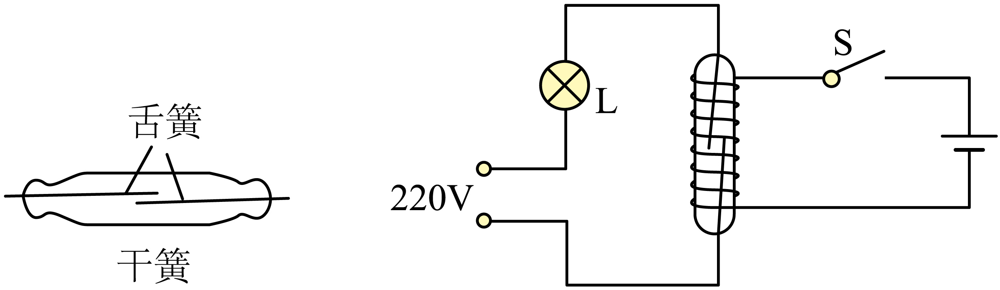

## 讲解

### 判据

磁体与门窗位置改变，干簧管通断，继电器切换提示灯和蜂鸣器。检查装置时按输入、检测、切换、报警四段逐段核对。

### 流程

1. 先单独检查资料常开干簧管：磁体靠近有足够磁场应闭合，移开应恢复分开。恒定磁场可维持闭合，原理是磁化吸引与弹性复位。
2. 按原图连控制回路，检查干簧管闭合后继电器线圈是否通电；不要只看报警支路电源是否存在。
3. 门关磁体靠近时，干簧闭合、继电器吸合，动触点c接a，LED作正常提示；门开磁体远离，控制电流断开，c回b，蜂鸣器报警。
4. 如果门开不响，逐段查干簧是否断开、继电器是否释放、c是否接b、蜂鸣器回路是否闭合。一个现象可能由不同环节造成，不能未经观察唯一指认某元件故障。

资料装置原图和工作说明如下；它没有专门的门窗数值习题，例题保留同章干簧继电器题，用来检验共同的磁控原理。

如图，在门的上沿嵌入一小块永磁体M，门框内与M相对的位置嵌入干簧管SA，并将干簧管接入报警电路。则利用干簧管在磁场中的特性，将门与门框的相对位置这一非电学量转换为电路的通断。

三、实验电路及器材

以下为门窗防盗报警装置电路图。

其中各元件作用如下：

干簧管SA→作为传感器，用于感知磁体磁场是否存在，可将磁场的存在与否转换为电路的通断，相当于一个控制开关。

继电器（虚线框部分）→作为执行装置。当继电器线圈中有电流通过时，开关与触点a接通，无电流时，开关与触点b接通，可将继电器中电流的有无转换为对指示灯和蜂鸣器电路的控制，相当于一个自动的双向开关。

发光二极管LED→作为电路正常工作提示。

电阻R→作为发光二极管的限流电阻，起保护作用。

蜂鸣器H→作为报警提醒。

闭合电路开关S，系统处于防盗状态。

当门窗紧闭时，磁体M靠近干簧管，干簧管两个簧片被磁化相吸，处于导通状态，使继电器工作，继电器的动触点c与常开触点a接通，二极管LED发光，显示电路处于正常工作状态。

当门窗开启时，磁体离开干簧管，干簧管失磁断开，继电器被断电。继电器的动触点c与常闭触点b接通，蜂鸣器H发声报警。

## 例题

> 题目与解析：第五章 传感器（单元自测·提升卷）（解析版）.docx，来源ID S08，第5—10段。分段选取时保留该子问的完整题干、答案与解析；题目背景和原资料标注照录。

1．如图所示，将一对磁性材料制成的弹性舌簧密封于玻璃管中，舌簧端面互叠，但留有间隙，就制成了一种磁控元件——干簧管，以实现自动控制．某同学自制了一个线圈，将它套在干簧管上，制成一个干簧继电器，用来控制灯泡的亮灭，如图所示．干簧继电器在工作中所利用的电磁现象不包括

A．电流的磁效应

B．磁场对电流的作用

C．磁极间的相互作用

D．磁化

**原资料答案：** ．B

**原资料详解：** 试题分析：S闭合时，控制电路接通，线圈产生磁场，舌簧被磁化，在两舌簧端面形成异名磁极，因相互吸引而吸合，于是工作电路接通．S断开时，两舌簧退磁，在弹力作用下分开，工作电路断开．故该装置中利用了电流的磁效应、磁化及磁极间的相互作用．没有利用磁场对电流的作用，故选项B正确．

### 顺着本题再看清一步

例题利用线圈磁场代替门窗永磁体，干簧的磁化、吸合与复位机制相同，所以“不包括”安培力的B。门窗报警还加了继电器常开、常闭切换，不能把例题灯与干簧直接串联的亮灭关系照搬过来。

## 易错

本装置门关时干簧闭合却蜂鸣器不响，闭合的是控制回路；报警工作支路的接点由继电器决定，二者不能省略。
