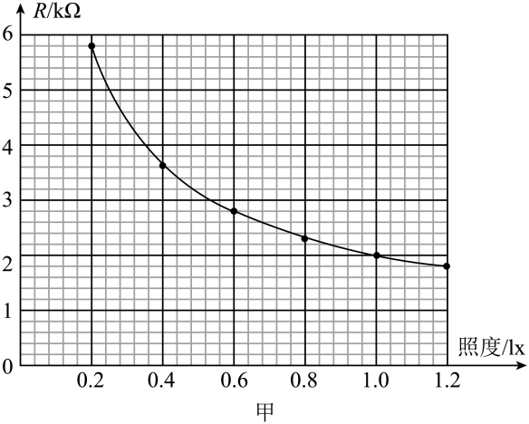
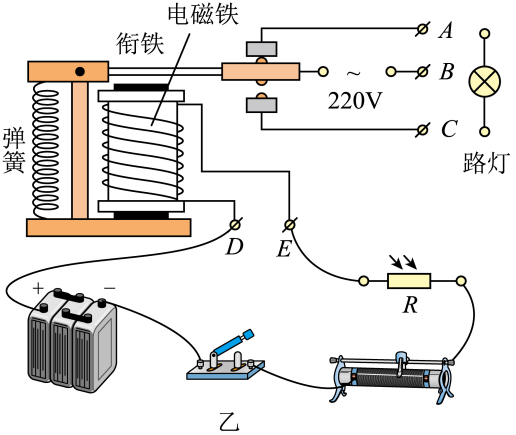
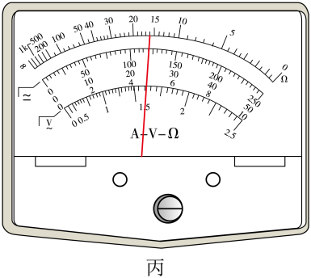

## 讲解

### 判据

给照度—阻值图、继电器吸合电流和控制电源，要求某照度触发或调得更暗才亮。先弄清“吸合点灯”还是“释放点灯”，再计算门槛。

### 流程

1. 按原图，天亮光敏阻小、控制电流大、衔铁吸下，灯应熄灭；天暗控制电流减小、衔铁释放，灯接到常闭的AB支路亮。因此此装置点灯对应释放门槛。
2. 从R—照度图读门槛光敏电阻，再求控制总电阻 $R_{\text{总}}=E/I_{\text{阈}}$；串联各电阻都要计入，特别是继电器线圈电阻。
3. 可调电阻 $R_{\text{滑}}=E/I_{\text{阈}}-R_{\text{光}}-R_{\text{线圈}}$。想更暗才亮，门槛R光更大，而总门槛固定，所以滑动电阻应减小。
4. 吸合与释放门槛若不同，分别用给定值；不能把实际继电器的迟滞自动忽略。原题只用2 mA教材门槛，按此模型计算。

原图横坐标1.2 lx处的黑点位于2.0 kΩ下方一小格，即1.8 kΩ，与原答案一致。读图要先找横坐标，再沿纵向找到曲线，最后向左读阻值，不能把邻近的2.0 kΩ粗网格线当成该点读数。

## 例题

> 题目与解析：第五章 传感器（专项训练）（解析版）.docx，来源ID S02，第332—347段。分段选取时保留该子问的完整题干、答案与解析；题目背景和原资料标注照录。

17．（24-25高二下·山东·阶段练习）为了节能环保，一些公共场所使用光控开关控制照明系统。光控开关可采用光敏电阻来控制，光敏电阻是阻值随着光的照度而发生变化的元件（照度可以反映光的强弱，光越强，照度越大，照度单位为$lx$）。

(1)若在坐标系中描绘出了阻值随照度变化的曲线，如图甲所示。由图甲可求出照度为$1.2lx$时，光敏电阻的阻值为______$kΩ$。

(2)图乙所示是街道路灯自动控制模拟电路，利用直流电源为电磁铁供电，利用照明电源为路灯供电。为达到天亮灯熄、天暗灯亮的效果，路灯应接在______（选填“$AB$”或“$BC$”）之间。

(3)用多用电表“$\times 10Ω$”挡，按正确步骤测量图乙中电磁铁线圈电阻时，指针示数如图丙所示，则线圈的电阻为______$Ω$。已知当线圈中的电流大于或等于$2mA$时，电磁继电器的衔铁将被吸合，图中直流电源的电动势$E=6V$，内阻忽略不计，要求天色渐暗照度降低至1.2lx时点亮路灯，滑动变阻器的阻值为______$Ω$；为使天色更暗时才点亮路灯，应适当地______（选填“增大”或“减小”）滑动变阻器的电阻。

**原资料答案：** (1)1.8

(2)$AB$

(3)     160     1040     减小

**原资料详解：** （1）从图像上可以看出当照度为$1.2lx$时的电阻$R=1.8kΩ$

（2）当天亮时，光敏电阻的阻值变小，所以回路中电流增大，则衔铁被吸下来，此时触片和下方接触，此时路灯应该熄灭，说明路灯接在了$AB$上。

（3）根据欧姆表的读数规则，电磁铁线圈的电阻${R}^{′}=16\times 10Ω=160Ω$

回路中的电流为$2mA$时，回路的总电阻${R}_{总}=\frac{E}{I}=\frac{6}{0.002}Ω=3000Ω$

则滑动变阻器的阻值${R}_{滑}={R}_{总}-{R}^{′}-R=1040Ω$

为使天色更暗时才点亮路灯，天色更暗时光敏电阻更大，要保证回路中的电流$2mA$不变，则应减小滑动变阻器的阻值。

### 顺着本题再看清一步

原图1.2 lx处读1.8 kΩ，即1800 Ω；线圈欧姆表读16×10=160 Ω；门槛总阻6/0.002=3000 Ω。因此滑动变阻器为3000-1800-160=1040 Ω。图中2.0 kΩ对应约1.0 lx，不能与1.2 lx的点混用。AB接点和“更暗才亮应减小滑阻”的逻辑见上述分析。

## 易错

读图不要把1.2 lx处的曲线点误读到2.0 kΩ粗网格线上；应读1.8 kΩ。计算滑动电阻时还须扣除线圈的160 Ω，不能把3000 Ω总电阻直接当作滑动电阻。另有同章题漏计线圈电阻，本条列式明确计入。
