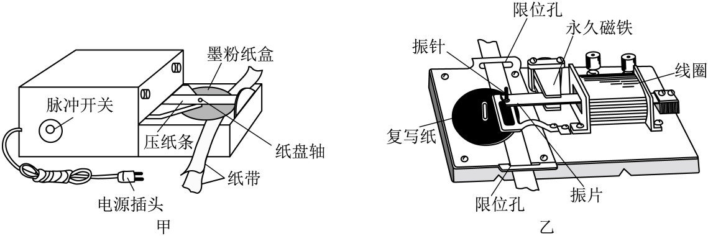
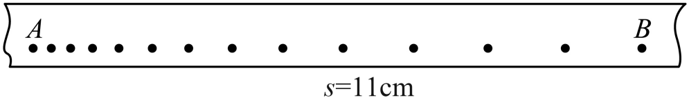

## 错法

纸带两端之间数出14个点，就乘14个周期；或者看到O到E共6个计数点，就用6T。

错在把边界点与点之间的间隔混同。经过时间发生在两个点之间，首点只是起始标记。

## 正解

沿点序画短线段，连续n个点之间只有n-1段。周期为 $T_0$ 时，两端时间为 $(n-1)T_0$。

本题AB有13个计时间隔，50 Hz对应每段0.02 s，故时间0.26 s。不能因数到了两个端点就给每个端点额外加一个周期。再用11.00 cm除这个时间，才能得到约0.42 m/s。

## 例题

> 题目与解析：高一上物理第一章  单元测试·提升卷（解析版）.docx，来源ID S14，第161—193段。题目背景与原资料标注照录。

12．（8分）打点计时器是高中物理实验中常用的实验器材，请你完成下列有关问题：

(1)如图甲、乙是两种打点计时器，电源频率为50Hz，下列说法正确的是__________；

A．甲为电磁式打点计时器，乙为电火花式打点计时器

B．甲使用电源为220V直流，乙使用8V直流

C．甲的打点间隔为0.02s，乙的打点间隔也为0.02s

(2)①从纸带上直接得到的物理量、②从纸带上测量得到的物理量、③通过计算能得到的物理量，以上①②③三个物理量分别是__________

A．时间间隔、位移、平均速度

B．时间间隔、瞬时速度、位移

C．位移、时间间隔、加速度

(3)利用打点计时器测量纸带的速度，基本步骤如下：

A．当纸带完全通过计时器后，及时关闭开关

B．将纸带从墨粉纸盘下面穿过电火花计时器

C．用手拖动纸带运动

D．接通打点计时器开关

上述步骤正确的顺序是          。（按顺序填写编号）

(4)如下图所示的纸带是某同学练习使用电火花计时器时得到的，纸带的右端先通过电火花计时器，从点迹的分布情况可以断定纸带的速度变化情况是          （选填“加速”或“减速”）。

(5)如果图中的纸带与该实验中的纸带是1∶1的比例，用刻度尺实际测量一下AB间长度为11.00cm，则可以计算出纸带的平均速度是          $\mathrm{m/s}$。（结果保留两位有效数字）

**原资料答案：** (1)C；(2)A；(3)BDCA；(4)减速；(5)0.42

**原资料详解：** （1）AB．甲为电火花打点计时器，甲使用电源为220V交流；乙为电磁式打点计时器乙使用8V交流，故AB错误；

C．电源频率为50Hz，根据

$T=\frac1f=\frac1{50}\,\mathrm s=0.02\,\mathrm s$

可知甲的打点间隔为0.02s，乙的打点间隔也为0.02s，故C正确；

故选C。

（2）从纸带上直接得到的物理量是时间间隔，从纸带上测量得到的物理量是位移，通过计算能得到的物理量是平均速度、瞬时速度和加速度。

故选A。

（3）利用打点计时器测量纸带的速度，将纸带从墨粉纸盘下面穿过电火花计时器，先接通打点计时器开关，然后用手拖动纸带运动，当纸带完全通过计时器后，及时关闭开关。故上述步骤正确的顺序是：BDCA。

（4）纸带的右端先通过电火花计时器，由图中纸带点迹的分布可知，相同时间内通过的位移逐渐减小，则纸带的速度变化情况是减速。

（5）由图中纸带可知，AB间的时间为

$t=13\times0.02\,\mathrm s=0.26\,\mathrm s$

则纸带的平均速度为

$\bar v=\frac{x}{t}=\frac{11.00\times10^{-2}}{0.26}\,\mathrm{m/s}\approx0.42\,\mathrm{m/s}$

### 顺着本题再看清一步

子问(5)原公式明确AB跨13段，时间0.26 s、速度约0.42 m/s。子问(4)要按右端先通过读先后；其余电源和操作子问依原解析保留，不能把不同条件的周期混用。
