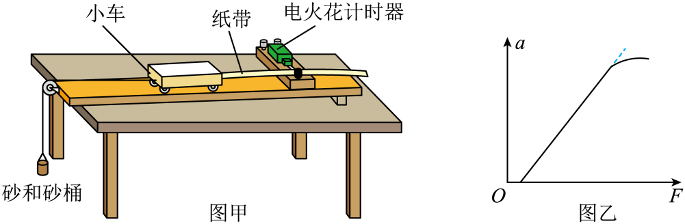
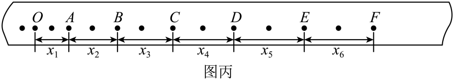

## 错法

槽码或砂桶经轻绳拉小车，就直接写“绳拉力＝槽码重力”，无论悬挂质量多大都把横轴mg当作小车实际拉力。

这把静止悬挂物的平衡条件搬到了正在向下加速的悬挂物上。轻绳、轻滑轮的理想化可以让绳的拉力传递一致，却不能让悬挂物在有加速度时仍合力为零。

## 正解

补偿小车阻力后，设小车总质量M、悬挂总质量m、绳拉力T。两物体共用加速度大小a：

$$T=Ma,\qquad mg-T=ma$$

第一式研究小车，第二式研究悬挂物，正方向分别沿各自运动方向。把两式相加消去T：

$$mg=(M+m)a,\qquad a=\frac{mg}{M+m}$$

再将a代回T＝Ma，得到T＝Mmg/(M+m)。由于悬挂物也要加速，总有一部分重力用于改变它自身的运动，拉力小于mg。

只有m远小于M，T与mg的差异才较小。以mg为基准的相对差是m/(M+m)，是否可以忽略，应与实验精度要求比较。

固定M增大m，近似关系a＝mg/M不再成立，图像会向下偏离原直线。若用力传感器直接测T，则横轴可以记录真实拉力，不需要用mg代替；其他摩擦、质量和测量条件仍需控制。

## 例题

> 题目与解析：高一上物理第四章  单元测试·基础卷（解析版）.docx，来源ID S10，第158—177段。题目背景与原资料标注照录。

11．（6分）为探究物体质量一定时加速度与力的关系，小明设计了如图甲实验装置。

(1)实验中，平衡摩擦力时，            （选填“需要”或者“不需要”）将砂及砂桶用细线绕过定滑轮系在小车上。适当垫高木板一端，轻推小车，使得小车能匀速下滑则认为平衡摩擦力。之后改变砂和砂桶质量，            （选填“需要”或者“不需要”）重新平衡摩擦力。

(2)小明根据实验数据作出图像如图乙，该图线不过原点并在末端发生弯曲，其原因是_______。（选填字母代号）

A．木板右端垫起的高度过小（即平衡摩擦力不足）

B．木板右端垫起的高度过大（即平衡摩擦力过度）

C．砂和砂桶的总质量m远小于小车及车上砝码的总质量M

D．砂和砂桶的总质量m未远小于小车及车上砝码的总质量M

(3)图丙为某次实验得到的纸带，相邻两个计数点之间的距离如图，已知交流电频率为f，则小车加速度的表达式为a=           。（用$x_{1}$、$x_{2}$、$x_{3}$、$x_{4}$、$x_{5}$、$x_{6}$及f表示）

**原资料答案：** (1) 不需要、不需要；(2)AD；(3)$\frac{(x_4+x_5+x_6)-(x_1+x_2+x_3)}{36}f^2$

**原资料详解：** （1）[1]平衡摩擦力时，不需要将砂和砂桶用细线绕过定滑轮系在小车上，只需要适当垫高木板一端，轻推小车，使得小车能匀速下滑。

[2]平衡摩擦力之后，小车所受重力的下滑分力和摩擦力平衡，之后不需要再次平衡摩擦力。

（2）AB．该图线不过原点是因为平衡摩擦力不足，导致小车一开始没有加速度，故A正确，B错误；

CD．设小车及车上砝码的总质量为M，砂和砂桶的总质量m

根据牛顿第二定律有$F=Ma$，$mg-F=ma$，解得$F=\frac{Mmg}{m+M}$

由上式可知$M\gg m$时，可以认为细绳拉力近似等于砂和砂桶的重力，即当$M\gg m$这个条件不满足时，图像发生弯曲，故C错误，D正确。

故选AD。

（3）根据逐差公式$(x_4+x_5+x_6)-(x_1+x_2+x_3)=a(3T)^2$，其中$T=2\frac1f$

解得$a=\frac{(x_4+x_5+x_6)-(x_1+x_2+x_3)}{36}f^2$

### 顺着本题再看清一步

原题第(2)问选AD。A解释图像未过原点：补偿不足，拉力先要克服残余阻力；D解释末端弯曲：悬挂质量不再远小于小车质量。B的补偿过度会给出另一类截距，不符图；C表示近似有保障，不能解释末端偏离。第(1)问只改变砂桶时两空“不需要”；第(3)问按图中每两个打点周期取一个计数点，用T＝2/f和逐差法得到原答案，不能用1/f。
