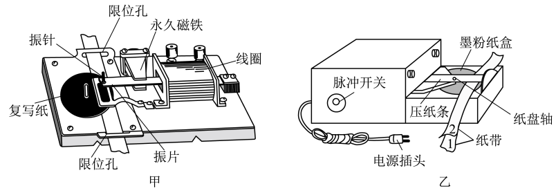

## 讲解

### 是什么

电火花计时器通过脉冲放电和墨粉纸盘，在运动纸带上留下点迹。本章仪器使用220 V交流电源，50 Hz时相邻计时点间隔0.02 s。

它与电磁式都是记录等时间间隔的仪器，不是直接读取速度的传感器；不同的是打点机制和所用电源。

### 怎么来的

启动电源及脉冲装置后，放电针、墨粉纸盘与纸盘轴之间发生火花放电，墨粉在纸带相应位置留下点。纸带继续运动，重复的脉冲便留下连续点迹。

周期由频率确定，$T=1/f$。点之间的距离由纸带在这个周期内的运动决定，而不是由脉冲的大小直接决定。固定打点时间是后续比较间距、计算运动量的基础。

### 什么时候能用

按本章所示装置，把纸带放在正确路径，先通电稳定、再运动纸带，记录完成后及时断电。电源数值与型号相关，识别图时看墨粉纸盘、脉冲装置等结构。

纸带上可选择每隔4个未画出的计时点取一个计数点；此时两计数点间有5个周期，不是一个周期。

## 例题

> 题目与解析：高一上物理第一章  单元测试·基础卷（解析版）.docx，来源ID S10，第142—152段。题目背景与原资料标注照录。

11．（6分）打点计时器是高中物理实验中常用的实验器材，下图为两种打点计时器，请你完成下列有关问题。

(1)乙图是______打点计时器（选填字母）。

A．电磁打点计时器

B．电火花打点计时器

(2)在打点计时器打出的纸带上，可以直接得到的物理量是______（单选）。

A．时间间隔

B．位移

C．加速度

D．平均速度

**原资料答案：** (1)B；(2)A

**原资料详解：** （1）乙图是电火花打点计时器。

故选B。

（2）在打点计时器打出的纸带上，可以直接得到的物理量是时间间隔；位移需要用刻度尺测量，加速度和平均速度需要通过计算得到。

故选A。

### 顺着本题再看清一步

图乙墨粉纸盘、脉冲装置表明它是电火花式，(1)选B；(2)选时间间隔A，位移、加速度、平均速度分别要测量或计算。

## 易错

- **火花式220 V直流**：资料要求交流。
- **每两个画出的大点都相隔0.02 s**：可能是计数点，先读漏画数量。
- **先拉后通电**：开始点迹不稳定，顺序须改。
