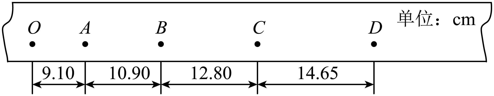

## 讲解

### 判据

用小车、纸带和打点计时器研究“速度怎样随时间变化”，需要把纸带的离散位置转成对应时刻的速度，再作v-t图像判断变化规律。间距增大只能说明越来越快；是否匀加速，要进一步看等时间位移差或速度图线。

### 流程

**安装并获得可测纸带。** 小车拖动纸带、由槽码牵引；释放前尽量靠近打点计时器，先接通电源再释放，以免丢失开始运动的有效点。让纸带沿运动方向顺畅通过，防止牵扯和摩擦突变影响运动。计时器用本题电火花器材的交流电源，操作按设备要求。

**选清晰段并定义计数点。** 不必从第一个拥挤点开始，但选定第一计数点为时间零后，其初速度不一定为零。相邻计数点之间还有4点，跨5个打点周期，0.02×5=0.10 s；时间来自打点间隔，实验不另用秒表。

**对每个中间点求瞬时速度。** 目标点前后各取一等时段，总距离除2T。按恒加速度模型，中间时刻速度等于该对称段平均速度；未先确认模型时，这是短段估计。原题B点前后AB、BC共10.90+12.80 cm，除0.20 s得到1.185 m/s，保留三位有效数字1.19。

**整理时刻—速度并拟合。** 以选定计数点为时间零，把各个v对应到中间点的时刻，在v-t坐标中描点。若点列近似沿直线分布，用一条能反映总体趋势的直线拟合，让点大致分布在两侧；斜率(较远两点的Δv)/(Δt)给a。不要逐点折线连接后把每段斜率当真实加速度，也不要为凑直线随意删点。

**用逐差法交叉核验。** 本题四段长度s₁至s₄，先把两段合成等时大段比较：

$$a=\frac{(s_3+s_4)-(s_1+s_2)}{4T^2}$$

因为两大段各历时2T，分母为(2T)²。原题得到约1.86 m/s²。相邻差1.80、1.90、1.85 cm接近一致，支持近似匀加速；微小差别来自测量和实验误差。图像与差分结论若冲突，应回查时间、单位、段号与异常操作。

## 例题

> 题目与解析：第二章  匀变速直线运动的研究（知识清单）（答案版）.docx，来源ID S06，第416—427段。题目背景与原资料标注照录。

【例13】桂林市某学校物理校本课兴趣小组在“探究小车做匀变速直线运动的规律”的实验时，要用到电火花打点计时器，已知其打点周期为$T=0.02\,\mathrm{s}$；

(1)该兴趣小组安装好实验装置后，开始实验。实验中以下操作必需且正确的是________。

A．先释放小车，后接通电源

B．在释放小车前，小车应尽可能靠近打点计时器

C．用秒表测量小车运动的时间

(2)某次实验中，他们用该打点计时器记录了被小车拖动的纸带的运动情况，在纸带上确定了O、A、B、C、D共5个计数点，相邻点间的距离如图所示，每两个相邻计数点之间还有四个点未画出。试根据纸带上各个计数点间的距离：

①计算出打下B点时小车的瞬时速度大小为　　　　m/s（计算结果保留三位有效数字）。

②计算出小车的加速度大小为　　　　${m/s}^{2}$（计算结果保留三位有效数字）。

**原资料解析：** （1）为了充分的利用纸带，应该先接通电源，后释放小车，在释放小车前，小车应尽可能靠近打点计时器，故B正确，A错误；时间可以通过打点计时器在纸带上打出的点得出，不需要用秒表测量小车运动的时间，故C错误。

（2）①根据题意可知纸带上相邻计数点的时间间隔$t=5T=0.1\,\mathrm{s}$，根据中间时刻的瞬时速度等于该过程平均速度可得${v}_{B}=\frac{10.90+12.80}{2\times 0.1}\times {10}^{-2}m/s\approx 1.19\,\mathrm{m/s}$；

②根据逐差法可得加速度$a=\frac{12.80+14.65-(9.10+10.90)}{4\times {0.1}^{2}}\times {10}^{-2}{m/s}^{2}\approx 1.86{m/s}^{2}$。

### 顺着本题再看清一步

**原题答案：** (1)B；(2)①1.19 m/s；②1.86 m/s²。源段416又重复插入上一题A—E示意图，该图不对应本题O—D数值；正文省去此误插图，计算依据为题目所指O、A、B、C、D图及其9.10、10.90、12.80、14.65 cm。

逐项看操作：先电后车使计时器进入稳定打点状态，A反了；靠近计时器能记录较长的有效运动，B成立；每次点间隔已给时间，C不必。vB要用AB+BC，不能只用AB。加速度把后两段与前两段比较，并先把cm换m：[(12.80+14.65)−(9.10+10.90)]×10⁻²/[4×0.1²]=1.8625 m/s²，按三位有效数字取1.86。

## 易错

- A先释放后通电会丢掉开始阶段，B靠近计时器可增加有效纸带，C秒表并非必需计时工具；原题操作选B。
- 本题图的数值是相邻段长度，另一原例d₁至d₄却是从A起的累计距离，要先看箭头含义。
- 拟合线不必经过原点，选择的时间零处小车可能已经有速度；不应强行让它满足v₀=0。
