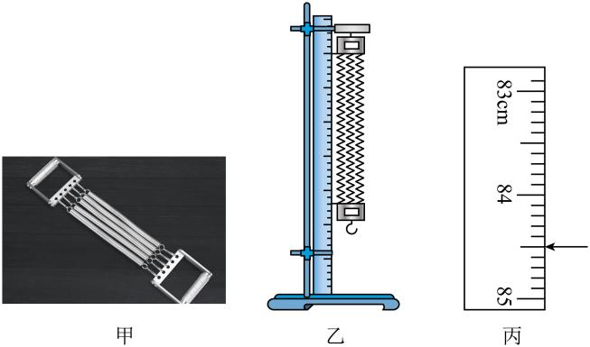

## 讲解

### 判据

实验要求建立弹簧弹力与伸长量的关系，或由弹簧长度及挂重反求劲度系数时，要分别测“力”和“形变量”，再观察F-x关系。不能只测总长、挂重后直接猜正比。

### 流程

**先设长度基准。** 使用轻质弹簧，竖直悬挂、未加钩码时测自由下垂长度l₀；以同一姿态测有载长度l。形变量为x=l−l₀。这样减去同一装置的基准，也能减少不一致姿态带来的系统偏差。

**用静止状态确定力。** 逐次挂不同已知质量钩码，待静止后测长。轻弹簧、单钩码模型中，弹力F=mg；未静止时拉力还与加速度相关，不能仅用mg。避免超弹性限度，卸载后观察是否能恢复，防止把永久伸长当线性弹性。

**每组一一配对并换单位。** 记录质量、力、当前长度、伸长量；质量kg、长度m、力N。同一组的F不能配到另一组x。至少多组数据才能判断关系，不能凭一组F/x声称已验证胡克定律。

**描点、拟合、求斜率。** 横轴x、纵轴F，选统一尺度；线性范围近似直线，k=ΔF/Δx、单位N/m。若横轴用了总长l，直线横截距应为l₀，不能强迫过原点。实测点未必全在直线上，要看总体趋势，查明显异常原因，不能随意删点凑规律。

**多弹簧原题用增量处理。** 拉力器有5根相同并列弹簧，共同伸长Δx；新增10 kg负重时，新增弹力总量mg由5根分担：

$$mg=5k\Delta x,\qquad k=\frac{mg}{5\Delta x}$$

资料中下指针从60.00 cm到84.50 cm，新增伸长24.50 cm。这里不是把加载后的总长度当x；初始手柄作用若已使弹簧伸长，用前后状态作差即可消去不变的初始负担。原式中的F据此理解为新增弹力总量，而非每根弹簧全部受力。

**核验测长条件。** 上指针固定在10.00 cm，前后下指针之差才等于每根新增伸长；若上端也移动，应分别算两次上下刻度差再相减。

## 例题

> 题目与解析：高一上物理第三章  单元测试·基础卷（解析版）.docx，来源ID S10，第130—140段。题目背景与原资料标注照录。

11．（6分）为了全面提升学生体质健康水平，培养终身运动的习惯。某学校准备购买一批健身器材，图甲是一款健身房中常用的拉力器，该拉力器由两个手柄和5根完全相同的长弹簧组成。为了测量该拉力器中长弹簧的劲度系数，某同学设计了如下实验步骤：

（1）在铁架台上竖直固定一刻度尺，将该拉力器竖直悬挂在旁边，拉力器两侧手柄上固定有刻度线指针，如图乙所示（乙图仅为拉力器的示意图，拉力器实际有5根完全相同的长弹簧），调整好装置，待拉力器稳定后，上方指针正好与刻度尺$x_1=10.00\,\mathrm{cm}$处刻度线平齐，下方指针正好与$x_2=60.00\,\mathrm{cm}$处刻度线平齐。

（2）在拉力器下挂上m=10kg的负重，稳定后拉力器下方指针所指刻度如图丙所示，则刻度尺的读数$x_{3}$=       cm。

（3）在（2）中的负重下，每根弹簧（5根完全相同的长弹簧忽略自重）的形变量Δx=           cm。

（4）通过查阅相关资料得知，云南省大部分地区的重力加速度约为$9.78\,\mathrm{m/s^2}$，则每根长弹簧的劲度系数k=           N/m（结果保留3位有效数字）。

**原资料答案：**     （2） 84.50    （3） 24.50    （4） 79.8

**原资料详解：** （2）[1]由图丙可知，刻度尺的读数为$x_3=84.50\,\mathrm{cm}$

（3）[2]在（2）中的负重下，每根弹簧（5根完全相同的长弹簧忽略自重）的形变量为$\Delta x=x_3-x_2=84.50\,\mathrm{cm}-60.00\,\mathrm{cm}=24.50\,\mathrm{cm}$

（4）[3]根据受力平衡和胡克定律可得$mg=F=5k\Delta x$

解得每根长弹簧的劲度系数为$k=\frac{mg}{5\Delta x}=\frac{10\times9.78}{5\times0.245}\,\mathrm{N/m}\approx79.8\,\mathrm{N/m}$

### 顺着本题再看清一步

**原题答案：** 刻度84.50 cm，新增形变量24.50 cm，每根k=79.8 N/m。图中1 cm分成10格，读数按mm刻度估读并以cm记成84.50。上端前后不变，伸长增量84.50−60.00=24.50 cm=0.2450 m。新增负重97.8 N，单根分担19.56 N，故k=19.56/0.2450≈79.8 N/m。由装置先辨5根共同工作，再取长度增量，才能避免两处变量混淆。

## 易错

- 84.50 cm是尺上位置，不是弹簧长，更不是形变量。
- 每根弹簧分担总新增负重的五分之一，不能拿mg直接除单根Δx而漏因数5。
- 原装置初始长50.00 cm不必等于轻弹簧自然原长；本题以负重前后增量求k，无需自行假设手柄没有重力。
