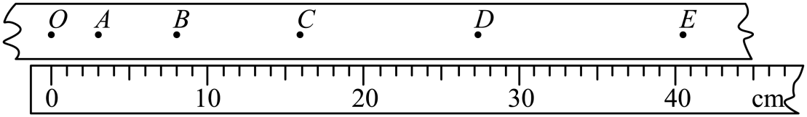

## 讲解

### 判据

纸带题给电源频率、两计数点之间省略的计时点，要求时间或速度时，先恢复真正的时间间隔。图上画了几个大点，不等于经历几个周期。

### 流程

**先求相邻计时点周期。** $T_0=1/f$；50 Hz时为0.02 s。

**再把漏画点换成间隔。** 相邻两个计数点之间还有4个计时点，沿点序走过5段，所以计数点间隔 $T=5T_0=0.10\ \mathrm s$。

**然后数目标段包含几个计数间隔。** O、A、B、C、D、E共6个计数点，OE跨5段，时间 $5T=0.50\ \mathrm s$；AC跨2段，时间 $2T=0.20\ \mathrm s$。

**最后配同段位移。** 不能把OE位移配AC时间，也不能因题目画6个点就用6T。时间决定后才有可靠的速度计算。

## 例题

> 题目与解析：高一上物理第一章  单元测试·基础卷（解析版）.docx，来源ID S10，第153—166段。题目背景与原资料标注照录。

12．（8分）某同学在“用打点计时器测速度”的实验中，得到如图所示的纸带，按照打点的先后顺序，纸带上的计数点依次用O、A、B、C、D、E表示，每两个相邻的计数点之间还有4个计时点没画出来。

(1)电火花计时器使用           V的           电源（填“交流”或“直流”）。

(2)由图可以知道，纸带做的是           （填加速、减速或匀速）直线运动。

(3)小车经过OE段的平均速度是           m/s（结果保留1位小数），小车经过B点时的速度是           m/s（结果保留1位小数）。

**原资料答案：** (1)  220     交流；(2)加速；(3)     0.8     0.7

**原资料详解：** （1）[1][2]电火花计时器使用220V的交流电源。

（2）由于间距逐渐变大，所以纸带做的是加速直线运动。

（3）两点的时间间隔

$T=5\times\frac1{50}\,\mathrm s=0.10\,\mathrm s$

小车经过$OE$段的平均速度是

$\bar v=\frac{x_{OE}}{5T}=\frac{40.5\times10^{-2}}{5\times0.1}\,\mathrm{m/s}\approx0.8\,\mathrm{m/s}$

小车经过B点时的速度是

$v_B\approx\frac{x_{AC}}{2T}=\frac{(16.0-3.0)\times10^{-2}}{2\times0.1}\,\mathrm{m/s}\approx0.7\,\mathrm{m/s}$

### 顺着本题再看清一步

(1)220 V交流；(2)按点的先后间距增大，判加速；(3)OE用0.50 s，AC用0.20 s，原结果分别0.8 m/s、B点约0.7 m/s。B点速度使用相邻等时段平均作估计，不是所有变速运动都能精确等同。

## 易错

- **漏画4点就用4个周期**：两端之间有5个间隔。
- **6个计数点就6T**：只有5个间隔。
- **OE与AC时间混用**：目标段不同。
