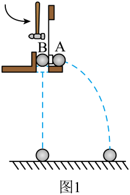
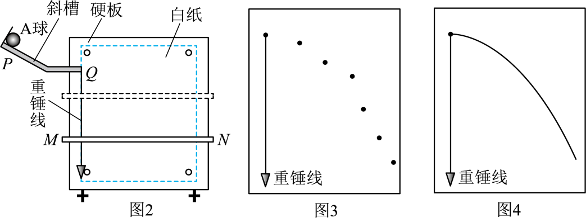
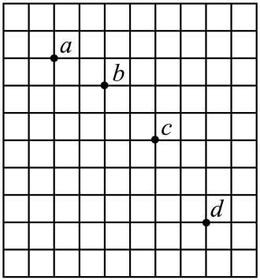

## 讲解

### 判据

同一高度、同时释放，一球有水平初速、另一球竖直初速为零自由下落，用落地先后比较两者竖直运动。要说明被控制的是高度、释放时刻和竖直初速度，改变的是平抛球的水平初速度。

同时落地支持竖直分运动与水平初速度无关；它不能单独证明平抛球的水平速度恒定。要检验水平运动，需要等时间的水平位置变化或另一个水平匀速参照。

### 流程

1. **把装置调到同条件。** 两球从相同高度出发，平抛球初速水平，因此两者竖直初速都为零；敲击机制使释放尽量同时。若高度或释放时刻不同，声音比较失去对应关系。
2. **重复改变水平初速度和共同高度。** 每次仍只听到一次落地声，在实验分辨率内支持落地同时。改变高度是在改变竖直运动时间范围，改变敲击力度是在改变水平运动。
3. **说明证据能回答什么。** 配合自由落体参照和重力模型，可以说明竖直分运动具有自由落体特点；没有测水平距离与时间，就不能从同声证明水平匀速。
4. **记录轨迹时保持可重复条件。** 斜槽末端水平保证水平抛出；同位置静止释放保证相近初速；硬板竖直才能准确记录竖直平面轨迹。斜槽有稳定摩擦不妨碍重复取得相同初速，不要求把摩擦彻底消除。
5. **检查异常点。** 固定水平位置处，水平初速偏大意味着到该位置时间更短、下降更少，点会偏在正常轨迹上方。释放更高或带额外初速都可能造成这种偏差，其他条件也须逐项检查。
6. **从等水平间隔位置求速度。** 平抛水平匀速使等水平间隔对应等时间T；竖直相邻位移差为gT²。先求T，再求水平速度，竖直瞬时速度用两侧位置间的平均速度，因为竖直为恒加速度。

实验结论都带装置条件和测量分辨率；“只听到一下”不是任意高度和任意受力情况下的普遍证明。

## 例题

> 题目与解析：高一下物理第五章  单元测试·基础卷（解析版）.docx，来源ID S10，第148—180段。题目背景与原资料标注照录。

12．（10分）某同学探究平抛运动的特点。

(1)用如图1所示装置探究平抛运动竖直分运动的特点。用小锤打击弹性金属片后，A球沿水平方向飞出，同时B球被松开并自由下落，比较两球的落地时间。多次改变A、B两球释放的高度和小锤敲击弹性金属片的力度，发现每一次实验时都只会听到一下小球落地的声响，由此      说明A球竖直方向分运动为自由落体运动，      说明A球水平方向分运动为匀速直线运动。（选填“能”或“不能”）

(2)用如图2所示装置研究平抛运动水平分运动的特点。将白纸和复写纸对齐重叠并固定在竖直硬板上。A球沿斜槽轨道PQ滑下后从斜槽末端Q飞出，落在水平挡板MN上。由于挡板靠近硬板一侧较低，钢球落在挡板上时，A球会在白纸上挤压出一个痕迹点。移动挡板，依次重复上述操作，白纸上将留下一系列痕迹点。

①下列操作中，必要的是      。

A．通过调节使斜槽末段保持水平

B．每次需要从不同位置静止释放A球

C．通过调节使硬板保持竖直

D．尽可能减小A球与斜槽之间的摩擦

②某同学用图2的实验装置得到的痕迹点如图3所示，其中一个偏差较大的点产生的原因，可能是该次实验      。

A．A球释放的高度偏低

B．A球释放的高度偏高

C．A球没有被静止释放

D．挡板MN未水平放置

(3)在“探究平抛运动的特点”的实验中，用一张印有小方格的纸记录轨迹，小方格的边长$L=1.6\,\mathrm{cm}$，若小球在平抛运动中的几个位置如图中的a、b、c、d所示，小球在b点的速度大小为      。（结果取两位有效数字，g取10m/$\mathrm{s}^{2}$）

**原资料答案：** (1)     能     不能;；(2)     AC     BC；(3)1.0m/s

**原资料详解：** （1）[1]B做自由落体运动，A做平抛运动，多次改变A、B两球释放的高度和小锤敲击弹性金属片的力度，发现每一次实验时都只会听到一下小球落地的声响，表明两球下落高度相同时，下落的时间也相同，由此能够说明A球竖直方向分运动为自由落体运动；

[2]改变小锤敲击弹性金属片的力度，A球平抛运动的初速度大小不一样，由于不能够确定时间与速度的具体值，即也不能确定水平位移的大小，因此不能说明A球水平方向分运动为匀速直线运动。

（2）①[1]

A．为了确保小球飞出的初速度方向水平，实验中需要通过调节使斜槽末段保持水平，故A正确；

B．由于实验需要确保小球飞出的初速度大小一定，则实验时每次需要从同一位置静止释放A球，故B错误；

C．小球平抛运动的轨迹位于竖直平面，为了减小误差，准确作出小球运动的轨迹，实验时，需要通过调节使硬板保持竖直，故C正确；

D．实验时每次小球均从斜槽同一高度静止释放，小球克服阻力做功相同，小球飞出的初速度大小相同，因此斜槽的摩擦对实验没有影响，故D错误。

故选AC。

②[2]根据图像可知，偏差较大的点位于正常轨迹点的上侧，表明该点水平方向的速度比其它点的水平速度大，可知有可能是小球释放是没有被静止释放，释放时有一定的初速度，或者小球释放位置偏高。

故选BC。

（3）竖直方向根据$\Delta y=y_{bc}-y_{ab}=L=gT^2$

可得$T=\sqrt{\frac{1.6\times10^{-2}}{10}}\,\mathrm s=0.04\,\mathrm s$

水平方向根据$x=2L=v_0T$

可知小球的水平分速度为$v_0=\frac{2\times1.6\times10^{-2}}{0.04}\,\mathrm{m/s}=0.8\,\mathrm{m/s}$

小球在b点的竖直速度大小为$v_{yb}=\frac{y_{ac}}{2T}=\frac{3\times1.6\times10^{-2}}{2\times0.04}\,\mathrm{m/s}=0.6\,\mathrm{m/s}$

则小球在b点的速度大小为$v_b=\sqrt{v_0^2+v_{yb}^2}=\sqrt{0.8^2+0.6^2}\,\mathrm{m/s}=1.0\,\mathrm{m/s}$

### 顺着本题再看清一步

方格边长L＝1.6 cm＝0.016 m。图中相邻点的水平距离都为2L，故经历同一时间T；竖直位移依次为L、2L、3L，相邻差为L。

$$gT^2=L,\quad T=\sqrt{0.016/10}=0.04\,\mathrm s$$

水平速度v_x＝2L/T＝0.8 m/s。b点是a、c的时间中点，在竖直恒加速度运动中，用a到c的平均竖直速度求b点瞬时竖直速度：

$$v_{yb}=\frac{L+2L}{2T}=\frac{0.048}{0.08}=0.6\,\mathrm{m/s}$$

再合成得v_b＝√(0.8²+0.6²)＝1.0 m/s。a点不是抛出点，不能把a到b的竖直位移直接当作从零初速开始的自由落体位移。

第(2)问②的D项不符合原图所示单点偏高的标准解释，原题选BC；实际异常点还应检查挡板、描点与释放误差，不能凭一张图唯一认定某个操作失误。

## 易错

原题第(1)问为“能、不能”，不能从同声把两个方向的运动都证明。第(2)问①选AC，B破坏同初速，D不是必要条件；②选BC。原详解“斜槽摩擦没有影响”指稳定摩擦不妨碍同初速重复，摩擦变化仍会造成误差。
