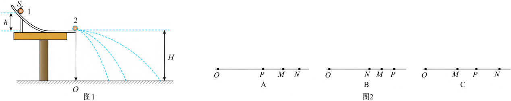

## 讲解

### 判据

验证动量守恒需独立测出同一系统碰前后质量与有符号速度，比较总动量。不能先用动量守恒算未知速度，再拿这个速度“验证”同一规律。

斜槽平抛方案把共同飞行时间约去，用水平射程比例代替速度比例；气垫导轨/光电门方案用挡光片长度除挡光时间估计局部速度。两种都要先保证对应模型。

### 流程

1. **减小外冲量并固定入射条件。** 斜槽末端水平、两球等半径使碰撞对心；m₁＞m₂有助于避免入射球反弹。入射球每次从同一位置由静止释放，使碰前速度重复一致；不要求斜槽全部无摩擦，只需重复条件稳定。

2. **测量必要量。** 天平量m₁、m₂，重锤线定抛出点正下方O，重复落点取中心位置P、M、N。测OP、OM、ON，不把两落点间距离当其中一个射程。

3. **把射程转成速度关系。** 同一水平出口、相同落差给共同t＝√(2H/g)，碰前v₀＝OP/t，碰后v₁＝OM/t、v₂＝ON/t。代动量式后乘t：

$$m_1OP=m_1OM+m_2ON$$

所以为比较动量，不必实际测H或释放高度h，只须保证共同落差与水平出口；图中必要操作CD。

4. **比较误差与进一步判断。** 使用重复测量、实际长度和质量计算两侧是否在误差内相等，不强求读数逐字相等。本题若再验证弹性，利用已成立的动量式和动能式，可得v₀+v₁＝v₂，乘共同t得到OP+OM＝ON。

5. **其他测速方法说明。** 光电门v≈d/Δt，d为挡光片实际沿运动方向宽度；有限挡光期间是平均速度，片足够窄才近似碰前后瞬时值，量质量时含附件。气垫轨要调水平，碰撞短时比较的是整个系统，不能只量其中一个滑块。

## 例题

> 题目与解析：高二上物理第一章  动量守恒定律·基础通关卷（解析版）.docx，来源ID S13，第188—211段。分段选取时保留该子问的完整题干、答案与解析；题目背景和原资料标注照录。

12．（8分）用如图1所示的装置进行实验，让两个小球在斜槽末端对心碰撞可以验证动量守恒定律。图1中的$O$点为小球抛出点在记录纸上的垂直投影。实验时，先使球1多次从斜槽上位置$S$由静止释放，确定其平均落地点，记为$P$。然后，把半径相同的球2置于水平轨道的末端，再将球1从位置$S$由静止释放，与球2相碰，重复多次，分别确定碰后球1和球2的平均落地点，记为$M$和$N$，分别测出$O$点到平均落地点的距离$OM$、$OP$、$ON$。测得球1的质量为$m_1$，球2的质量为$m_2$，已知$m_1>m_2$。（$P$、$M$、$N$在图中未画出）

(1)下列实验步骤中必要的是__________。（选填选项前的字母）

A．测量球1静止释放的高度$h$

B．测量抛出点距地面的高度$H$

C．检验斜槽末端是否水平

D．利用重锤线确定$O$点的位置

(2)a.完成上述实验，图2中平均落地点的位置可能正确的是__________。

b.在误差允许范围内，若关系式__________成立（用题中已知字母表示），说明两球碰撞前后动量守恒。

(3)某次实验时先将球1从斜槽上位置$S$静止释放，确定球1平均落地点$P$。然后将球2放在斜槽末端，发现球2沿斜槽向左滚动，于是调整斜槽末端水平，调整后斜槽末端离地面高度跟原来相同。从斜槽上位置$S$静止释放球1，与球2碰撞后，确定两球平均落地点$M$和$N$。若不考虑调整斜槽引起小球在空中运动时间的微小变化，则$m_1OP$__________$m_1OM+m_2ON$。（选填“>”“=”或“<”）

(4)某同学进一步研究两球是否发生弹性碰撞，只需要验证满足__________（需只用$OP$、$OM$、$ON$写出表达式）条件，则说明两球的碰撞为弹性碰撞。

**原资料答案：** (1)CD；(2)     C     $m_1OP=m_1OM+m_2ON$；(3)$<$；(4)$OP+OM=ON$

**原资料详解：** （1）AB．球1从斜槽上同一位置$S$由静止释放，到达斜槽末端速度相同；小球离开斜槽后做平抛运动，下落高度相同，运动时间$t=\sqrt{\frac{2H}{g}}$相同，速度$v=\frac xt$，动量守恒式中$t$可约去，用$x$代替$v$，因此不需要测量释放高度$h$和抛出点高度$H$，故AB错误；

C．为了确保小球做平抛运动，即实验前，调节装置，使斜槽末端水平，故C正确；

D．$O$是抛出点在纸上的垂直投影，是测量射程的基准点，必须用重锤线确定$O$点位置，故D正确。

故选CD。

（2）[1]设碰撞前入射球速度$v_0=\frac{OP}{t}$，碰撞后球1速度小于$v_0$，射程小于$OP$；碰撞后球2速度大于碰撞后球1速度，射程大于$OM$，因此落地点顺序可能为$MPN$。

故选C。

[2]碰撞后入射球速度$v_1=\frac{OM}{t}$，被碰球速度$v_2=\frac{ON}{t}$，代入动量守恒定律$m_1v_0=m_1v_1+m_2v_2$

可得验证的表达式应为$m_1OP=m_1OM+m_2ON$

（3）调整斜槽前，斜槽末端不水平，球1抛出时初速度水平分量小于球1的初速度大小，在空中运动时间$t_0$不变，则$OP=v_{0\text{水平}}t_0$

动量守恒要求$m_1v_0t_0=m_1OM+m_2ON$，因此$m_1OP=m_1v_{0\text{水平}}t_0<m_1v_0t_0=m_1OM+m_2ON$

故填$<$。

（4）若碰撞过程为弹性碰撞，还应满足$\frac12m_1v_0^2=\frac12m_1v_1^2+\frac12m_2v_2^2$

联立$m_1OP=m_1OM+m_2ON$，$v_0=\frac{OP}{t}$，$v_1=\frac{OM}{t}$，$v_2=\frac{ON}{t}$

解得$OP+OM=ON$

### 顺着本题再看清一步

第(1)问CD，AB的高度不必测，但共同落差和水平出口不能省。第(2)问图C落点O、M、P、N满足入射球减速且被碰球可在最远；验证m₁OP＝m₁OM+m₂ON。

第(3)问原先球2向左滚说明出口原先沿右向上倾斜；初速水平分量小于速率，题目又要求忽略飞行时间差，并保持出口高度及释放位置条件，原OP低估对应速率。调整后碰撞射程账更大，故m₁OP＜m₁OM+m₂ON。这个误差结论保留原题的忽略时间差条件，不作为任意斜槽调整的通用方向。

第(4)问先有动量守恒，再用弹性动能式因式分解：m₁v₀²−m₁v₁²＝m₂v₂²，m₁(v₀−v₁)＝m₂v₂，除去共同非零项得v₀+v₁＝v₂，所以OP+OM＝ON。原图与全部子问详解保留。

## 易错

出口不水平会破坏平抛共同时间模型；弹性额外条件不能替代动量验证；只比较速度之和在质量不等时错误；测量不使用待验证公式反求速度。
