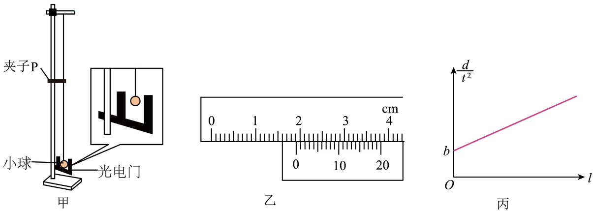

## 讲解

### 判据

光电门直接记录遮光时间，用已测的有效遮光长度除以时间估计通过时速率，再与独立测得的高度差比较机械能。遮光时间是通过光束的局部时间，不是整个下落时间。

用小球遮光时，要让光束尽量经过球心，使有效遮光长度接近直径d；用窄遮光条时，长度取沿运动方向的遮光宽度。装置变化，几何测量量也要变化。

### 流程

1. **先量遮光尺寸。** 本题游标卡尺测球直径d，毫米单位换成米后再代能量公式；读数由主尺与游标对齐刻度相加，不把小球半径代成直径。
2. **确定真实下降高度。** l是夹子到球上端的绳长，不是球心转动半径。水平释放到最低点，球心下降h＝l+d/2，球的半径不能漏。
3. **用遮光测速度。** v约等于d/t。遮光路程相对轨道半径足够小，短时间平均速率可估计最低点瞬时速率；有加速度时不是任意长遮光区间都严格等于瞬时值。
4. **独立比较能量。** mg(l+d/2)与(1/2)m(d/t)²比较，约去m。这里速度由光电门测量得到，不由势能换算得到，避免循环验证。
5. **把关系变成可检验直线。** 在d固定、改变l的实验中，将能量式两边乘2、再除d，得到d/t²＝(2g/d)l+g。纵轴d/t²、横轴l，截距为g，斜率为2g/d。
6. **解释动能偏大的测量可能。** 若光束低于球心，遮光有效弦长小于直径，仍用d/t会把速度估大，平方后动能也偏大。不能只用v＝ωr说移动光束改变了球心的转动半径；原解析这种说法不足以说明误差。

本题采用小球近似质点、绳不可伸长、悬点固定和阻力可忽略的模型。有限球径的影响先体现在h的几何项和遮光长度，不用自造一个转动动能数据。

## 例题

> 题目与解析：高一下物理第八章  单元测试·提升卷（解析版）.docx，来源ID S14，第176—190段。题目背景与原资料标注照录。

12．（9分）某同学用如图甲装置验证机械能守恒定律，上端固定在铁架台顶部，下端系一小球，小球自然下垂位置处固定一光电门，$P$是可移动的夹子，已知当地重力加速度为$g$。

(1)用游标卡尺测得小球的直径$d$如图乙，则$d=$          mm；用毫米刻度尺测得夹子下端到小球上端的细线长度为$l$。

(2)将细线水平拉直，使小球从与夹子下端等高处由静止释放，记录小球通过光电门的遮光时间$t$，则小球通过最低点时的速度大小$v=$          （用所测物理量符号表示）；

(3)本实验中，满足关系式          ，则验证了机械能守恒（用所测物理量符号表示）；

(4)移动$P$的位置多次实验，将实验数据描绘在$\frac d{t^2}-l$坐标平面上得到如图丙所示的图线。已知图线的纵截距为$b$，当满足$b=$          时，则验证了机械能守恒；

(5)实验中发现小球动能的增加量总是大于势能的减少量，可能的原因是          （写出一个即可）。

**原资料答案：** (1)19.25；(2)$\frac dt$；(3)$\frac d{t^2}=\frac{2g}{d}l+g$；(4)g；(5)能是光电门放置的位置偏低

**原资料详解：** （1）根据游标卡尺的测量原理，$d=1.9\,\mathrm{cm}+0.05\,\mathrm{mm}\times5=19.25\,\mathrm{mm}$

（2）根据光电门的测量原理，小球的瞬时速度为$v=\frac dt$

（3）若机械能守恒，小球下降时的重力势能转化为动能，有$mg\left(l+\frac d2\right)=\frac12mv^2=\frac12m\left(\frac dt\right)^2$

整理后，有$\frac d{t^2}=\frac{2g}{d}l+g$

（4）根据公式$\frac d{t^2}=\frac{2g}{d}l+g$

当$b=g$时满足机械能守恒。

（5）可能是光电门放置的位置偏低，根据公式$v=\omega r$可知，圆周运动时离圆心越远，线速度越大，会使得光电门测得的速度偏大，动能偏大。

### 顺着本题再看清一步

直径19.25 mm，代入能量计算时写0.01925 m。原题第(2)问v≈d/t；第(3)问由

$$mg\left(l+\frac d2\right)=\frac12m\left(\frac dt\right)^2$$

先约去m，再把两边乘2，得到2gl+gd＝d²/t²；最后两边除以d：

$$\frac d{t^2}=\frac{2g}{d}l+g$$

因此第(4)问要求截距b＝g；斜率同时应与2g/d相符。原资料在“整理后”处省略的中间变形已逐步补出。

第(5)问可写光电门未对准球心：有效遮光弦长偏小，使t偏短，而计算仍使用整直径，v测偏大。实际球心轨道半径依然由l+d/2决定，不能把光束高度当成新的球心半径。

## 易错

卡尺主尺1.9 cm等于19 mm，游标5格×0.05 mm得0.25 mm，合19.25 mm。最低点h不是l而是l+d/2。纵轴不是v²，所以不能把其截距误套成0。光电门偏低的结论可作为误差可能，但原v＝ωr理由应更正。
