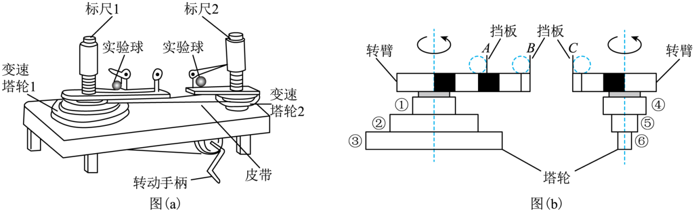

## 讲解

### 判据

向心力演示器用小球对挡板的作用，经杠杆、弹簧套筒转成标尺露出格数，在相同标定条件下比较两侧力的大小。它比较的是径向约束力，不是直接读小球速度。

研究向心力与m、r、ω关系，用控制变量法：固定其中两个，改变第三个。改变塔轮层数会改变两侧角速度比，但小球转动半径和塔轮皮带接触半径是不同的半径。

### 流程

1. **追溯力的传递。** 挡板对球的压力提供径向作用，球对挡板的反作用力使杠杆带动测力套筒，露出的等分格反映力。两侧标定一致，才可以用格数比表示力比。
2. **先控制球质量。** 比较半径或角速度时用等质量两球；同体积不同材料的球未必等质量，不能只凭球大小相同来控制m。
3. **再控制小球运动半径。** 球到各自转轴的距离是r，图中A、C等半径，B更远。研究r关系时，m和ω应相同；只选相同质量还不够。
4. **用塔轮决定角速度比。** 无滑动皮带给轮缘线速率相等，ω左R左＝ω右R右；R是所选层的塔轮接触半径。各球随对应转臂转动，才继承该侧角速度。
5. **由标尺比求力比。** 两侧露格1∶4，力比就是1∶4；若小球m、r都相同，用F＝mω²r得角速度比的平方为1∶4，角速度比为1∶2。
6. **核对题目要求与装置信息。** 本例由等质量、等小球半径和标尺比即可反求角速度比，不要求确定皮带所在层。若要进一步确定层数，必须有各层塔轮的半径比，不能由小球半径或示意图尺寸猜出。

数据能支持比例关系，仍有摩擦、标尺粗读和转速不稳等实验误差。匀速转动手柄有助于让读数对应稳定的圆周运动。

## 例题

> 题目与解析：第六章 圆周运动（复习讲义）（解析版）.docx，来源ID S04，第475—488段。题目背景与原资料标注照录。

【例9】在“探究向心力大小的表达式”实验中，所用向心力演示器如图a所示，图b是演示器部分原理示意图：其中皮带轮①、④的半径相同，轮②的半径是轮①的2倍，轮④的半径是轮⑤的2倍，两转臂上黑白格的长度相等。A、B、C为三根固定在转臂上的挡板，可与转臂上做圆周运动的实验球产生挤压，从而提供向心力，图a中的标尺1和2可以显示出两球所受向心力的大小关系。可供选择的实验球有：质量均为2m的甲球和乙球、质量为m的丙球。

(1)下列实验与本实验方法相同的是（　　）

A．探究平抛运动的特点

B．探究两个互成角度的力的合成规律

C．探究加速度与力和质量的关系

(2)为探究向心力与圆周运动轨道半径的关系，实验时应选择甲球和     球作为实验球；

(3)在某次实验中，一组同学把甲球和乙球分别放在A、C位置，将皮带处于塔轮的某一层上，匀速转动手柄时，左边标尺露出1个分格，右边标尺露出4个分格，则A、C位置处的小球转动所需的向心力之比为     ，A、C两个挡板角速度之比为     。

**原资料答案：** (1)C；(2)乙；(3)     1:4     1:2

**原资料详解：** （1）探究向心力大小的表达式与探究加速度与力和质量的关系采用的都是控制变量法；故选C。

（2）探究向心力与圆周运动轨道半径的关系应使两球质量相等，故应选择甲球和乙球作为实验球

（3）[1]左右标尺露出的格数表示向心力的大小，故向心力之比为$1:4$；

[2]皮带处于塔轮的某一层上，转动半径相同，两个小球质量相同，由向心力公式$F=2m\omega^2r$

可知A、C两个挡板角速度之比为$1:2$。

### 顺着本题再看清一步

甲、乙质量都为2m，因此第(2)问选乙；丙质量为m，不能保持质量不变。实际探究半径时应选塔轮等半径的一层，使两侧角速度相同。

第(3)问A、C半径相同，标尺1∶4给出F_A/F_C＝1/4。将共同的2m、r约掉：

$$\frac{F_A}{F_C}=\frac{2m\omega_A^2r}{2m\omega_C^2r}=\frac{\omega_A^2}{\omega_C^2}=\frac14$$

角速度取大小的正值，得到ω_A/ω_C＝1/2。题干给出左轮②半径是轮①的2倍，右轮⑤为轮④的一半，且①④同半径，所以第二层塔轮半径比为4∶1。该层不能直接与所得角速度比1∶2对应。

本题第(3)问给的是标尺读数，所以由等质量、等小球半径可确定1∶2；而题干列出的第一层塔轮比1∶1、第二层4∶1，第三层比值未给。它没有要求确定使用哪一层，不需要猜测未给的第三层尺寸。

## 易错

原题(1)选C，探究加速度与力、质量也用控制变量法；A通常用分运动比较，B用等效替代。第(2)问选乙，只保证等质量，还须同角速度才能真正单独研究半径。第(3)问角速度比应对力比开平方，不能直接写1∶4。
