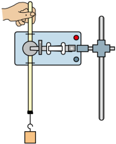
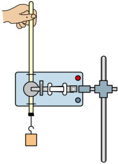
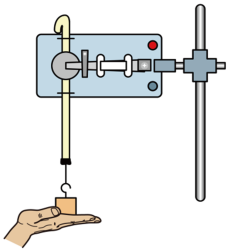
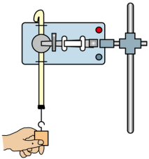

## 讲解

### 判据

重物带纸带下落，独立测下降高度和速度，再比较重力势能减少量与动能增加量。这里验证的是数据是否符合理论，不能先用v＝√(2gh)或v＝gt给速度，再代回同一个待检关系。

特别分清“势能变化量”和“势能减少量”：下降h₂时，变化量为−mgh₂，减少量为+mgh₂。原题答案和详解把变化量写为正mgh₂，属于符号错误，正文按末减初更正。

### 流程

1. **安装并保持纸带竖直。** 限位孔、纸带和重物运动方向对齐，减少摩擦；选密度较大的重物以减小空气阻力相对重力的影响。重物起始靠近计时器，以保留足够记录长度。
2. **先接通电源，再从静止释放。** 使开始记录时速度尽量接近零。第一个点O是否真的对应零速，仍需检查；若不能保证，可用两个非初始点比较能量变化，不强行令v_O＝0。
3. **高度从纸带读，速度也从纸带读。** 连续打点周期T，B两侧A、C到O距离为h₁、h₃，B点速度约为(h₃−h₁)/(2T)。恒加速度时中点关系精确，一般下落有阻力时按小间隔估计。
4. **再计算能量。** 若v_O近似零，ΔE_k＝m(h₃−h₁)²/(8T²)，ΔE_p＝−mgh₂；比较正的ΔE_k与正的势能减少量mgh₂。质量在比较中约掉，所以不是必需的单独测量量。
5. **检查图像的纵轴。** 若画v²对h，零初速理论斜率应为2g；若画v²/2对h，斜率才为g。不能不看纵轴把“斜率g”照搬。原知识清单第106段写v²-h斜率g，少了系数2。
6. **解释偏差而不硬凑等式。** 阻力通常使测得动能增量偏小；速度估计、刻度和打点误差也可能影响结果。不能说只要一次ΔE_k偏大就证明守恒失效，更不能修改读数使两边相等。

原题第(4)问是高度测量得到的势能变化值与该真实运动的势能变化相比，阻力不会直接改变同一高度测量的定义；它会改变实际运动和能量分配，这是不同问题。

## 例题

> 题目与解析：高一下物理第八章  单元测试·基础卷（解析版）.docx，来源ID S10，第166—187段。题目背景与原资料标注照录。

12．（9分）某兴趣小组的几位成员做“验证机械能守恒定律”的实验。

(1)下图是四位同学释放纸带瞬间的照片，操作正确的是（　　）

A．

B．

C．

D．

(2)关于上述实验，下列说法中正确的是（　　）

A．重物最好选择密度较大的铁块

B．重物的质量必须测量

C．实验中应先接通电源，后释放纸带

D．可以通过纸带测量物体的下落高度h，再代入公式$v=\sqrt{2gh}$求解瞬时速度

(3)若某同学正确操作得到如图所示的纸带。在纸带上选取三个连续打出的点A、B、C，测得它们到起始点O的距离分别为$h_{1}$、$h_{2}$、$h_{3}$。已知当地重力加速度为g，打点计时器打点的周期为T，设重物的质量为m。从打O点到打B点的过程中，重物的重力势能变化量为           ，重物的动能变化量为           。（结果用题设字母表示）；

(4)从打O点到打B点的过程中，重物会受到空气阻力的作用，纸带与限位孔之间也存在相互作用的摩擦力，因此，重物的重力势能变化量的测量值与真实值相比会           。（填“偏大”“偏小”或“不变”）

**原资料答案：** (1)A；(2)AC；(3)     $mgh_2$     $\frac{m(h_3-h_1)^2}{8T^2}$；(4)不变

**原资料详解：** （1）在释放纸带瞬间应保证纸带竖直，且重物应靠近打点计时器。故选A。

（2）

A．重物最好选择密度较大的铁块，故A正确；

B．由$mgh=\frac12mv^2$，可知验证机械能守恒定律动能与重力势能中的质量可以消去，所以不需要测量质量，故B错误；

C．实验中为了充分利用纸带，且打第一个点时纸带速度接近为零，应先接通电源后释放纸带，故C正确；

D．正确的是通过测量某段位移，求该段位移平均速度的方法求该段位移中间时刻的瞬时速度，如果用$v=\sqrt{2gh}$ 求速度是以机械能守恒为前提得出的结果，无法验证实验，故D错误。

故选AC。

（3）[1]从打O点到打B点的过程中，重物的重力势能变化量为$\Delta E_p=mgh_2$

[2]打B点时速度大小为$v_B=\frac{h_3-h_1}{2T}$

重物的动能变化量为$\Delta E_k=\frac12mv_B^2=\frac{m(h_3-h_1)^2}{8T^2}$

（4）从打O点到打B点的过程中，重物受到空气阻力的作用，纸带与限位孔之间也存在相互作用的摩擦力，不影响重物下落高度的测量，因此，重物的重力势能变化量的测量值与真实值相比会不变。

### 顺着本题再看清一步

第(3)问先从纯运动测量确定B点速度，再代入动能定义：

$$v_B\approx\frac{h_3-h_1}{2T},\qquad\Delta E_k\approx\frac12m\left(\frac{h_3-h_1}{2T}\right)^2=\frac{m(h_3-h_1)^2}{8T^2}$$

重物下降h₂，向上为正时末高度减初高度为−h₂，所以**正确的重力势能变化量是−mgh₂，原题正号不是变化量而是减少量。** 两者相加近似为零，才是守恒检验。

原题第(4)问“不变”指直接量得的h₂对应真实势能变化，没有因为阻力而多出一个测高修正项；这不表示有阻力时动能增加量仍必等于mgh₂。

纸带初始点检查中，教材常用首两点间约2 mm，是50 Hz、g约10 m/s²、近似静止释放时的(1/2)gT²估计，不是所有频率和器材都应固定为2 mm。

## 易错

第(1)问A保持竖直且重物靠近计时器；其他图释放位置或握持方式不符合要求。第(2)问AC正确，B质量可约，D用待验证关系算速度形成循环。第(3)问原ΔE_p正号必须更正为负，动能式在O近似零速条件下成立。
