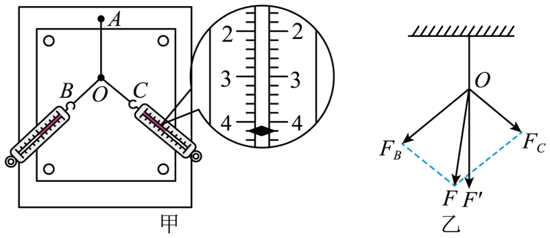

## 讲解

### 判据

用两只测力计共同拉橡皮条，再用一只测力计单独拉，比较两个力的理论合成与单力实际效果。核心是等效替代：两种拉法必须让同一橡皮条结点处于同一位置，且静止。

### 流程

**固定基准、检查器材。** 木板上铺白纸、固定橡皮条一端，另一端接轻绳套；测力计校零、拉动时沿自身轴线、与木板面平行，读数视线正对刻度。橡皮条不应超弹性限度。

**双力拉时记三种量。** 两测力计互成角度，结点静止在O。记两力示数、两细绳方向，以及O的位置。示数给大小，细绳方向给作用线，O提供等效状态基准，缺任何一个都无法完整重现力图。

**单力拉必须回同一O。** 取一测力计使结点仍在O，记大小与方向。相同橡皮条、固定端相同、结点位置相同，长度及方向才相同，故橡皮条的恢复作用相同，两种外拉作用具有相同效果。只拉相同长度却转到别方向，也不能保证相同矢量效果。

**画理论合力与实际单力。** 所有力图用同一标度，从O依双力大小和方向画邻边、作平行四边形对角线F；单力实测图记F′，方向沿其细绳。F来自定则作图，F′来自独立测量，二者不可先强制画成一样。

**比较大小和方向。** 在实验误差内F与F′接近，支持定则。若只是示数接近但方向不同，不算完整验证。改变双力夹角等重复几组，查看结论是否稳定；出现大偏差先查结点复位、标度、摩擦和读数。

此实验也控制装置状态，但其核心判断是两种作用的等效替代，不能只把“控制了条件”当成所问的核心科学方法。

## 例题

> 题目与解析：高一上物理第三章  单元测试·基础卷（解析版）.docx，来源ID S10，第141—165段。题目背景与原资料标注照录。

12．（9分）某实验小组用橡皮条与弹簧秤验证“力的平行四边形定则”，实验装置如图甲所示。其中A为固定橡皮条的图钉，O为橡皮条与细绳的结点，OB和OC为细绳。

(1)本实验用的弹簧测力计示数的单位为N，图甲中弹簧测力计的示数为         N；

(2)本实验采用的科学方法是______。

A．理想实验法

B．等效替代法

C．控制变量法

D．建立物理模型法

(3)实验时，主要的步骤是：

A．在桌上放一块方木板，在方木板上铺一张白纸，用图钉把白纸钉在方木板上；

B．用图钉把橡皮条的一端固定在板上的A点，在橡皮条的另一端拴上两条细绳，细绳的另一端系着绳套；

C．用两个弹簧测力计分别钩住绳套，互成角度地拉橡皮条，使橡皮条伸长，结点到达某一位置0。读出两个弹簧测力计的示数，记下两条细绳的方向；

D．按选好的标度，用铅笔和刻度尺作出两只弹簧测力计的拉力$F_{1}$和$F_{2}$的图示，并用平行四边形定则求出合力$F_{\text{合}}$；

E．只用一只弹簧测力计，通过细绳套拉橡皮条使其伸长，把橡皮条的结点拉到同一位置O，读出弹簧测力计的示数，记下细绳的方向，按某一标度作出这个力$F'_{\text{合}}$的图示；

F．比较$F'_{\text{合}}$和$F_{\text{合}}$的大小和方向，看它们是否相同，得出结论。

上述步骤中：①有重要遗漏的步骤的序号和遗漏的内容分别是          和          ；

②有叙述内容错误的序号及正确的说法分别是          和                       。

(4)根据实验结果作出力的图示如图乙所示。在图乙中用一只弹簧测力计拉橡皮条时拉力的图示为       ；它的等效力是             。

**原资料答案：** (1)4.2；(2)B(3)  C     C中应加上“记录下O点的位置”     E     E中应说明“按同一标度”

(4)     F′     F

**原资料详解：** （1）1N被分为5格，每小格表示0.2N，读数时进行本位估读，故读数为4.2N；

（2）本实验采用的科学方法是等效替代法，故选B；

（3）[1]有重要遗漏的步骤的序号C；

[2]步骤C中应加上“记录下O点的位置”；

[3]有叙述内容错误的序号E；

[4]步骤E中应说明“按同一标度”作力的图示；

（4）[1][2]由图乙可知，力F沿对角线方向，为两分力的合力的理论值，F′沿橡皮条方向，为一个弹簧测力计拉橡皮条时的拉力，其等效力为F。

### 顺着本题再看清一步

**原题答案：** (1)4.2 N；(2)B；(3)C补记O位置，E改同一标度；(4)F′，等效力F。A理想实验不是这里的做法，实际读取测力计；C控制变量虽然包含在操作控制中，却没有点明双力与单力的等效替换；D建立模型也不是该验证的核心方法。读数每格0.2 N、图示4.2 N。双力的大小和方向用于作F，单力回同一O得到F′，比较二者的矢量图示才是验证。

## 易错

- 步骤C漏记录O，下一次无法可靠回到同一状态。
- 步骤E说“某一标度”可能换了尺度，应与双力图使用同一标度。
- F是双力理论合成、F′是单力实测；不能因都叫合力就混成同一次读数。
