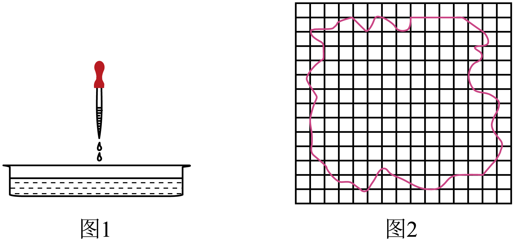

## 讲解

### 是什么

油膜法把少量油酸在水面充分铺开的膜近似为单分子层，把厚度当成分子尺度。若纯油酸体积为V油、膜面积S，则 $d\approx V_{\text{油}}/S$。V用m³、S用m²，d用m。

### 怎么来的

直接测分子很小的长度困难，先把很多分子铺成一层，测宏观总量。体积关系 $V_{\text{油}}=Sd$ 来自近似均匀厚度的薄层；教材把分子简化成紧密排布的球，把厚度称直径。

实际油酸分子不是球，排列取向与单层密度影响厚度，因此测得是模型下的尺度估计，不是精密球体直径。油酸酒精溶液用于稀释，酒精进入水或挥发，纯油酸留成膜。

### 什么时候能用

膜须充分展开、接近单层、形状稳定，水面与器材较洁净。爽身粉只帮助显出边界，太厚会妨碍展开。多层或未展开时S偏小，V/S会偏大。

V必须是这一滴里纯油酸的体积，不是含酒精整滴溶液体积。面积以边界实际图形数格，不一定把膜当圆求面积。

## 例题

> 题目与解析：第一章  分子动理论（专项训练）（解析版）.docx，来源ID S02，第304—320段。分段选取时保留该子问的完整题干、答案与解析；题目背景和原资料标注照录。

24．（24-25高二下·广西百色·期末）某实验小组做用油膜法估算分子大小的实验时，操作如下：

①向浅水盘中倒入清水，在水面上均匀地撒一层痱子粉；

②将浓度为η的油酸酒精溶液滴一滴在浅水盘中央，如图1；

③待水面稳定后，画出油膜的形状如图2。

已知正方形小方格的边长为L、边缘轮廓所围成的正方形小方格数为136格，1滴油酸酒精溶液的体积为V。

(1)实验中将油酸分子看成是球形，采用的方法是______；

A．等效替代法

B．控制变量法

C．理想模型法

D．比值定义法

(2)需将纯油酸稀释目的是      。（选填“A”形成单分子层油膜或“B”容易测量油膜面积）

(3)油酸分子的直径为      。

**原资料答案：** (1)C；(2)A；(3)$\frac{\eta V}{136L^2}$

**原资料详解：** （1）实验中将油酸分子看成是球形，采用的方法是理想模型法。

故选C。

（2）需将纯油酸稀释目的是当油酸酒精溶液滴在水面时能形成单分子层油膜。

故选A。

（3）油酸分子的直径为$d=\frac{V_0}{S}=\frac{\eta V}{136L^2}$

### 顺着本题再看清一步

第1问C是理想模型，不是控制变量；第2问稀释主要帮助形成单层，选A；第3问面积136L²，纯油酸体积ηV，所以d=ηV/(136L²)。量纲V/L²给长度，η无量纲。

## 易错

球形与单层都是理想模型；原题浓度η、滴体积V须先给V油=ηV，再除136L²。
