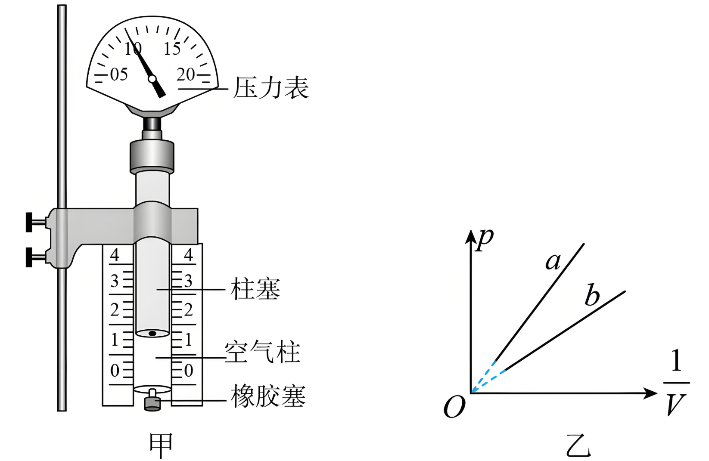

## 讲解

### 判据

实验不是先相信pV恒定，而是固定气体量和温度，改变体积并测压强，再检验数据是否支持反比。控制条件与所画图像必须对应。

### 流程

1. 密封选定一段气体，检查接口和活塞不漏气。否则n变了，曲线偏离无法归因于p与V关系。
2. 与温度稳定的环境充分热接触，缓慢推动并等待示数稳定。快速压缩容易升温，快速膨胀容易降温，使等温条件失效。
3. 测V时纳入连通管、传感器等死体积；测p时确认仪器读数是绝对压强还是表压，表压需加环境大气压。
4. 多组p、V数据可检验pV近似恒定；作p-1/V图时，若过原点近似直线，说明p与1/V成正比，即p与V成反比。
5. 同一份气体比较不同温度的曲线，斜率为nRT，斜率大表示温度高。改变环境温度并等待平衡可以开始另一组等温实验，但不能在同一组数据中混入变温点。

## 例题

> 题目与解析：第二章  气体、固体和液体（专项训练）（解析版）.docx，来源ID S04，第711—727段。分段选取时保留该子问的完整题干、答案与解析；题目背景和原资料标注照录。

45．（24-25高二下·贵州黔西·期末）某同学应用如图甲所示的装置做“探究气体等温变化的规律”的实验。设计了如下的实验步骤，其中操作正确的步骤是      （填步骤前的数字序号）。

①利用注射器选取一段空气柱为研究对象，保持气体的质量和温度不变。

②把柱塞快速地向下压或向上拉，读取空气柱的长度$l$（可得到空气柱体积$V$）与压强$p$的几组数据。

③为了直观反映气体的压强$p$与体积$V$的关系，应作出$p-\frac{1}{V}$图像。

④改变空气柱或环境温度，重复实验。

若图像是过原点的一条直线，则说明一定质量的气体，在温度不变的情况下，压强与体积成      （选填“正比”或“反比”）。图乙是该同学在不同环境温度下，对同一段空气柱做实验时得出的两条等温线$a$和$b$，对应的温度分别为$T_a$、$T_b$，则$T_a$      （选填“>”“=”或“<”）$T_b$。

**原资料答案：**      ①③     反比     >

**原资料详解：** [1]实验目的探究气体等温变化的规律，则需要确保空气质量与温度一定，可知，利用注射器选取一段空气柱为研究对象，保持气体的质量和温度不变，步骤①正确；为了确保实验过程温度一定，实验中应把柱塞缓慢地向下压或向上拉，稳定后读取空气柱的长度$l$（可得到空气柱体积$V$）与压强$p$的几组数据，步骤②错误；根据玻意耳定律有$pV=C$

变形得$p=\frac{C}{V}$

可知，为了直观反映气体的压强$p$与体积$V$的关系，应作出$p-\frac{1}{V}$图像，步骤③正确；实验目的探究气体等温变化的规律，环境温度需要保持不变，步骤④错误。其中操作正确的步骤是①③。

[2]结合上述有$p=\frac{C}{V}$

可知，若图像是过原点的一条直线，则说明一定质量的气体，在温度不变的情况下，压强与体积成反比。

[3]根据理想气体状态方程有$\frac{pV}{T}=C$

变形得$p=CT\cdot\frac{1}{V}$

可知，$p-\frac{1}{V}$图像的斜率$k=CT$

等温线$a$的斜率大于等温线$b$的斜率，则有$T_a>T_b$

### 顺着本题再看清一步

①控制气体量与温度，正确；②“快速”破坏温度条件，错误；③p-1/V直线化对应反比，正确；④在正在测量的同组中改变温度破坏控制条件，错误。

原解析把等温常量和$pV/T$常量都记为C，符号易混。实验讲解分别使用$K=nRT$表示本组pV常量、$nR$表示同一份气体的pV/T常量，因此斜率为$nRT$，a线更陡表示$T_a>T_b$。

## 易错

原题④作为这一组等温数据的操作判错；若另开一组、每组各自固定温度，才可以比较不同温度曲线。等温线是同一温度的一组状态，不表示整个装置永远只能用一个温度。
