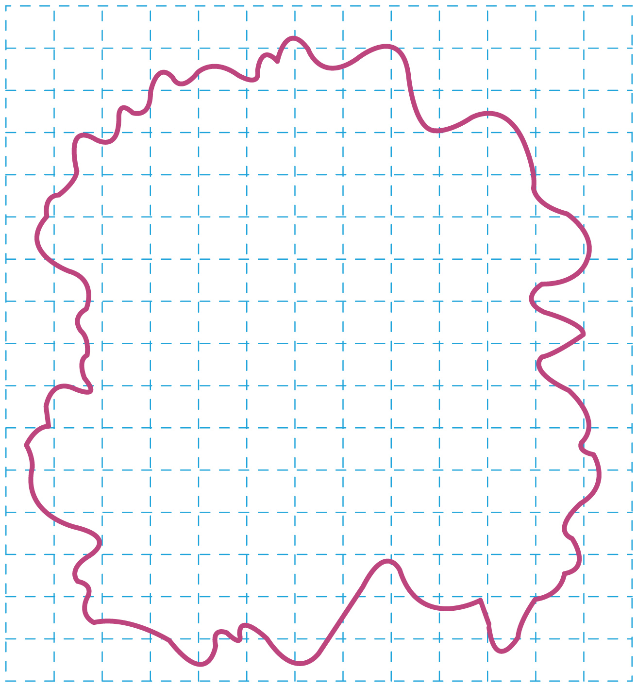

## 讲解

### 判据

给稀释配制、一定滴数总体积、油膜数格图，要求d、操作顺序和误差。计算链必须区分溶液、纯油酸和膜面积。

### 流程

1. 浓度取体积分数 $c=V_{\text{纯油}}/V_{\text{配成溶液}}$，分母是最后总体积。配制后防止长时间酒精挥发改变浓度。
2. n滴溶液总体积V₀，则每滴平均溶液体积V₀/n；其中纯油酸为 $V_{\text{油}}=cV_0/n$。累积测量降低单滴读数相对误差。
3. 水面撒薄而均匀粉层，滴一滴，待充分展开且稳定才描边。按题规则数有效方格N，格边a，则S=Na²。
4. 统一体积与面积单位，用 $d=cV_0/(nNa^2)$。cm³/cm²得cm，最后转m；不能仅把数值写入而不跟单位。
5. 误差从比例追：c或V₀估大使d偏大，滴数n多记使d偏小，S估小使d偏大。每次只讨论指定误差，其他条件固定。

数格存在边界取舍，原题允许一小范围结果，不强行假称精确粒径。

## 例题

> 题目与解析：第一章  分子动理论（专项训练）（解析版）.docx，来源ID S02，第321—337段。分段选取时保留该子问的完整题干、答案与解析；题目背景和原资料标注照录。

25．（24-25高二下·山东威海·期末）在“用油膜法估测油酸分子的大小”实验中，有下列实验步骤：

①往浅盘里倒入约2cm深的水，待水面稳定后将适量的爽身粉均匀地撒在水面上；

②用注射器将油酸酒精溶液滴一滴在水面上，待油膜形状稳定；

③将玻璃板平放在坐标纸上，已知小方格的边长为1cm，计算出油酸分子直径的大小；

④将1mL的油酸溶于酒精，制成$10^3\,\mathrm{mL}$的油酸酒精溶液；用注射器将油酸酒精溶液一滴一滴地滴入量筒中，测得80滴为1mL；

⑤将玻璃板放在浅盘上，然后将油膜的形状用彩笔描绘在玻璃板上。

请回答下列问题：

(1)上述步骤中，正确的顺序是       ；（填写步骤前面的数字）

(2)估算油酸分子的直径为        m；（结果保留2位有效数字）

(3)若80滴油酸酒精溶液的体积略小于1mL，则油酸分子直径的测量值          。（填“偏大”或“偏小”）

**原资料答案：** (1)④①②⑤③；(2)9.6×$10^{-10}$/9.5×$10^{-10}$/9.7×$10^{-10}$；(3)偏大

**原资料详解：** （1）“用油膜法估测油酸分子的大小”实验步骤为：准备油酸酒精溶液④→准备水槽，撒上痱子粉①→形成油膜②→描绘油膜边缘⑤→测量油膜面积，计算分子直径③，故正确的顺序为④①②⑤③。

（2）每滴油酸酒精溶液中含油酸的体积$V=\frac1{10^3}\times\frac1{80}\,\mathrm{mL}=1.25\times10^{-5}\,\mathrm{mL}$

油酸膜的面积$S=130\times1^2\,\mathrm{cm^2}=130\,\mathrm{cm^2}$

油酸分子的直径$d=\frac VS\approx9.6\times10^{-8}\,\mathrm{cm}=9.6\times10^{-10}\,\mathrm m$

（3）若80滴油酸酒精溶液的体积略小于1mL，则每滴溶液体积的测量值偏大，故直径的测量值偏大。

### 顺着本题再看清一步

浓度1/1000，每滴溶液1/80 mL，纯油酸1.25×10⁻⁵ mL。原解析约数130个1 cm²格，面积130 cm²；厚度约9.6×10⁻⁸ cm=9.6×10⁻¹⁰ m。原题给9.5—9.7×10⁻¹⁰ m的数格容许范围，照录而非补造数据。

## 易错

原提取103 mL的3是丢失的上标，图片公式核验配制总体积为10³ mL，正文恢复。80滴总体积估大，就把单滴与d都估大。
