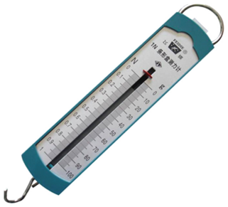
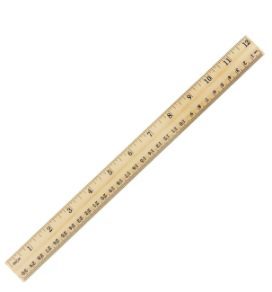
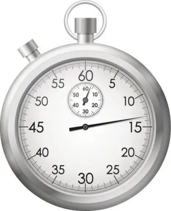
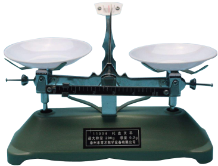

## 讲解

### 是什么

基本量是单位体系选定的基础物理量；基本单位是它们对应的单位。SI的七个基本量与基本单位分别是长度—米m、质量—千克kg、时间—秒s、电流—安培A、热力学温度—开尔文K、物质的量—摩尔mol、发光强度—坎德拉cd。本章力学计算主要用m、kg、s。

导出单位由基本单位按照物理量间的关系组合而成。速度不是基本量，单位m/s；加速度的单位m/s²；力的单位牛顿N，等价于kg·m/s²。一个单位有专门名称，不等于它是基本单位。[SI基本单位表](https://www.bipm.org/en/measurement-units/si-base-units)

### 怎么来的

先从定义关系找单位。速度是位移除以时间，所以单位是m/s；加速度是速度变化除以时间，所以单位是m/s²。再用第二定律把力的单位与质量、加速度联系：

$$1\,\mathrm N=1\,\mathrm{kg}\times1\,\mathrm{m/s^2}=1\,\mathrm{kg\cdot m\cdot s^{-2}}$$

这不是说“所有有单位的量都是基本量”，而是许多物理量可以在同一个体系里追溯到选定的基本量。

### 什么时候能用

判仪器测什么，先看它直接测得的物理量，再判断这个量是不是基本量。刻度尺测长度，秒表测时间，天平比较质量；弹簧测力计测力，力属于导出量。

公式两边相等，单位必须相容；同类物理量相加要先换成同一单位。厘米和米都能表示长度，但不能把厘米数值直接当成米数值代入以牛顿为力单位的F＝ma计算。

单位相同只能说明量纲相容，不能证明公式一定正确；位移和路程都用米，却不是同一物理量。单位为1的量也可能有明确物理意义，不能把“无单位”理解为“没有物理量”。

## 例题

> 题目与解析：高一上物理第四章  单元测试·基础卷（解析版）.docx，来源ID S10，第27—35段。题目背景与原资料标注照录。

3．下列物理仪器中，不能测量基本物理量的是（　　）

A．

B．

C．

D．

**原资料答案：** A

**原资料详解：** 

A．弹簧测力计测力的大小，力不是基本物理量，故A正确；

B．刻度尺测距离的长度，长度是基本物理量，故B错误；

C．秒表测一段过程的时间，时间是基本物理量，故C错误；

D．天平测物体的质量，质量是基本物理量，故D错误。

故选A。

### 顺着本题再看清一步

看到四种仪器，依次写出它们测的量：力、长度、时间、质量。然后与基本量表对应，只有力不在其中，故选A。牛顿虽然是常见的独立名称，仍是导出单位。

## 易错

题目问“不能测量基本物理量”，不是“不能测量”。原题A的弹簧测力计能测力，只是力属于导出量；B、C、D分别测长度、时间、质量，均为基本量。不要用仪器是否常见来分类。
