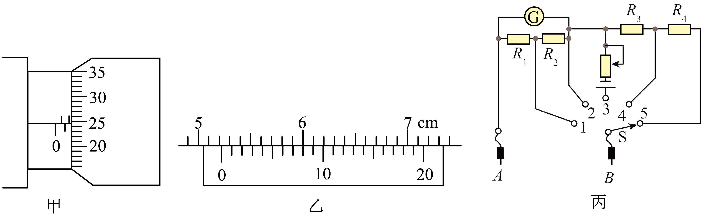

## 讲解

### 判据

先辨仪器，再按它的分度和估读规则。游标看零线与对齐格；测微器看固定尺露出的整格、半格，再看基准线对应的可动格。不要先看答案要求单位就猜一串数字。

### 流程

1. **确认最小读数。** 本原图乙20分度游标，单格差0.05 mm；甲测微器50分度、螺距0.5 mm，每格0.01 mm。
2. **游标先主尺。** 零线经过52 mm但未到53 mm，主尺取52；第8格对齐，加8×0.05＝0.40 mm，得52.40 mm，再除10成5.240 cm。
3. **测微器先固定尺。** 整毫米1、半毫米已露出，固定部分1.5 mm；基准线在24与25间，估读24.5格，可动部分0.245 mm，合1.745 mm。
4. **保留各自有效末位。** 游标按对齐结果、不额外估读；测微器按本章器材估到0.001 mm。原题允许1.744～1.746 mm体现图示估读范围，不是不同固定刻度读法。
5. **核量纲和位置。** cm与mm相差10倍；读的是游标零线、套筒基准线和已露出的半格，不是外壳边缘。需要真实测量时先做零误差检查。

## 例题

> 题目与解析：第十一章 电路及其应用（专项训练）（解析版）.docx，来源ID S02，第437—437；439—439；458—458；464—465段。分段选取时保留该子问的完整题干、答案与解析；题目背景和原资料标注照录。

(1)用螺旋测微器测量电阻丝的直径时，测量结果如图甲所示，可知金属丝的直径D=       mm；用游标卡尺测量金属丝的长度如图乙所示，可知金属丝的长度L=        cm。

**原资料答案：** (1)     1.744/1.745/1.746     5.240

**原资料详解：** （1）[1]金属丝的直径$D=1.5\,\mathrm{mm}+0.01\,\mathrm{mm}\times24.5=1.745\,\mathrm{mm}$

[2]金属丝的长度$L=5.2\,\mathrm{cm}+0.05\,\mathrm{mm}\times8=5.240\,\mathrm{cm}$

### 顺着本题再看清一步

原题第(1)两空：D约1.745 mm，L＝5.240 cm。两条原详解的算式已保留，可分别用“固定1+0.5+0.245”和“主尺52+0.40，再除10”复核。

游标末位0不是可有可无的装饰；测微器可接受末位估读略不同，但不能出现整整0.5 mm差异。

## 易错

最常见错因是把游标0线算第1格、混用cm/mm、测微器漏半格或不估读。原图是组合图，甲乙分别对应不同仪器。
