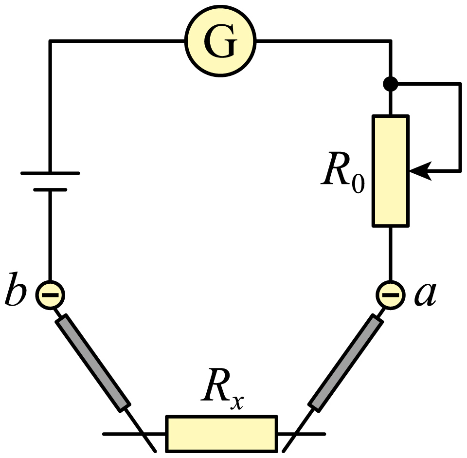

## 错法

换欧姆挡倍率后直接测，认为只要最后乘新的倍率即可；或把左端机械零位当成右端欧姆零位。错在更换内部电阻网络后，表头电流与刻度对应关系需要重建。

还有反向机械重复：不换倍率只是测第二只电阻也说必须调零，这不是原题需要的条件。

## 正解

换倍率后短接表笔，欧姆调零使右端0 Ω，再接待测电阻。偏角太大、靠右应选小倍率；偏角太小、靠左选大倍率，然后再调零，读数乘倍率。

简单模型I＝E/(R内+Rx)。短接Rx＝0、调到Ig满偏，R内＝E/Ig；半偏I＝Ig/2时代入得R内+Rx＝2R内，所以Rx＝R内。这个对应关系依赖校准，不能把一次调零永远用于所有倍率。

原题C是E不变、内部阻值变但仍可调零的特定情形；电池电动势变时，不无条件保证旧刻度都准确。

## 例题

> 题目与解析：第十一章 电路及其应用（单元测试·提升卷）（解析版）.docx，来源ID S10，第64—75段。分段选取时保留该子问的完整题干、答案与解析；题目背景和原资料标注照录。

6．如图所示为电阻表的内部电路，a、b为表笔插孔，下列说法正确的是（　　）

A．a孔插红表笔

B．测量新的电阻时，必须要重新进行欧姆调零

C．电池用久了，若电动势不变而内阻增大，则欧姆调零后，仍可以准确测量电阻

D．用“$\times10$”挡测量时，若指针偏角太大（靠近表盘的右端），应换用“$\times100$”挡

**原资料答案：** C

**原资料详解：** 

A．根据多用电表内部结构，电流从红表笔流入、黑表笔流出可知a孔插黑表笔，故A错误；

B．测量新的电阻时，若倍率改变则必须要重新进行欧姆调零，若倍率不变则不需要重新欧姆调零，故B错误；

C．电池用久了，若电动势不变而内阻增大，则欧姆调零后，使电流表满偏，即指针指到最右端，根据$R_{\text{内}}=\frac E{I_g}$可知仍可以准确测量电阻，故C正确；

D．用“$\times10$”挡测量时，若指针偏角太大（靠近表盘的右端），说明该电阻较小，应换用“$\times1$”挡，故D错误。

故选C。

### 顺着本题再看清一步

A的a孔是黑表笔，错；B“每换一个电阻必调”过于绝对，错；C在给定恒E且可调零条件下正确；D应换×1而非×100，错。正确操作是改倍率后校准，不是只换一个倍率标签。

机械调零纠正无电流指针位置，欧姆调零纠正短接满偏位置，两者方向和作用不同。
