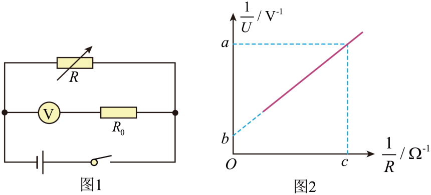

## 讲解

### 判据

已知电阻箱R、只配电压表或电流表时，先由闭合电路方程构造直线，不强行套U-I图的截距。理想伏阻法量端电压U端，理想安阻法量总电流I。

$$\frac1{U_{\text{端}}}=\frac rE\frac1R+\frac1E,\qquad \frac1I=\frac1ER+\frac rE$$

伏阻的横轴1/R、安阻的横轴R不同。若用了改装电表，要先确定表盘读数是否已经折算，本题U仍是原4 V表的示值，端电压为10U。

### 流程

1. **从基本电路式开始。** 伏阻：E＝U端+(U端/R)r，除以E U端，得1/U端＝1/E+(r/E)(1/R)。安阻：E＝I(R+r)，两边除EI，得1/I＝R/E+r/E。

2. **解释系数。** 伏阻直线截距b＝1/E、斜率k＝r/E，E＝1/b、r＝k/b；安阻截距b＝r/E、斜率k＝1/E，E＝1/k、r＝b/k。若串入保护电阻R_s，安阻截距为(r+R_s)/E，求r必须扣R_s。

3. **处理本题十倍改装。** 4 V表扩大到40 V，其内阻从4 kΩ变为40 kΩ，应串36 kΩ。原示值U对应总端电压10U，所以直线为1/U＝10/E+(10r/E)(1/R)，截距b＝10/E。

4. **代图求数值。** b＝0.3 V⁻¹，E＝10/b≈33.3 V；斜率k＝(a−b)/c＝(1.0−0.3)/2.0＝0.35 Ω/V，r＝k/b≈1.2 Ω。不能把a当斜率，也不能省略横坐标单位。

5. **考虑分流。** 改装支路总内阻R_V总＝10R_V，支路电流等于U/R_V＝10U/R_V总。把这一电流补入源总电流，再推直线截距；E测与r测都偏小。原解析在这一步有十倍系数错误，见下方校正。

## 例题

> 题目与解析：第十二章 电能 能量守恒定律（单元测试·基础卷）（解析版）.docx，来源ID S06，第191—211段。分段选取时保留该子问的完整题干、答案与解析；题目背景和原资料标注照录。

12．新能源汽车使用的电源大多数由锂离子电池串联而成，某物理实验小组想通过实验测量某个新型锂电池组的电动势和内阻，具体进行了以下操作：

(1)为完成本实验，需要将实验室内量程为4V、内阻为4kΩ的电压表改装成量程为40V的电压表使用，则需串联一个阻值为        kΩ的定值电阻$R_0$。

(2)该小组设计了如图1所示电路图进行实验，正确进行操作，利用记录的数据进行描点作图得到如图2所示的$\frac1U-\frac1R$的变化图像，其中U为图1中电压表的读数，R为电阻箱的读数，图中$a=1.0$，b=0.3，$c=2.0$。若忽略电压表分流带来的影响，由以上条件可以测出电池组的电动势$E=$        V，内阻$r=$        $\Omega$（计算结果均保留一位小数）。

(3)若考虑电压表分流带来的影响，则上述第（2）问中的测量值与真实值相比：电池组电动势的测量值        （填“偏大”、“偏小”或“无影响”），内阻的测量值        （填“偏大”、“偏小”或“无影响”）。

**原资料答案：** (1)36（1分）

(2)     33.3  （2分）   1.2（1分）

(3)     偏小   （2分）  偏小（2分）

**原资料详解：** （1）串联的电阻$R_0=\frac{40-4}{4}\times4\,\mathrm{k\Omega}=36\,\mathrm{k\Omega}$。

（2）[1][2] 根据电路规律可知$10U=E-\frac{10U}{R}r$

变形可得图像方程$\frac1U=\frac{10}{E}+\frac{10r}{E}\frac1R$

则$b=\frac{10}{E}$

故$E=33.3\,\mathrm V$

且$\frac{10r}{E}=\frac{a-b}{c}$

故$r=1.2\,\Omega$。

（3）[1][2] 考虑电压表分流，$10U=E_{\text{真}}-\left(\frac{10U}{R}+\frac U{R_V}\right)r_{\text{真}}$

则$\frac1U=\frac{10}{E_{\text{真}}}\left(1+\frac{r_{\text{真}}}{R_V}\right)+\frac{10r_{\text{真}}}{E_{\text{真}}}\frac1R$

则$b=\frac{10}{E_{\text{真}}}\left(1+\frac{r_{\text{真}}}{R_V}\right)$

故$E_{\text{测}}<E_{\text{真}}$，偏小

且$\frac{10r_{\text{真}}}{E_{\text{真}}}=\frac{a-b}{c}$

故$r_{\text{测}}<r_{\text{真}}$，偏小。

### 顺着本题再看清一步

原题结果36 kΩ、33.3 V、1.2 Ω及两参数偏小均保留。**原解析第207—208段的系数需校正：** 前一式用了原表内阻R_V＝4 kΩ和支路电流U/R_V，因而正确应为

$$\frac1U=\frac{10}{E_{\text{真}}}\left(1+\frac{r_{\text{真}}}{10R_V}\right)+\frac{10r_{\text{真}}}{E_{\text{真}}}\frac1R$$

原式括号内r真/R_V缺少分母10。若改用R_V总＝40 kΩ，才可写1+r真/R_V总。由正确式得E测＝E真/[1+r真/(10R_V)]，r测＝r真/[1+r真/(10R_V)]，仍均偏小；原题误差方向答案不变。

安阻法的R若仅为电阻箱，而电流表有内阻R_A，则拟合得到r测＝r+R_A。这部分是从电路方程补写的方法说明，没有新增试题。

## 易错

图像方程的U是表盘读数还是端电压必须写明；伏阻与安阻截距不同；保留电压表原内阻与改装总内阻两个量，不能用同一个符号偷换。
