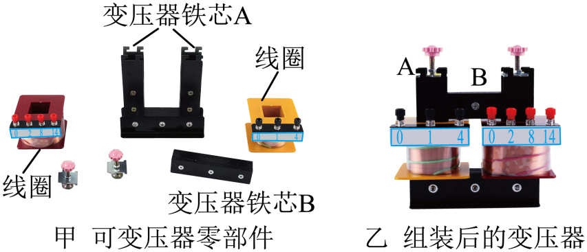

## 讲解

### 判据

可拆变压器实验要求检验电压比是否接近匝数比，或解释输出电压偏差。要分清实际测量值与电源挡位标注值，采用控制变量，不能编造未测的输入电压。

### 流程

1. 按资料用低压交流电源、闭合铁芯与两个已知匝数绕组。电源和绕组额定条件共同限制操作，匝数比本身不能独立证明安全。选降压配置只是本题教材做法。
2. 改副匝数时保持原匝数和实际原电压不变；同时改多项就不能判断输出变化来自哪一项。测交流电压用交流电压挡，未知范围先最大量程再选适合量程。
3. 同时测 $U_1,U_2$，比较 $U_2/U_1$ 与 $n_2/n_1$；不要把标注“6 V”无条件当成实测6 V。真实损耗、漏磁和负载都可能使比例偏离理想值，轻负载下较接近模型。
4. 原、副线圈共用变化通量。铁芯用相互绝缘薄片，是增大涡流回路阻力、减小涡流热损耗，不是为了多发热。
5. 解释偏高、偏低时每个假设单独代比例检查方向：原匝数增大或副匝数减小会降低输出。单一副电压测量不一定能唯一确定实际电源电压。

本资料未提供整组实测记录，所以这里保留原题数据与分析，不补造实验表。

## 例题

> 题目与解析：第三章 交变电流（单元自测·基础卷）（解析版）.docx，来源ID S04，第157—187段。分段选取时保留该子问的完整题干、答案与解析；题目背景和原资料标注照录。

12．某学校高二（9）班物理实验课上，同学们用可拆变压器探究“变压器的电压与匝数的关系”。可拆变压器如图甲、乙所示。

（1）下列说法正确的是________。

A．为确保实验安全，实验中要求原线圈匝数小于副线圈匝数

B．变压器原线圈接低压交流电时，可以用多用电表的“直流电压挡”测量副线圈电压

C． 研究副线圈匝数对副线圈电压的影响时，需保持原线圈电压、匝数不变，改变副线圈的匝数

D．测量副线圈电压时，先用中间挡位的量程试测，大致确定后再选用适当的挡位

（2）变压器铁芯是由相互绝缘的薄硅钢片平行叠压而成的，而不是采用一整块硅钢，这样设计的原因是________。

A．增大涡流，提高变压器的效率

B．减小涡流，提高变压器的效率

C． 增大铁芯中的电阻，以产生更多的热量

（3）一位同学实验时，发现两个线圈的导线粗细不同。他选择的原线圈为800匝，副线圈为400匝，原线圈接学生电源的正弦交流输出端“$6\,\mathrm V$”挡位，测得副线圈的电压为$3.2\,\mathrm V$。则下列分析正确的是_______。

A．原线圈导线比副线圈导线粗

B．学生电源实际输出电压大于标注的“$6\,\mathrm V$”

C．原线圈实际匝数与标注的“800”不符，应大于800

D．副线圈实际匝数与标注的“400”不符，应小于400

**原资料答案：**    C     B     B

**原资料详解：** （1）

A．为确保实验安全，应该降低输出电压，实验中要求原线圈匝数大于副线圈匝数，故A错误；

B．变压器只能改变交流电的电压，原线圈输入交流电压，副线圈输出交流电压，应用多用电表的“交流电压挡"测量，故B错误；

C．研究变压器电压和匝数的关系，用到控制变量法，可以先保持原线圈电压、匝数不变，改变副线圈的匝数，研究副线圈匝数对副线圈电压的影响，故C正确；

D．为了保护电表，测量副线圈电压时，先用最大量程试测，大致确定电压后再选用适当的挡位进行测量，故D错误。

故选C。

（2）变压器只能变交流，不能变直流，变压器的铁芯，在整块导体内部发生电磁感应而产生感应电流的现象称为涡流现象，要损耗能量，不用整块的硅钢铁芯，其目的是增大电阻，从而减小涡流，减小发热量，提高变压器的效率。

故选B。

（3）

A．原线圈的匝数多，因此电压大电流小，故原线圈导线应该选用细的，故A错误；

B．根据

$\frac{U_1}{U_2}=\frac{n_1}{n_2}$

测得副线圈的电压偏高，可能是因为学生电源实际输出电压大于标注的“$6\,\mathrm V$”，故B正确；

C．如果原线圈实际匝数与标注的“800”不符，大于800，则测得副线圈的电压应偏低，而不是偏高，故C错误；

D．如果副线圈实际匝数与标注的“400”不符，小于400，测得副线圈的电压应偏低，而不是偏高，故D错误。

故选B。

### 顺着本题再看清一步

理想预测6×400/800=3 V，测到3.2 V比它高。B给出能使结果偏高的可能原因；C增加原匝数、D减少副匝数都会降低结果，与现象相反。第一问C是控制变量；第二问B是减小涡流。保留原答案C、B、B，同时把“可能”与“已证明”区分清楚。

## 易错

资料把升压配置一概写成不安全，适用范围应限本题低压教学配置；导线粗细与允许电流、功率和制造条件有关，不能只靠匝数孤立判断。3.2 V偏高可由实际输入偏高解释，但不是仅凭该值就唯一证实。
