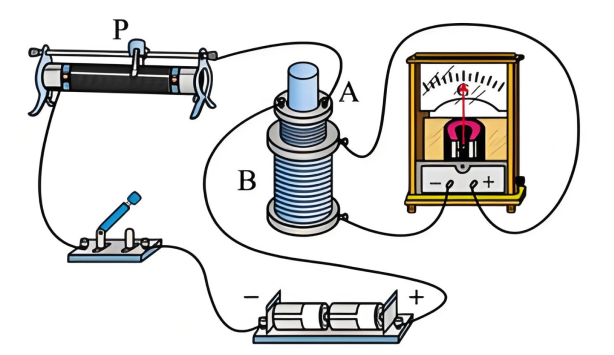
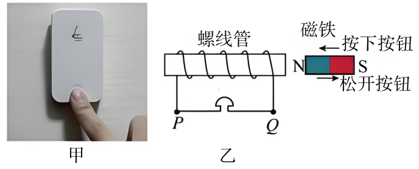

## 讲解

### 判据

实验用灵敏电流计观察条形磁铁或双线圈造成的感应电流方向，需要把指针偏转、端子电流、线圈绕向和感应磁场连接起来。不能直接背“右偏就是顺时针”，同一偏转在不同接线与绕向下可对应不同绕行方向。

### 流程

1. 先用小电流和保护电阻标定电流计：电流从哪一接线柱流入时，指针向哪边偏。器材型号可能不同，资料明确“左进左偏”须实验得到，不能假定所有仪表都如此。
2. 磁铁实验让螺线管与电流计组成闭路，认清绕线。分别做N极插入、N极抽出、S极插入、S极抽出，保持其余条件尽量相同，观察运动过程中的短暂偏转。
3. 每次先记录原磁场方向和通量增减，再记录电流方向及由其推得的感应磁场；最后归纳“增反减同”。磁铁停住时指针回零不能当成“磁场消失”，它表示通量不再变化。
4. 双线圈实验一次线圈接电源、开关、滑动变阻器，二次接灵敏表。闭合前让滑动变阻器接入最大电阻，限制电流；确认闭合、断开、改变一次电流分别导致怎样的二次偏转。
5. 原题闭合时右偏，建立了“当前接线下通量增加→右偏”的观察。随后滑片向左使一次电阻减小、电流增大，再引起同方向通量增加，因此二次仍右偏。沿原图接线判断滑片，不用器材的外观左右代替有效电阻变化。
6. 检验结论时改变一个条件，如磁极或运动方向；只用一个磁极一次插入不足以排除其他解释。偏转大小受通量变化快慢影响，判断方向时无需假定两次速度相同。

这里写的是实验方法；下面记录的是资料已有设问和解析，没有填写未经操作的实测数据。

## 例题

> 题目与解析：第二章 电磁感应（单元测试·基础卷）（解析版）.docx，来源ID S04，第158—176段。分段选取时保留该子问的完整题干、答案与解析；题目背景和原资料标注照录。

12．（8分）某实验小组使用如图所示的器材探究“电磁感应现象”中影响感应电流方向的因素。

(1)实验前            （选填“需要”或“不需要”）判明电流表指针的偏转方向和电流方向之间的关系；

(2)实验时，闭合开关前滑动变阻器的滑片应位于       端（选填“左”或“右”），当闭合开关时，发现灵敏电流计的指针右偏。指针稳定后，迅速将滑动变阻器的滑片P向左移动时灵敏电流计的指针         （选填“左偏”“不动”或“右偏”）。

(3)该组同学经过以上实验探究，对家中“自发电”无线门铃按钮原理进行研究，其“发电”原理如图乙所示，按下门铃按钮过程，磁铁靠近螺线管；松开门铃按钮过程，磁铁远离螺线管回归原位，下列说法正确的是（   ）

A．按下按钮时，门铃会响

B．按住按钮不动，门铃会响

C．按下和松开按钮过程，通过门铃的感应电流大小一定相等

**原资料答案：** ．(1)需要

(2)     右     右偏

(3)A

**原资料详解：** （1）由于本实验通过电流计指针偏转方向确定感应电流方向，所以实验前需要判明电流表指针的偏转方向和电流方向之间的关系。

（2）实验时，闭合开关前滑动变阻器接入电路的电阻最大，所以滑动变阻器的滑片应位于右端；

由于闭合开关时，灵敏电流计的指针右偏，即穿过线圈的磁通量增大时，指针右偏，所以指针稳定后迅速将滑动变阻器的滑片P向左移动时，回路中电阻减小，电流增大，穿过线圈的磁通量增大，则灵敏电流计的指针右偏。

（3）

A．按下和松开按钮过程，螺线管中磁通量发生变化，螺线管产生感应电动势，门铃均会响，故A正确；

B．按住按钮不动，螺线管中磁通量不变，螺线管中的感应电动势为零，门铃不会响，故B错误；

C．按下和松开按钮过程，螺线管中磁通量的变化率不一定相同，故螺线管产生的感应电动势不一定相同，通过门铃感应电流大小不一定相等，故C错误。

故选A。

## 易错

- 双线圈之间不直接接线也可互感；一次稳态电流持续存在时，二次电流计应回零。
- 门铃按住不动时磁通量不变，B错；按下与松开速度不同，变化率可不同，C错。
- “闭合前最大电阻”要用实际连接端子判断，本图对应滑片右端。
