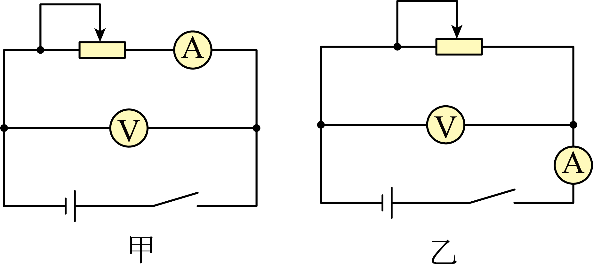
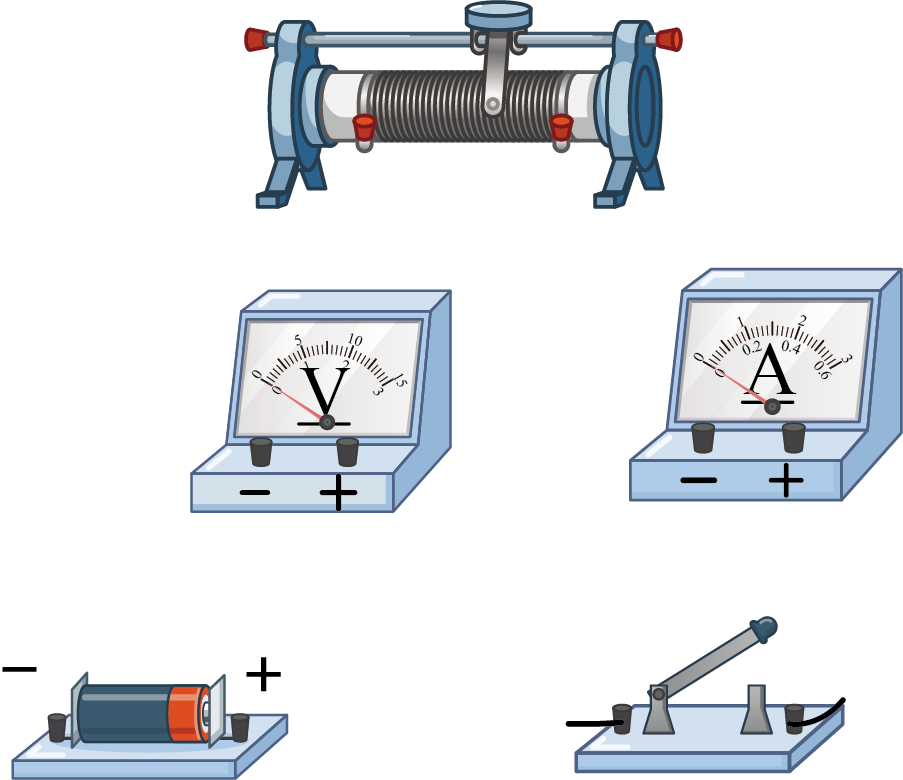
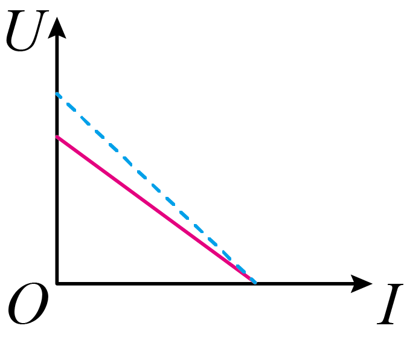
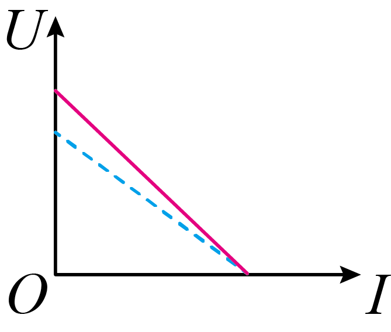
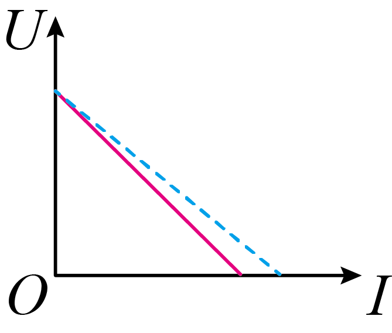
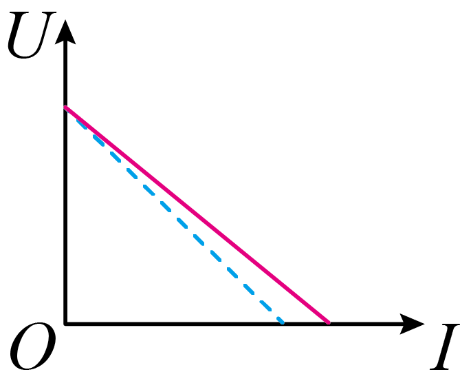
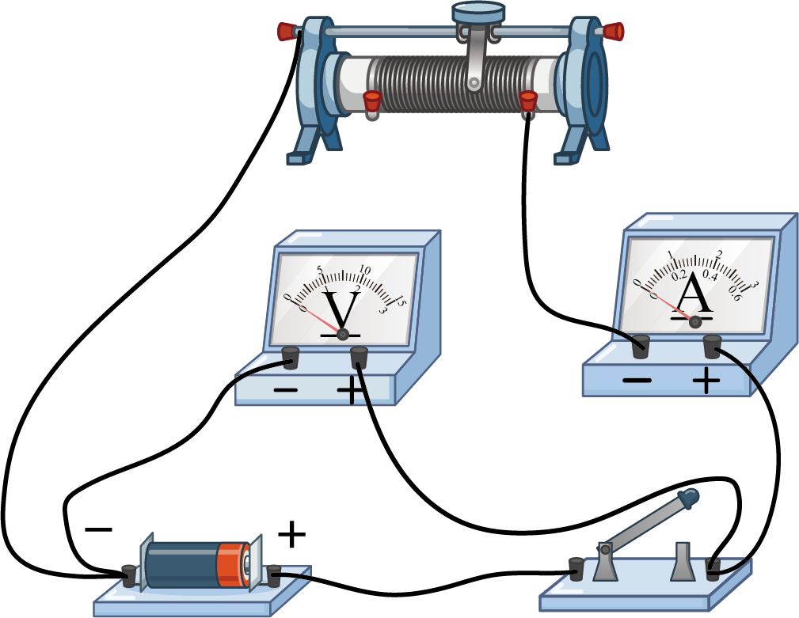

## 讲解

### 判据

需要测未知源的E、r，用改变外电阻取得多组U、I，再拟合U-I关系。固定E、r时直线截距、斜率分别反映E、r；实际电表会造成系统误差，先辨电流表测的是源总电流还是某条外部支路。

本题甲电压表直接跨电源，电流表只测负载支路；乙电流表测总电流，但电压表没有把电流表电压降算进来。两者的误差来源不同。

### 流程

1. **选范围与电路。** 1.5 V电池配0—3 V电压表；电池r约0.5 Ω与电流表0.2 Ω接近，乙增加的电流表压降会明显影响r。甲电压表3 kΩ远大于源r，分流小，因此选甲。

2. **连接并保护元件。** 断开开关连接，电压表并联、电流表串联，正电流从正接线柱流入。滑动变阻器取一上一下接线柱，开始用较大接入阻值限制电流；改变阻值获取分散工作点，避免长时间大电流使电池状态改变。

3. **拟合并取参数。** 以实测支路电流I_A为横轴、端电压U为纵轴作直线。纵截距为E测，斜率绝对值为r测；不是任意工作点的U/I。

4. **从分流推误差。** 甲中I源＝I_A+U/R_V，代入E＝U+rI源，把含U项移到一起：

$$U=\frac{E R_V}{R_V+r}-\frac{rR_V}{R_V+r}I_A$$

所以E测＝E R_V/(R_V+r)，r测＝rR_V/(R_V+r)，两者偏小；两条直线横截距均E/r，图A符合。

5. **比较乙与减误差。** 乙若电压表只测负载，E＝U+I(r+R_A)，E测＝E、r测＝r+R_A。甲选大R_V减少分流，乙选小R_A减少附加压降，不凭“内接外接”名称硬背。

## 例题

> 题目与解析：第十二章 电能 能量守恒定律（单元测试·基础卷）（解析版）.docx，来源ID S06，第165—190段。分段选取时保留该子问的完整题干、答案与解析；题目背景和原资料标注照录。

11．某实验小组利用电流表和电压表测定一节干电池的电动势和内阻，实验器材如下：

干电池一节（电动势约为1.5V；内阻约为$0.5\,\Omega$）；

电压表V（量程为0~3V，内阻约为$3\,\mathrm{k\Omega}$）；

电流表A（量程为0~0.6A，内阻约为$0.2\,\Omega$）；

滑动变阻器（最大阻值为$20\,\Omega$）；

开关、导线若干。

(1)实验电路图选择        （选填“甲”或“乙”）。

(2)用笔画线代替导线将图中的器材连成实验电路        。

(3)完成实验后，某同学利用图像分析由电表内阻引起的实验误差。在下图中，实线是根据实验数据描点作图得到的$U-I$图像；虚线是该电源真实的路端电压U随真实的干路电流I变化的$U-I$图像．本次实验分析误差的$U-I$图像是________。

A．

B．

C．

D．

(4)为减小电表内阻引起的实验误差，在电表量程不变的情况下，可以采取的措施是________．

A．换用内阻更小的电流表

B．换用内阻更大的电流表

C．换用内阻更小的电压表

D．换用内阻更大的电压表

**原资料答案：** (1)甲

(2)见解析

(3)A

(4)D(每空2分)

**原资料详解：** （1）因为干电池的内阻较小，接近电流表内阻，为了减小误差，所以电流表相对于电源应采用外接法，所以实验电路图选择甲。

（2）根据图甲电路图，完整的实物连接如图所示

（3）由于电压表的分流作用，相同的路端电压下，电流表测量的电流值小于流过电源的电流，内阻的测量值为电源和电压表并联后的总电阻，比实际电源的内阻小，对应实线斜率的绝对值比虚线的小，但当电压为零时，电压表的内阻对测量没有影响，实线和虚线重合。

故选A。

（4）因为电压表的分流作用产生的误差，为减小电表内阻引起的实验误差，在电表量程不变的情况下，可以采取的措施是换用内阻更大的电压表。

故选D。

### 顺着本题再看清一步

第(1)问甲；第(2)问原图已给完整连线；第(3)问A，因为甲的截距和负斜率绝对值都减小而横截距不变，B的截距偏大、C与D的纵截距不变都不合本接法；第(4)问D，增大R_V才减分流，改R_A不能针对这里的主要误差。短路截距是图像外推结果，不是实验要测的实际短路点。

## 易错

“内接/外接”要说明相对电源还是待测电阻，直接读电路最可靠；图像横截距相同不表示E、r各自没误差；连线图应与所选甲电路一致。
