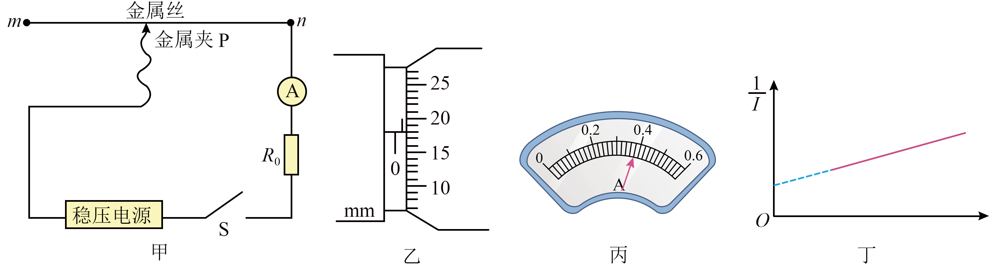

## 讲解

### 判据

目标ρ与测得电阻R不同，需要有效长度L和直径D。粗细均匀金属丝的截面积S＝πD²/4，ρ＝RS/L。本题通过改变有效长度、用1/I-L直线斜率排除固定串联电阻的影响。

**原题答案第(2)问漏斜率k，原解析保护位置误写n；本文按原图更正为ρ＝πkU₀D²/4、起始夹在m端，原文仍保留供核对。**

### 流程

1. **测直径与长度。** 测微器不同位置、不同方向量D并取合理平均，注意半毫米和估读；接线测的L是n端到金属夹的有效金属丝长度，不是整卷或两外接导线长度。单位统一米。
2. **确定初始最大电阻。** 图中从n端串联到P，P在m端时有效金属丝最长，电流较小；P在n端会使金属丝接入长度近零。因此起始应m，本原答案m正确，原第176段解析n错误。
3. **读电流并记录长度。** 本题I分度0.02 A，读0.38 A；测完断开减少升温，金属丝温度改变会使ρ变化，不宜大电流长时间通电。
4. **列完整串联电阻。** 稳压U₀，电流表内阻RA与定值R₀均保留：U₀＝I(RA+R₀+ρL/S)。两边先除I，再除U₀，把含L项分开：

$$\frac1I=\frac{\rho}{U_0S}L+\frac{R_A+R_0}{U_0}$$

5. **从轴名读斜率。** 纵轴1/I、横L，斜率k＝ρ/(U₀S)，固定RA和R₀只进截距。乘U₀S得到ρ＝kU₀S，再代S＝πD²/4，得ρ＝πkU₀D²/4。
6. **检验量纲与误差。** k单位A⁻¹m⁻¹，乘U₀和D²给Ω·m；省k的原答案量纲错误。D以平方进入，直径误差敏感。若通电中ρ变、接触电阻随位置变、导体不匀或稳压失效，直线斜率法的条件就需重查。

## 例题

> 题目与解析：第十一章 电路及其应用（单元测试·提升卷）（解析版）.docx，来源ID S10，第165—182段。分段选取时保留该子问的完整题干、答案与解析；题目背景和原资料标注照录。

12．某探究小组要测量一根硬质直金属丝（粗细均匀）的电阻率，设计了如图甲所示的实验电路。实验室提供的器材有：稳压电源（输出电压为$U_0$内阻不计）、电流表$A$定值电阻$R_0$金属夹$P$（电阻不计，一端可连接导线，另一端可夹在金属丝的不同位置）、开关$S$导线若干。请回答下列问题：

(1)实验步骤如下：

①用螺旋测微器测量金属丝的直径$D$，如图乙所示，则$D=$           mm；

②按图甲连接电路，闭合开关$S$前，金属夹$P$应置于金属丝的           （选填“m”或“n”）端；

③闭合开关$S$，移动金属夹$P$，记录电流表示数$I$，断开开关$S$，记录金属夹$P$与金属丝$n$端的距离$L$，某次电流表的示数如图丙所示，则$I=$           A；

④重复步骤③，得到若干组$I,L$的值，以$\frac1I$为纵坐标、           （选填“$L$”或“$\frac1L$”）为横坐标作图，得到一条直线，如图丁所示。

(2)数据处理：丁图中直线的斜率为$k$，该金属丝的电阻率$\rho=$           （用$\pi,U_0,k,D$表示）。

**原资料答案：** (1)     0.680   （1分）  m  （1分）   0.38  （2分）   L（2分）

(2)$\frac{\pi U_0D^2}{4}$（2分）

**原资料详解：** （1）[1]图乙可知金属丝的直径为$D=0.5\,\mathrm{mm}+0.01\,\mathrm{mm}\times18.0=0.680\,\mathrm{mm}$；

[2]为了保护电路，闭合开关$S$前，金属夹$P$应置于金属丝的$n$端；

[3]电流表的分度值为$0.02\,\mathrm A$，故读数保留到百分位，即读数为$0.38\,\mathrm A$；

[4]根据$I=\frac UR,\quad R=\rho\frac LS$，$U_0=I\left(R_A+\frac{\rho L}{S}+R_0\right)$

整理可得$\frac1I=\frac\rho{U_0S}L+\frac{R_A+R_0}{U_0}$

以$\frac1I$为纵坐标$L$为横坐标作图，得到一条直线。

（2）根据斜率$k=\frac\rho{U_0S},\quad S=\frac{\pi D^2}{4}$

联立可得$\rho=\frac{\pi kU_0D^2}{4}$

### 顺着本题再看清一步

第(1)①：0.5+18.0×0.01＝0.680 mm，半毫米已露出；②：夹m端保证有效长度最大，原解析n须更正；③：0.38 A；④：横轴L而非1/L。

第(2)：**正确ρ＝πkU₀D²/4，原答案图片仅πU₀D²/4漏k；原最终推导第182段含k正确。** 无法把没有k的答案与其自身斜率式统一，不能照抄。

若用通常伏安法另外求R，也应先选内/外接并核其系统误差，再ρ＝RπD²/(4L)，取多组U-I并不自动消去测量接线造成的偏差。

## 易错

S14第196段将S写πd²，漏1/4，正文使用正确πd²/4。RA非零只在本题固定项进截距，不代表一般伏安法可以忽略电表内阻。
