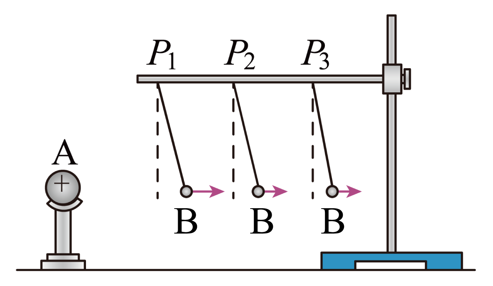

## 讲解

### 判据

改变小球距离观察悬丝偏角，或保持距离改变电荷量，就是控制变量探究。偏角是可观察量，静电力是待判断量；要说明为什么偏角反映力，不能只记“角大力大”。

### 流程

1. **固定可比较的实验条件。** 比距离时保持两球电荷量、悬球质量及装置其他条件，避免漏电导致电荷量同时变化；比电荷量时保持距离等条件。
2. **等待悬球静止。** 平衡时重力mg向下、绳力沿绳、水平静电力F；若静电力不水平，不能直接沿用以下式子。
3. **用偏角转换力。** Tcosθ＝mg，Tsinθ＝F，两式相除得到tanθ＝F/(mg)，于是F＝mg tanθ。因同一个小球m与g固定，偏角减小意味着F减小。
4. **按操作分别得结论。** 本题P₁、P₂、P₃距离依次增大，平衡偏角依次减小，说明同电荷量下距离增大静电力减小。若改变电荷量需另一组控制距离的比较。
5. **分清定性与定量。** 只观察角度趋势不能直接推出1/r²，想检验指数需可靠量出力与距离，并控制电荷变化。这个装置以几何量显力，方法本题主要考控制变量。

## 例题

> 题目与解析：第九章 静电场及其应用（单元测试·基础卷）（解析版）.docx，来源ID S06，第129—140段。题目背景与原资料标注照录。

11．某物理兴趣小组利用图示装置来探究影响电荷间静电力的因素。如图，A是一个带正电的小球，系在绝缘丝线上带正电的小球B会在静电力的作用下发生偏离，静电力的大小可以通过丝线偏离竖直方向的角度显示出来。

(1)他们分别进行了以下操作。把系在丝线上的带电小球B先后挂在如图甲中横杆上的$P_{1}$、$P_{2}$、$P_{3}$等位置，小球B平衡后丝线偏离竖直方向的夹角依次____________，由此可得，两小球所带电量不变时，距离增大，两小球间静电力________。（填“增大”、“减小”或“不变”）

(2)以上实验采用的方法是______（填正确选项前的字母）。

A．等效替代法

B．理想实验法

C．控制变量法

D．微小量放大法

**原资料答案：** (1)     减小     减小  (2)C（每空2分）

**原资料详解：** （1）[1]把系在丝线上的带电小球B先后挂在如图甲中横杆上的$P_{1}$、$P_{2}$、$P_{3}$等位置，由题图可知小球B平衡后丝线偏离竖直方向的夹角依次减小；

[2]设细线与竖直方向夹角为$\theta$，根据平衡条件可得

$mg\tan\theta=F$

由此可得，两小球所带电量不变时，距离增大，$\theta$减小，则两小球间静电力减小。

（2）根据题意保持电荷量不变，只改变距离，研究力的变化情况，或者保持距离不变，改变电荷量，研究力的变化情况，所以实验采用的方法是控制变量法。

故选C。

### 顺着本题再看清一步

第(1)问两空均为减小：从图示实际平衡位置看球间距离增大，偏角变小，tanθ随之减小。第(2)问C，控制电荷量、只改距离是决定性特征；不是把未实际进行的理想过程作推理，B不符；A等效替代、D微小量放大均不是题中主要变量安排。

题中悬挂点位置是操作量，库仑式中的r则是两球实际球心间距；偏转后两者并不自动相等。

## 易错

把距离变化引起的角变与电荷同时泄漏混在一起；只用三次“角变小”便宣称严格证明平方反比。F＝mg tanθ依赖平衡和静电力水平。
