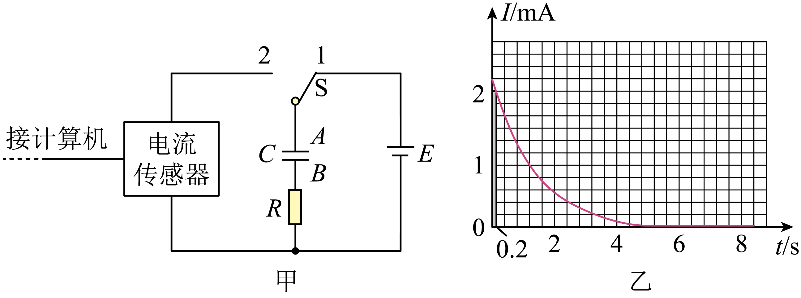

## 讲解

### 判据

看开关把电容器接到电源还是接入无电源的电阻回路，判断充放电；看I-t图的面积判断转移电荷，不能把面积叫电容或能量。充放电电流可以方向相反，题图若画其大小，要与有符号电流图分开。

### 流程

1. **按真实线路判状态。** 本题S接1连接电源充电，接2断开电源并经R闭路放电。不是按触点数字背结论。
2. **观察电压与电流。** 充电时电容器电压逐渐升高，理想稳定后达电源8.0 V，电流降零；放电时电压与电流大小下降。电流零不等于电容器没有电荷，充满后的零电流仍有Q。
3. **把小面积还原成定义。** I＝ΔQ/Δt，短区间ΔQ≈IΔt。矩形高为I、宽0.2 s，面积近似这0.2 s内释放的电荷量；曲线下整个面积给全过程Q。图中左端高度作矩形只是在小区间近似，不是连续变化电流严格恒定。
4. **检查单位与正负。** 纵轴mA、横轴s，面积单位mC；若使用有符号I，面积为有符号转移量，求释放电荷量大小需取相应绝对值。
5. **改R时固定总量条件。** 先充分充到同一U、结构C不变，再完整放电，初始Q＝CU相同。减小R让起始电流更大、过程更快，面积仍Q；只积分到某个固定短时刻的面积未必不变。
6. **求C用放电前电压。** 本题按充分充电取U＝8.0 V，Q＝3.44×10⁻³ C，C＝Q/U＝4.30×10⁻⁴ F＝430 μF。若未充足，不应直接拿电源电压代初始电容电压。

## 例题

> 题目与解析：第十章 静电场中的能量（单元测试·基础卷）（解析版）.docx，来源ID S06，第164—176段。题目背景与原资料标注照录。

11．在“用传感器观察电容器的充放电过程”实验中，按图甲所示连接电路。电源电动势为8.0V，内阻可以忽略。单刀双掷开关S先跟2相接，某时刻开关改接1，一段时间后，把开关再改接2，实验中使用了电流传感器来采集电流随时间的变化情况。

(1)开关S改接2后，电容器进行的是__________（选填“充电”或“放电”）过程。此过程得到的I—t图像如图乙所示，图中用阴影标记的狭长矩形的面积的物理意义是______________________。如果不改变电路其他参数，只减小电阻R的阻值，则此过程的I—t曲线与坐标轴所围成的面积将___________（选填“减小”“不变”或“增大”）。

(2)若实验中测得该电容器在整个放电过程中释放的电荷量$Q=3.44\times10^{-3}\,\mathrm C$，则该电容器的电容为__________μF。

**原资料答案：** (1)     放电     0.2秒内电容器释放的电荷量     不变

(2)430（每空2分）

**原资料详解：** （1）[1] 开关S接1时，电源在给电容器充电，开关S改接2后，电源断开，电容器放电，在电路中充当电源；

[2]$I-t$曲线与坐标轴所围成的面积表示初始时刻电容器所带电荷量的多少，也表示在该段时间内，电容器所放出电荷量的总和，则阴影面积表示0.2s内电容器放出的电荷量；

[3] 只减小电阻的阻值，对电容器所带电荷的量没有影响，所以初始时刻电容器所带电荷量不变，即$I-t$曲线与坐标轴所围成的面积将不变；

（2）[1]由

$C=\frac QU$

可得该电容器的电容为

$C=430\,\mathrm{\mu F}$

### 顺着本题再看清一步

第(1)问：接2放电，阴影矩形近似表示对应0.2 s区间的释放电荷；减R后完整放电面积不变。第(2)问430 μF，换算不要把10⁻⁴ F误写成0.43 μF。

原答案将矩形面积直接称“0.2秒内电荷量”，正文补出短区间近似；来源题目与答案的数值均保留。

## 易错

矩形对应的是图中那一小段时间，未必特指从零到0.2 s；连续曲线下的面积才给准确积分含义。总面积相同需要初始电压相同且放电完整。
