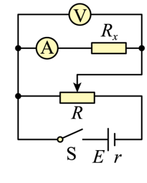
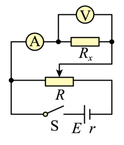
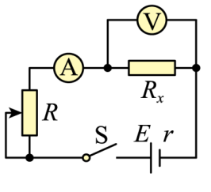
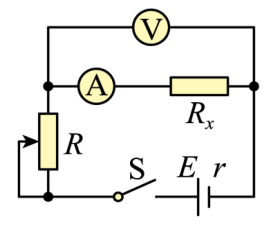

## 讲解

### 判据

伏安法用两表的读数之比算电阻，但真实电流表有RA，电压表有RV。先判断电压表测哪一段、电流表测哪些支路，再推误差；“大内小外”是简记，不能代替相对误差比较。

### 流程

1. **内接看分压。** 电压表跨Rx与A整体，电流表读Ix；U测＝Ix(Rx+RA)，所以R测＝U测/Ix＝Rx+RA，偏大，相对误差RA/Rx。
2. **外接看分流。** 电压表只跨Rx，电流表读Ix+Iv；I测＝U/Rx+U/RV，故R测＝RxRV/(Rx+RV)，偏小，相对误差Rx/(Rx+RV)。
3. **定量比较。** 本题Rx约50 Ω，RA约0.5 Ω，RV约2000 Ω；内接相对误差0.5/50＝1%，外接50/2050约2.44%，所以内接更好。常用Rx与√(RA RV)比较是在小误差条件下的近似分界，不能把它说成精确等误差条件。
4. **再选调压方式。** 变阻器仅0～5 Ω，远小于负载50 Ω；限流方式只给较窄电流变化，分压能取得更宽的电压范围。本题A兼有分压和内接，符合最佳选择。
5. **安装和取数据。** 分压起始使待测部分电压接近零，限流起始接最大串联电阻；取多组读数，减少偶然误差但不能靠平均消除固定的电表系统误差。
6. **若已知RA/RV，可修正。** 内接从R测扣RA；外接由1/Rx＝1/R测−1/RV求Rx。若题目要求不修正最佳接法，仍先按误差选择。

## 例题

> 题目与解析：第十一章 电路及其应用（单元测试·基础卷）（解析版）.docx，来源ID S06，第6—11段。分段选取时保留该子问的完整题干、答案与解析；题目背景和原资料标注照录。

1．某实验小组在“测定某金属丝的电阻”的实验中，设计了如下所示的电路图。已知该金属丝的电阻约为50Ω，滑动变阻器阻值范围为0~5Ω，电流表内阻约0.5Ω，电压表内阻约2kΩ。则以下电路图中，哪个电路为本次实验应当采用的最佳电路（　　）

A．

B．

C．

D．

**原资料答案：** A

**原资料详解：** 由于待测电阻的阻值约为$50\,\Omega$，大于滑动变阻器的阻值，所以采用分压电路，且$\frac{R_x}{R_A}>\frac{R_V}{R_x}$，所以采用内接法。

故选A。

### 顺着本题再看清一步

A是分压内接，正确；B分压外接，电压表分流的相对误差较大；C限流外接同时不利；D虽内接，但小变阻器限流可调范围较窄。因此选A。

原详解Rx/RA>RV/Rx对应近似误差比较；本文进一步用两个真实比值核算，并明确其不是一般精确等误差分界。

## 易错

同样50 Ω是否算“大电阻”要相对于两表内阻判断；分压/限流与内接/外接是两个独立选择，不把它们合成一个口令。
