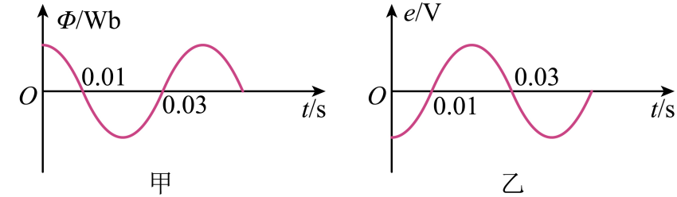

## 错法

把磁通量理解成“发电量”，觉得穿过线圈的磁场最多时电动势最大；或者把图像最高点当成变化最快。错误在于把存量与变化率混淆。

## 正解

法拉第定律用 $e=-N\,\mathrm d\Phi/\mathrm dt$。中性面线圈平面垂直磁场，通量绝对值最大，但附近转过相同小角度时通量只改变很少，极值点斜率为零，所以电动势为零。

平面平行磁场时通量为零，却穿过零点最陡，电动势绝对值最大。图中正峰和负峰都判零斜率；负峰是通量绝对值最大、代数最小。若说电流也为零，还须有纯电阻回路这一条件。

## 例题

> 题目与解析：第三章 交变电流（专项训练）（解析版）.docx，来源ID S02，第35—46段。分段选取时保留该子问的完整题干、答案与解析；题目背景和原资料标注照录。

3．（24-25高二下·山东日照·阶段练习）一个矩形线圈在匀强磁场中绕垂直于磁感线的轴匀速转动，穿过线圈的磁通量随时间变化的图象如图甲所示，则下列说法正确的是（　　）

A．t＝0时刻，线圈平面与中性面垂直

B．t＝0.01 s时刻，Φ的变化率最大

C．t＝0.02 s时刻，交流电动势达到最大

D．该线圈产生的交流电动势的图象如图乙所示

**原资料答案：** B

**原资料详解：** 

A．t=0时刻，磁通量最大，则线圈平面与中性面平行，A错误；

B．t=0.01 s时刻，Φ-t图像斜率最大，则Φ的变化率最大，B正确；

C．t=0.02 s时刻，磁通量最大，感应电动势为0，C错误；

D．磁通量最大时，感应电动势为0；磁通量为0即磁通量变化率最大时，感应电动势最大，图乙不符，D错误。

故选B。

### 顺着本题再看清一步

0.01 s对应通量过零，B正确；0.02 s对应负峰，电动势为零。资料把负峰简称“磁通量最大”，这里明确其绝对值含义，防止符号与大小混为一谈。
