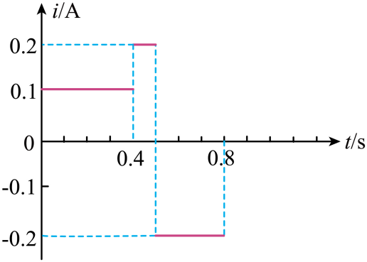

## 错法

看到交流和峰值就写 $I=I_m/\sqrt2$。错误发生在从波形跳到公式这一步：根号二来自正弦平方的周期平均，而不是“方向变化”的定义。

## 正解

先看是否正弦。是正弦且无额外直流分量时可除根号二；分段波按每段发热相加：$I^2T=\sum i_k^2\Delta t_k$。正负电流平方均为正；合并区段依据平方相同，而不是符号相同。

本图0.1 A持续半周期，电流绝对值0.2 A持续另半周期，故 $I^2=(0.1^2+0.2^2)/2$。对应电压有效值由纯电阻 $U=IR$ 求，而不是从最高电流换出正弦峰值。

## 例题

> 题目与解析：第三章 交变电流（专项训练）（解析版）.docx，来源ID S02，第120—127段。分段选取时保留该子问的完整题干、答案与解析；题目背景和原资料标注照录。

9．（25-26高三上·广东·阶段练习）通过一阻值$R=10Ω$的电阻的交变电流如图所示，其周期为$0.8\,\mathrm{s}$。电阻两端电压的有效值为（　　）

A．$\sqrt{5}V$

B．$\frac{\sqrt{10}}{2}V$

C．$5V$

D．$8\sqrt{5}V$

**原资料答案：** B

**原资料详解：** 根据电流的热效应计算电流的有效值${I}_{1}^{2}R⋅\frac{T}{2}+{I}_{2}^{2}R⋅\frac{T}{2}={I}^{2}RT$

可得流过电阻的电流的有效值$I=\frac{0.1\sqrt{10}}{2}A$

电阻两端电压的有效值为$U=IR=\frac{\sqrt{10}}{2}V$

故选B。

### 顺着本题再看清一步

最大电流0.2 A除根号二会得约0.141 A，低于原图正确约0.158 A，因为这段波形在最大绝对值附近持续的时间比例与正弦不同。原图B的√10/2 V来自平方时间平均；资料其他选项都不能替代这个计算。
