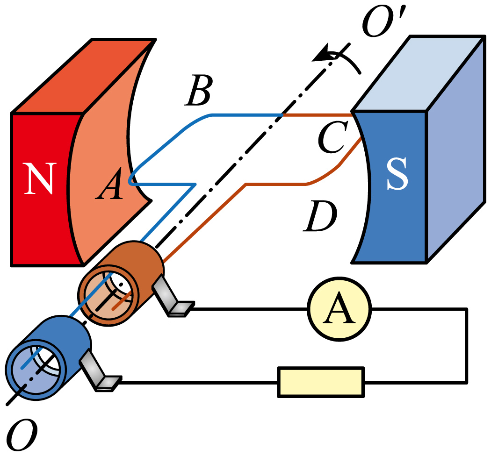

## 讲解

### 是什么

矩形线圈在匀强磁场中绕位于线圈平面内、垂直于磁场的轴匀速转动，是高中正弦交流发电模型。$N$ 为匝数，$B$ 为磁感应强度（T），$S$ 为单匝面积（m²），$\omega$ 为角速度（rad/s），$e$ 为瞬时电动势（V）。角度必须取磁场与线圈法线的夹角。

### 怎么来的

取线圈平面垂直磁场的中性面为起点，并选定磁通量正方向。转过角度 $\theta=\omega t$ 后，单匝磁通量为

$$\Phi=BS\cos\omega t.$$

法拉第定律中对单匝通量的变化率乘匝数，得到

$$e=-N\frac{\mathrm d\Phi}{\mathrm dt}=NBS\omega\sin\omega t=E_m\sin\omega t.$$

因此 $E_m=NBS\omega$。不是通量大就发电多，而是通量改变得快时电动势大。每转一周，角度增加 $2\pi$，故 $T=2\pi/\omega$、$f=\omega/(2\pi)$。从其他位置计时，写为 $e=E_m\sin(\omega t+\varphi_0)$，初相位由起始位置与正方向确定。

纯电阻回路总电阻为 $R$ 时，用欧姆定律把电动势变为电流：$i=e/R$，所以 $I_m=E_m/R$。这里的 $R$ 包含模型要求计入的内、外电阻，不能只选外负载。

### 什么时候能用

要求磁场均匀、有效面积固定、角速度恒定、转轴方向符合上述条件。轴平行磁场时，线圈对磁场的投影不按此式周期改变。实际负载的电感、电容会影响电流相位，电动势为零时电流不一定同时为零。

保持 $N,B,S$ 不变，把转速加倍，既使 $E_m$ 加倍，又使 $\omega$ 加倍。此模型一圈是一周期；多极发电机机械转速与电频率还涉及极对数，不能直接照搬“一圈一周期”。

## 例题

> 题目与解析：第三章 交变电流（专项训练）（解析版）.docx，来源ID S02，第91—107段。分段选取时保留该子问的完整题干、答案与解析；题目背景和原资料标注照录。

7．（25-26高三上·湖北·期中）如图所示，交流发电机中的线圈$ABCD$沿逆时针方向匀速转动，产生的电动势随时间变化的规律为$e=10sin(100\pi t)V$。下列说法正确的是（　　）

A．该交流电的频率为$50Hz$，每秒钟电流方向变化50次

B．线圈转到图示位置时，产生的电动势为$10V$

C．线圈转到图示位置时，$AB$边受到的安培力方向向下

D．仅线圈转速加倍，电动势为$e=20sin(100\pi t)V$

**原资料答案：** B

**原资料详解：** 

A．根据电动势表达式$e=10sin(100\pi t)V$

可知角速度为$ω=100\pi rad/s$

故该交流电的频率为$f=\frac{ω}{2\pi }=50Hz$

周期为$T=\frac{1}{f}=0.02\,\mathrm{s}$

交流电在一个周期内电流方向变化两次，故每秒钟电流方向变化100次，故A错误；

B．线圈转到图示位置时，此时磁场与线圈平面平行，磁通量最小，磁通量变化率最大，感应电动势最大，即为${E}_{m}=10V$，故B正确；

C．线圈转到图示位置时，由右手定则可知，电流由$B→A$；由左手定则可知，$AB$边受到的安培力方向向上，故C错误；

D．根据$ω=2\pi n$，${E}_{m}=NBSω$

可知仅线圈转速加倍，则角速度变为原来的两倍，即${ω}^{′}=200\pi rad/s$；最大值变为原来的两倍，即${{E}^{′}}_{m}=20V$，故电动势表达式为$e=20sin(200\pi t)V$，故D错误。

故选B。

### 顺着本题再看清一步

题中 $e=10\sin100\pi t$，读出 $E_m=10\,\mathrm V$、$\omega=100\pi\,\mathrm{rad/s}$，所以 $f=50\,\mathrm{Hz}$、$T=0.02\,\mathrm s$，每秒反向100次。转速加倍后应为 $e=20\sin200\pi t$。B所示起点线圈平面平行磁场，通量过零而变化率最大，正合最大电动势；C的受力方向还须依图中电流和磁场作左手定则。

## 易错

峰值前系数的单位是V，正弦内时间系数是角频率，不是频率。资料D仅改峰值、未改时间系数，正是同时漏看两种变化。
