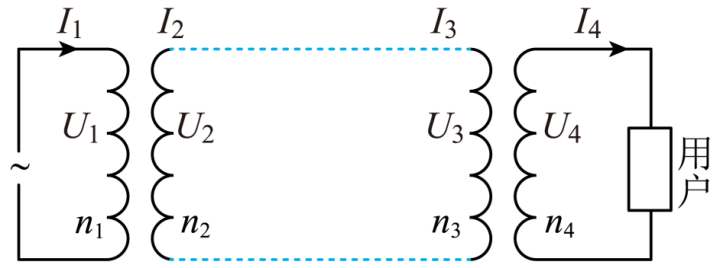

## 讲解

### 是什么

输电线有电阻，电流流过时一部分电能变成内能。$R_{\text{线}}$ 是整条回路线路总电阻（Ω），$I_{\text{线}}$ 是线路电流有效值（A），损耗功率 $P_{\text{损}}$ 用W。用户得到的功率是发送功率扣除线路损耗，而不是发电机功率全部到达用户。

### 怎么来的

从电阻热功率出发：$P_{\text{损}}=I_{\text{线}}^2R_{\text{线}}$。本章纯电阻等效、忽略变压器损耗的模型中，发送端 $P_{\text{送}}=U_{\text{送}}I_{\text{线}}$，代入可得

$$P_{\text{损}}=\left(\frac{P_{\text{送}}}{U_{\text{送}}}\right)^2R_{\text{线}}.$$

保持发送功率、线路电阻相同，提高发送电压使线路电流减小；电压升为原来的倍数，损耗按该倍数的平方下降。不是高电压本身直接减少电阻发热，而是同功率下电流变小。

线路电压降用欧姆定律，接收端和损耗满足

$$U_{\text{收}}=U_{\text{送}}-I_{\text{线}}R_{\text{线}},\qquad P_{\text{收}}=P_{\text{送}}-I_{\text{线}}^2R_{\text{线}}.$$

升压变压器决定发送电压，降压变压器根据接收电压再给用户电压；二者之间有线路电压降，不能把匝数比相反理解为用户电压必然完全回到发电电压。

### 什么时候能用

上述电压差以本章纯电阻输电模型为条件；一般交流线路有电抗时需要相位关系。题给“总电阻”已计入去、回两条线，不能再乘2。题只给单根线长和电阻率时，才按实际回路求总长度。

比较两种输电方案时逐项看固定条件。原例题规定发电功率、电压相同，用户电压和功率随方案改变；不能又暗中要求用户电阻也保持相同。

## 例题

> 题目与解析：第三章 交变电流（单元自测·基础卷）（解析版）.docx，来源ID S04，第190—205段。分段选取时保留该子问的完整题干、答案与解析；题目背景和原资料标注照录。

13．一小型水电站为某企业供电，发电机输出功率为66kW，输出电压为220V，输电线的总电阻为0.2Ω．

（1）若由发电机经输电线直接送电，求企业得到的电压和功率是多少？

（2）若用1：10升压变压器先升压，再用10：1的降压变压器降压，企业得到的电压和功率是多少？

**原资料答案：** （1）$48\,\mathrm{kW}$（2）$65.82\,\mathrm{kW}$

**原资料详解：** （1）直接输送，有$P_{\text{输出}}=U I^{\prime}_{\text{线}}$，解得$I^{\prime}_{\text{线}}=\frac{P_{\text{输出}}}{U}=300\,\mathrm A$

所以线路损耗的功率为$P_{\text{线}}=(I^{\prime}_{\text{线}})^2R_{\text{线}}=18\,\mathrm{kW}$

用户得到的电压为$U_{\text{用户}}=U-I^{\prime}_{\text{线}}R_{\text{线}}=160\,\mathrm V$

用户得到的功率$P_{\text{用户}}=P_{\text{输出}}-P_{\text{线}}=48\,\mathrm{kW}$

（2）输电电路如图所示：

$\frac{n_1}{n_2}=\frac{U_1}{U_2}$，可得$U_2=2200\,\mathrm V$

$P_{\text{输出}}=U_2I_2,\quad I_2=30\,\mathrm A$，$P_{\text{线}}=I_2^2R_{\text{线}}=180\,\mathrm W$

$U_3=U_2-I_2R=2194\,\mathrm V$

$\frac{n_3}{n_4}=\frac{U_3}{U_4}$可得$U_4=219.4\,\mathrm V$

用户得到的功率$P_{\text{用户}}=P_{\text{输出}}-P_{\text{线}}=65.82\,\mathrm{kW}$

点睛：解决本题的关键知道原副线圈电压之比、电流之比与匝数比的关系，以及知道升压变压器的输出电压、功率与降压变压器的输入电压和功率的关系．

### 顺着本题再看清一步

原答案栏只写两种方案的用户功率，解析还给出了所求电压，完整答案应为：直接输电160 V、48 kW；经变压器输电219.4 V、65.82 kW。升压前66 kW÷220 V=300 A；升压后66 kW÷2200 V=30 A，电流变为十分之一，线路损耗由18 kW变为180 W。

## 易错

线路电阻两端是线路电压降，不能将2200 V全当成线路电阻上的电压。功率守恒只适用于理想变压器本身，整条含电阻输电系统会损耗。
