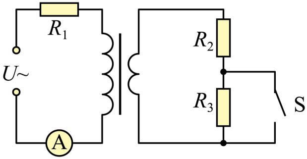

## 讲解

### 判据

副边开关或滑动变阻器改变负载，要求原、副电压电流与功率变化。首先检查固定的是电源电压，还是原线圈端电压；原边若另串电阻，这两个量不能等同。

### 流程

1. 匝数比不变，记 $a=n_1/n_2$。副负载 $R_L$ 折合到原边的等效电阻为 $R_{\rm in}=a^2R_L$，来源是电压比和逆电流比共同给出 $U_1/I_1$。
2. 无原边串联电阻且 $U_1$ 固定时，$U_2=U_1/a$ 固定；负载电阻减小使 $I_2=U_2/R_L$ 增大，原电流 $I_1=I_2/a$ 随之增大。
3. 若原边串 $R_s$，固定电源电压 $U$ 时先求 $I_1=U/(R_s+a^2R_L)$，再求 $U_1=U-I_1R_s$。负载减小使原电流增大、串联压降增大，所以原线圈端电压反而减小。
4. 再由匝数比求副端电压、电流，最后对指定电阻用 $P=I^2R$。开关短接一个电阻时，要重画剩余负载，不要只改一个电流。

因果顺序是电源及外电路条件、负载、端电压与电流共同约束；“电压由匝数决定”还需要原端电压条件。

## 例题

> 题目与解析：第三章 交变电流（专项训练）（解析版）.docx，来源ID S02，第151—168段。分段选取时保留该子问的完整题干、答案与解析；题目背景和原资料标注照录。

12．（2025·云南昆明·模拟预测）如图，理想变压器原线圈匝数为${n}_{1}$，接有一阻值为${R}_{1}=6R$的定值电阻和理想交流电电流表$A$，副线圈匝数为${n}_{2}$，接有阻值${R}_{2}=R$和${R}_{3}=5R$的两个定值电阻。$U$为正弦交流电电压源，输出电压的有效值恒定，频率为$50Hz$。当开关$S$断开时，电流表的示数为$I$，且${R}_{2}$的电功率为$9{I}^{2}R$，则（    ）

A．流经${R}_{2}$的交变电流的频率为$150Hz$

B．该变压器原、副线圈匝数比${n}_{1}:{n}_{2}=2:1$

C．当开关$S$闭合时，原线圈两端的电压增大

D．当开关$S$闭合时，${R}_{2}$的电功率变为$144{I}^{2}R$

**原资料答案：** D

**原资料详解：** 

A．理想变压器不改变交流电的频率，原线圈输入频率为50Hz，故副线圈中流经${R}_{2}$的电流频率仍为 50Hz，故A错误；

B．题意可知S断开时流过${R}_{2}$的电流${I}_{2}=\sqrt{\frac{P}{{R}_{2}}}=\sqrt{\frac{9{I}^{2}R}{R}}=3I$

则$\frac{{n}_{1}}{{n}_{2}}=\frac{{I}_{2}}{{I}_{1}}=\frac{3I}{I}=\frac{3}{1}$，故B错误；

C．将原线圈输入端等效为电阻${R}_{x}$，则有${R}_{x}=\frac{{I}_{2}^{2}}{{I}_{1}^{2}}{R}_{副}=\frac{{n}_{1}^{2}}{{n}_{2}^{2}}{R}_{副}=9{R}_{副}$

当开关$S$闭合时，副线圈电阻${R}_{副}$减小，则${R}_{x}$减小，根据分压定律可知原线圈两端的电压减小，故C错误；

D．开关$S$断开时，电源电压$U=({R}_{1}+{R}_{x})I=({R}_{1}+9{R}_{副})I=({R}_{1}+9({R}_{2}+{R}_{3}))I=60RI$

当开关$S$闭合时有${R}_{x}=9{R}_{2}=9R$

则原线圈电流${I}_{11}=\frac{U}{{R}_{1}+{R}_{x}}=4I$

则副线圈电流${I}_{22}=\frac{{n}_{1}}{{n}_{2}}{I}_{11}=12I$

故${R}_{2}$的电功率${P}_{{R}_{2}}={I}_{22}^{2}{R}_{2}=144{I}^{2}R$，故D正确。

故选D。

### 顺着本题再看清一步

由R₂原功率9I²R先知I₂=3I，故匝数比3。开关断开时副负载6R，原等效54R，加原串6R，电源U=60RI。闭合后副负载R，原等效9R，原电流60RI/(15R)=4I，副电流12I，R₂功率144I²R。原端电压由54RI降为36RI，故C错误、D正确。

## 易错

本题电源U固定，却因R₁串在原边而不能认为U₁固定。C把电源端与绕组端混用。频率仍50 Hz，匝数比不会把频率变为150 Hz。
