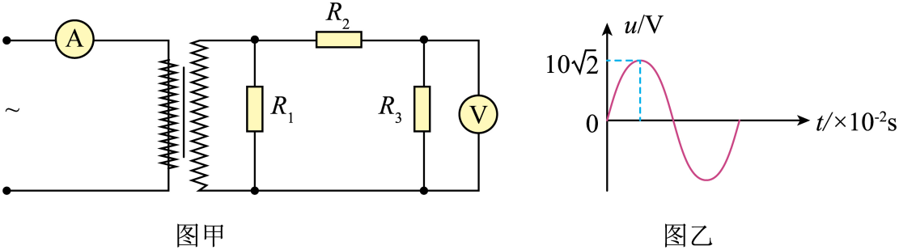

## 讲解

### 判据

题干指定理想变压器，并给匝数、某电阻电压图像或副边串并联负载。要分别确定绕组端电压、绕组总电流，再代匝数关系。

### 流程

1. 从正弦图像取有效值，而不是将峰值直接当表读数。看电压图究竟属于副线圈还是某一电阻。
2. 对副边电路先用欧姆定律。串联支路电流相同，总电压等于各电阻电压之和；并联支路端电压相同，副绕组电流为同相电阻支路电流之和。
3. 将副绕组端电压带入 $U_1/U_2=n_1/n_2$。不要用副边某个串联电阻的电压直接求匝数。
4. 将副绕组总电流带入 $I_1/I_2=n_2/n_1$，最后用纯电阻条件下 $U_1I_1=U_2I_2$ 复核，防止写成同方向的比例。
5. 如果求频率，必须有可读周期或明确电源频率；变压器不改变频率，但也不能补出题中没有的周期数据。

## 例题

> 题目与解析：第三章 交变电流（专项训练）（解析版）.docx，来源ID S02，第169—185段。分段选取时保留该子问的完整题干、答案与解析；题目背景和原资料标注照录。

13．（2025·全国·模拟预测）一含有理想变压器的电路如图甲所示，图中的电阻${R}_{1}=30Ω$，${R}_{2}=10Ω$，${R}_{3}=20Ω$，A为理想交流电流表，V为理想电压表，${R}_{3}$两端电压随时间变化的图像为图乙所示，电源的输出电压为2.5V，则下列说法正确的是（　　）

A．电流表示数为0.6A

B．电压表示数为$28V$

C．原线圈、副线圈匝数比为$1:6$

D．输入电压频率为$100Hz$

**原资料答案：** C

**原资料详解：** 

D．根据题目信息无法求出交流电的频率，故D错误；

B．根据题图可知${R}_{3}$两端电压的有效值为${U}_{3}=\frac{10\sqrt{2}}{\sqrt{2}}V=10V$

则电压表示数为$10V$，故B错误；

C．流过${R}_{3}$的电流${I}_{3}=\frac{{U}_{3}}{{R}_{3}}=0.5A$

变压器副线圈两端的电压${U}^{′}={I}_{3}（{R}_{2}+{R}_{3}）=15V$

根据$\frac{U}{{U}^{′}}=\frac{{n}_{1}}{{n}_{2}}$

可得原线圈、副线圈匝数比为$\frac{{n}_{1}}{{n}_{2}}=\frac{2.5}{15}=\frac{1}{6}$，故C正确；

A．流过副线圈的电流${I}^{′}=\frac{{U}^{′}}{{R}_{1}}+{I}_{3}=1A$

根据$\frac{I}{{I}^{′}}=\frac{{n}_{2}}{{n}_{1}}$

可得流过原线圈的电流$I=6A$

即电流表的示数为6A，故A错误。

故选C。

### 顺着本题再看清一步

看到R₃电压峰10√2 V，先变成有效值10 V，再求R₃支路0.5 A；看到R₂、R₃串联，副端为0.5×30=15 V；看到R₁并联，再加其0.5 A。由此C的1:6成立，A的0.6 A、B的28 V不成立，D因周期未知不能判成100 Hz。

## 易错

R₃的10 V并非副端15 V，R₃的0.5 A也并非副绕组总电流1 A。原资料选择题的数量级错误可用功率守恒再核：2.5×6=15×1。
