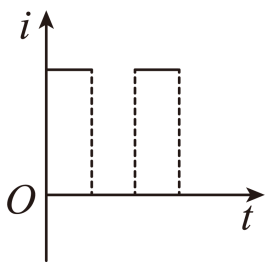
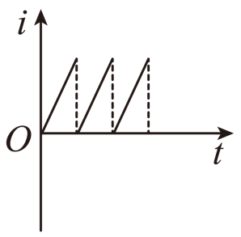
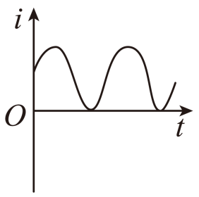
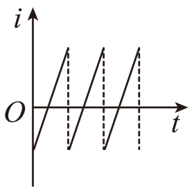

## 讲解

### 判据

给出电流—时间图或文字描述，让判断是否交流。核心看周期内电流是否反向，大小变动只是附加现象。

### 流程

1. 明确纵轴正负代表相对于约定正方向的流向，不把负值当“电流更小”而忽略反向。
2. 找完整重复周期，观察其中是否同时有正、负区间。只触零不变号的波形仍同向。
3. 将单向起伏判为脉动直流，将周期反向判为交流；无需再要求曲线光滑或呈正弦。
4. 若题目另问正弦交流，才检查是否正弦形状；“交流”和“正弦交流”范围不同，不能追加定义中没有的条件。

只有一次过零的暂态缺少周期重复条件，不能从一个局部片段推断整个过程。

## 例题

> 题目与解析：第三章 交变电流（单元自测·基础卷）（解析版）.docx，来源ID S04，第14—18段。分段选取时保留该子问的完整题干、答案与解析；题目背景和原资料标注照录。

2．如图所示的各图像中表示交变电流的是（　　）

A．

B．

C．

D．

**原资料答案：** D

**原资料详解：** 大小和方向随时间做周期性变化的电流，称为交变电流，A、B、C三幅图中的电流大小虽然变化，但方向不随时间做周期性变化，不是交流电。

故选D

### 顺着本题再看清一步

先约定图中正方向，再看一个完整周期里是否出现正、负两种电流。A、B虽有起伏，始终同向；C回到零后仍同向，不能把“经过零”当成“反向”；D正负交替，所以选D。交变电流也可以是矩形波、锯齿波，定义不要求波形为正弦。

## 易错

A、B、C虽然大小随时间变化，却都不出现负区间。D是锯齿形仍属交流，非正弦不是排除理由。
