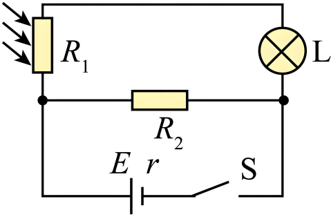

## 错法

把“信号更大”想成“阻值更大”，再直接判灯更亮、蜂鸣器更容易响。错误在于跳过输出节点与执行电路；传感器的R不等于执行器电流。

## 正解

阻增以后分别追踪总电阻、支路电流、节点电压，再看执行器用哪个量受控。恒压单元件中R增反而I减；串联分压中取光敏端与取定值端，U趋势相反。继电器吸合后也可能接通灯或断开灯，触点功能按图判断。

本手机模拟电路光敏电阻与灯串联，另一支路并联R₂，且电源有内阻。R₁增大使总电流减小，但端电压升高使R₂电流增大；灯支路电流于是更小，不能用“其他支路功率更大”替代灯的结论。

## 例题

> 题目与解析：第五章 传感器（专项训练）（解析版）.docx，来源ID S02，第65—74段。分段选取时保留该子问的完整题干、答案与解析；题目背景和原资料标注照录。

6．（25-26高三上·吉林长春·月考）智能手机有自动调节屏幕亮度的功能。如图所示为该调节功能的模拟电路简图，图中电路元件${R}_{1}$为光敏电阻，其阻值随外部环境光照强度减小而增大，${R}_{2}$为定值电阻，屏幕亮度由灯泡$L$调节。则当光照强度减小时（　　）

A．屏幕变亮

B．${R}_{2}$消耗的功率增大

C．电源的效率减小

D．流过电源的电流增大

**原资料答案：** B

**原资料详解：** BD．当光照强度减小时，元件${R}_{1}$的阻值变大，电路总电阻变大，总电流$I$减小，即流过电源的电流减小，${R}_{2}$两端电压等于路端电压 $U=E-Ir$，将增大，${R}_{2}$消耗的功率${P}_{{R}_{2}}=\frac{{U}^{2}}{{R}_{2}}$将增大，故B正确，D错误；

A．根据并联分流 $I={I}_{R2}+{I}_{L}$，因总电流减小，${R}_{2}$中的电流增大（${R}_{2}$两端电压增大），所以通过灯泡中的电流${I}_{L}$将减小，屏幕变暗，故A错误；

C．当光照强度减小时，元件${R}_{1}$的阻值变大，外电阻${R}_{外}$变大，电源的效率

$η=\frac{{I}^{2}{R}_{外}}{{I}^{2}（{R}_{外}+r)}=\frac{{R}_{外}}{（{R}_{外}+r)}=\frac{1}{1+\frac{r}{{R}_{外}}}$，变大，故C错误。

故选B。

### 顺着本题再看清一步

本图R₁与灯串成一支路，与R₂并联，而电源有内阻r。变暗→R₁增大→外电阻增大→总电流减小→内压降减小→端电压升高。R₂固定，所以其电流和功率增大；灯支路电流等于总电流减去R₂支路电流，反而减小、灯变暗。因此只有B。不能把总电流、R₂电流和灯电流当同一个量。
