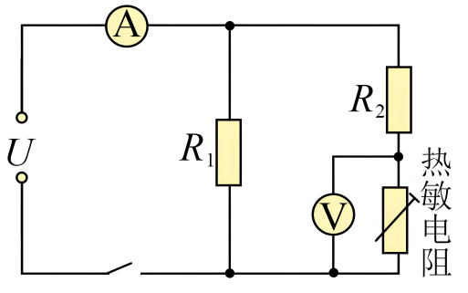

## 讲解

### 是什么

热敏电阻的阻值对温度变化敏感。负温度系数NTC在工作范围内升温阻降；正温度系数PTC升温阻升。R用Ω，温度用℃，应以题给曲线或类别判断，而不是见“半导体”就统一向下。

### 怎么来的

NTC材料中温度升高可显著增多参与导电的载流子，使导电增强，阻值下降；PTC具有不同材料和结构机理，本条不把NTC解释硬套PTC。测温时电路把R变化转为电压或电流，标定后形成温度读数。

通电还会焦耳发热，$P=I^2R$。若要测环境温度，过大测量电流可能使元件比环境更热；若利用自热限流，则自热反而是装置原理的一部分。稳态还须考虑向环境散热。

### 什么时候能用

先判R随t的趋势，再看恒压、恒流、串联或并联条件。恒压单元件中R变小使I变大，恒流单元件中R变小使U变小。固定电源串联分压中，NTC电压与定值电阻电压可能朝相反方向变。

NTC并不意味着报警一定在升温时发生，报警取哪路信号和比较门槛由控制电路决定。

## 例题

> 题目与解析：第五章 传感器（专项训练）（解析版）.docx，来源ID S02，第118—129段。分段选取时保留该子问的完整题干、答案与解析；题目背景和原资料标注照录。

3．（25-26高二上·河北张家口·期末）某种热敏电阻在环境温度升高时，电阻会迅速减小，将该热敏电阻接入如图所示的恒压电路中，闭合开关后，经过一段时间会观察到（　　）

A．电压表V示数增大

B．电压表V示数减小

C．电流表A示数减小

D．电流表A示数不变

**原资料答案：** B

**原资料详解：** CD．由题知，电压U恒定不变，闭合开关后，由于电流的热效应，热敏电阻的温度升高，其阻值减小，故电路的总电阻减小，根据$I=\frac{U}{{R}_{总}}$

可知总电流I增大，故电流表A示数增大，故CD错误；

AB．根据${I}_{1}=\frac{U}{{R}_{1}}$

可知流过电阻${R}_{1}$支路的电流${I}_{1}$不变；根据$I={I}_{1}+{I}_{2}$

可知流过${R}_{2}$支路的电流${I}_{2}$增大；根据${U}_{{R}_{2}}={I}_{2}{R}_{2}$

可知${R}_{2}$两端的电压${U}_{{R}_{2}}$增大；根据$U={U}_{R2}+{U}_{热}$

可知${U}_{热}$减小，故电压表V示数减小，故A错误，B正确。

故选B。

### 顺着本题再看清一步

NTC升温阻降，但图中电压表测的是NTC，不是固定电阻R₂。支路总阻值下降，电流增大；R₂压降增大，固定总电压扣除它后，NTC电压减小，B正确。R₁支路电流不变，总电流增大，所以C、D错误，A方向相反。

## 易错

源题说NTC通电后自热阻降，电压表测它自身分压所以读数下降；若量的是另一固定电阻，结论相反。
